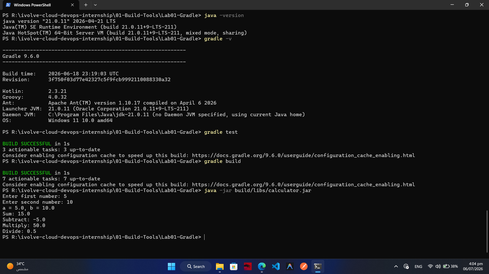

# Lab 01 – Building & Packaging a Java Application with Gradle

## 🎯 Objective

The objective of this lab is to learn how to build, test, package, and run a Java application using **Gradle**.

---

## 📋 Prerequisites

- Java JDK installed
- Gradle installed
- Git installed

---

## 📦 Project Repository

```text
https://github.com/Ibrahim-Adel15/calculator-gradle.git
```

---

## 🛠️ Steps

### 1. Verify Java Installation

```bash
java -version
```

---

### 2. Verify Gradle Installation

```bash
gradle -v
```

---

### 3. Clone the Repository

```bash
git clone https://github.com/Ibrahim-Adel15/calculator-gradle.git
```

Move into the project directory.

```bash
cd calculator-gradle
```

---

### 4. Run Unit Tests

```bash
gradle test
```

Expected Result:

- All tests pass successfully.

---

### 5. Build the Application

```bash
gradle build
```

Expected Result:

A JAR file is generated at:

```text
build/libs/calculator.jar
```

---

### 6. Run the Application

```bash
java -jar build/libs/calculator.jar
```

---

### 7. Verify the Application

Confirm that:

- The application starts successfully.
- Calculator operations work as expected.

---

## 📂 Generated Artifact

```text
build/libs/calculator.jar
```

---

## 📸 Screenshots

| Description | Image |
|------------|-------|
| Lab Execution (Gradle Installation, Unit Tests, Build Success & Running Application) |  |

---

## 📚 Commands Used

```bash
gradle -v

git clone https://github.com/Ibrahim-Adel15/calculator-gradle.git

cd calculator-gradle

gradle test

gradle build

java -jar build/libs/calculator.jar
```

---

## ✅ Learning Outcomes

By completing this lab, I learned how to:

- Install Gradle
- Clone a Git repository
- Execute unit tests
- Build Java applications
- Generate executable JAR files
- Run Java applications from the command line
