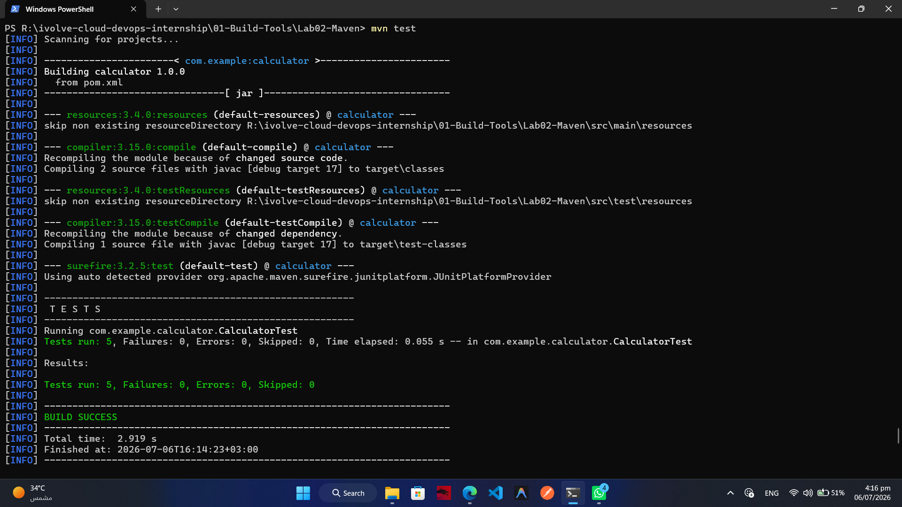
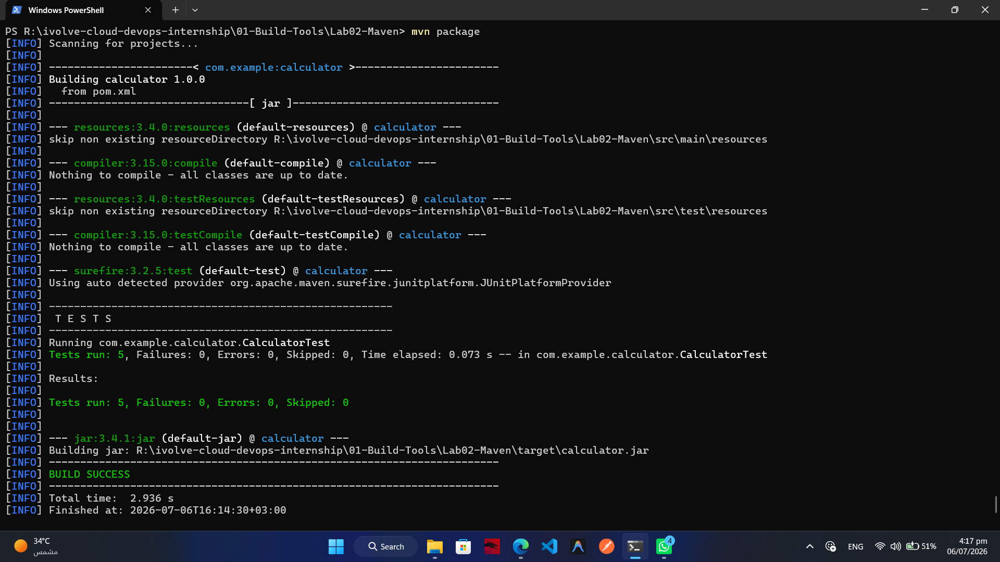
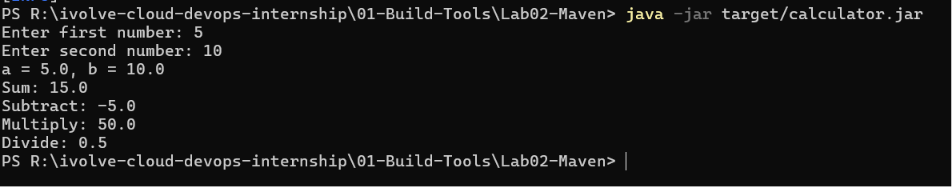

# Lab 02 – Building & Packaging a Java Application with Maven

## 🎯 Objective

The objective of this lab is to learn how to build, test, package, and run a Java application using **Maven**.

---

## 📋 Prerequisites

- Java JDK installed
- Maven installed
- Git installed

---

## 📦 Project Repository

```text
https://github.com/Ibrahim-Adel15/calculator-maven.git
```

---

## 🛠️ Steps

### 1. Verify Java Installation

```bash
java -version
```

---

### 2. Verify Maven Installation

```bash
mvn -version
```

---

### 3. Clone the Repository

```bash
git clone https://github.com/Ibrahim-Adel15/calculator-maven.git
```

Move into the project directory.

```bash
cd calculator-maven
```

---

### 4. Run Unit Tests

```bash
mvn test
```

Expected Result:

- All tests pass successfully.

---

### 5. Build the Application

```bash
mvn clean package
```

Expected Result:

A JAR file is generated at:

```text
target/calculator.jar
```

---

### 6. Run the Application

```bash
java -jar target/calculator.jar
```

---

### 7. Verify the Application

Confirm that:

- The application starts successfully.
- Calculator operations work correctly.

---

## 📂 Generated Artifact

```text
target/calculator.jar
```

---

## 📸 Screenshots

| Description | Image |
|------------|-------|
| Maven Unit Tests |  |
| Build Success |  |
| Running Application |  |

---

## 📚 Commands Used

```bash
mvn -version

git clone https://github.com/Ibrahim-Adel15/calculator-maven.git

cd calculator-maven

mvn test

mvn clean package

java -jar target/calculator.jar
```

---

## ✅ Learning Outcomes

By completing this lab, I learned how to:

- Install Maven
- Clone a Git repository
- Execute unit tests
- Build Java applications
- Package applications into executable JAR files
- Run Java applications using Maven-generated artifacts
