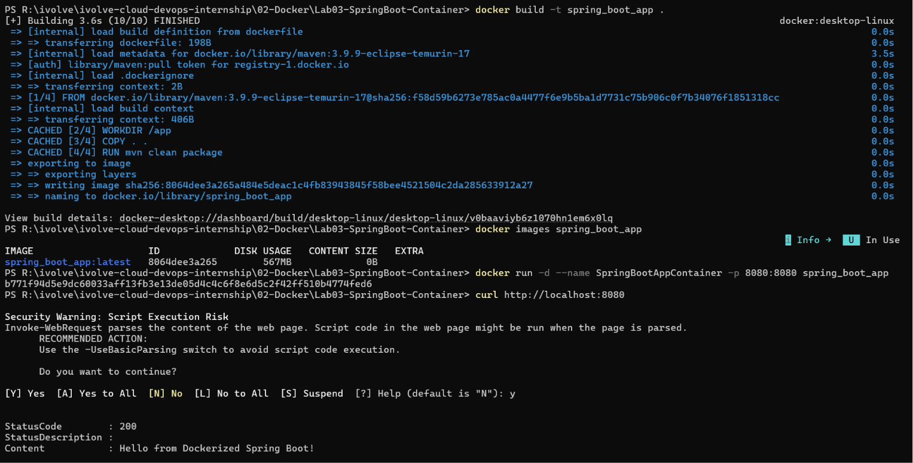

# 🚀 Lab 3: Run Java Spring Boot Application in a Docker Container (Single-Stage Build)

## 📌 Objective

This lab demonstrates how to containerize a Java Spring Boot application using a **single-stage Docker build**, where the application is built entirely inside the Docker image using Maven.

---

## 🛠️ Technologies Used

- Docker
- Java 17
- Maven
- Spring Boot

---

## 📂 Project Repository

```text
https://github.com/Ibrahim-Adel15/Docker-1.git
```

---

## 📋 Prerequisites

- Docker Desktop installed
- Git installed

---

## 🚀 Steps

### 1. Clone the Repository

```bash
git clone https://github.com/Ibrahim-Adel15/Docker-1.git
cd Docker-1
```

---

### 2. Create the Dockerfile

```dockerfile
FROM maven:3.9.9-eclipse-temurin-17

WORKDIR /app

COPY . .

RUN mvn clean package

EXPOSE 8080

CMD ["java","-jar","target/demo-0.0.1-SNAPSHOT.jar"]
```

---

### 3. Build Docker Image

```bash
docker build -t spring_boot_app .
```

Verify the image:

```bash
docker images
```

---

### 4. Run the Container

```bash
docker run -d --name SpringBootAppContainer -p 8080:8080 SpringBootApp
```

---

### 5. Test the Application

Open your browser:

```
http://localhost:8080
```

Or use curl:

```bash
curl http://localhost:8080
```

---

### 6. Stop the Container

```bash
docker stop SpringBootAppContainer
```

---

### 7. Remove the Container

```bash
docker rm SpringBootAppContainer
```

---

## 📸 Screenshots

| Description | Image |
|------------|-------|
| Docker Image Build, Container Execution & Application Test |  |

---

## 📊 Key Learning Outcomes

- Building a Java application inside Docker.
- Writing a Dockerfile for Spring Boot.
- Creating Docker images.
- Running containers.
- Exposing application ports.
- Understanding single-stage Docker builds.

