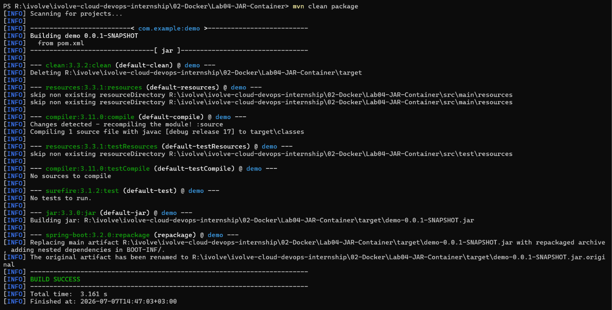
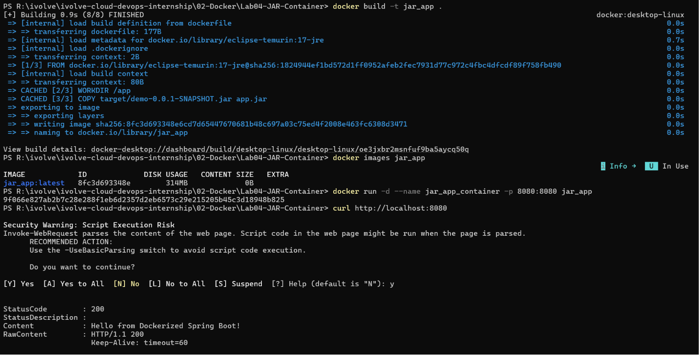

# 🚀 Lab 4: Run Java Spring Boot Application in a Docker Container (Runtime Image)

## 📌 Objective

This lab demonstrates how to package a Java Spring Boot application after building it locally with Maven, then create a lightweight Docker image containing only the compiled JAR file.

---

## 🛠️ Technologies Used

- Docker
- Java 17
- Maven
- Spring Boot

---

## 📂 Project Repository

```text
https://github.com/Ibrahim-Adel15/Docker-1.git
```

---

## 📋 Prerequisites

- Docker Desktop
- Git
- Java 17
- Maven

---

## 🚀 Steps

### 1. Clone the Repository

```bash
git clone https://github.com/Ibrahim-Adel15/Docker-1.git
cd Docker-1
```

---

### 2. Build the Application

```bash
mvn clean package
```

The generated JAR will be located at:

```text
target/demo-0.0.1-SNAPSHOT.jar
```

---

### 3. Create the Dockerfile

```dockerfile
FROM eclipse-temurin:17-jre

WORKDIR /app

COPY target/demo-0.0.1-SNAPSHOT.jar app.jar

EXPOSE 8080

CMD ["java","-jar","app.jar"]
```

---

### 4. Build Docker Image

```bash
docker build -t jar_app .
```

Verify the image:

```bash
docker images
```

---

### 5. Run the Container

```bash
docker run -d --name jar_app_container -p 8080:8080 jar_app
```

---

### 6. Test the Application

Open your browser:

```
http://localhost:8080
```

Or use curl:

```bash
curl http://localhost:8080
```

---

### 7. Stop the Container

```bash
docker stop jar_app_container
```

---

### 8. Remove the Container

```bash
docker rm jar_app_container
```

---

## 📸 Screenshots

| Description | Image |
|------------|-------|
| Building the Spring Boot application using Maven |  |
| Creating the Docker image from the pre-built JAR file, verifying the Docker image, running the container, and testing the Spring Boot application using `curl` |  |

---

## 📊 Comparison with Lab 3

| Feature | Lab 3 | Lab 4 |
|----------|-------|--------|
| Build inside Docker | ✅ | ❌ |
| Build on Local Machine | ❌ | ✅ |
| Requires Maven inside Image | ✅ | ❌ |
| Runtime Image Size | Larger | Smaller |
| Production Friendly | No | Better |

---

## 📚 Key Learning Outcomes

- Building a Spring Boot application locally.
- Creating lightweight runtime images.
- Copying application artifacts into Docker.
- Running Java applications inside containers.
- Understanding the separation between build and runtime environments.

