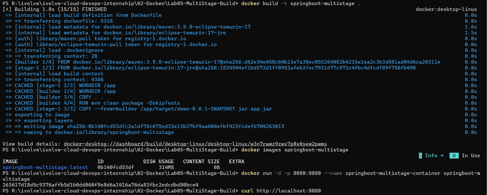
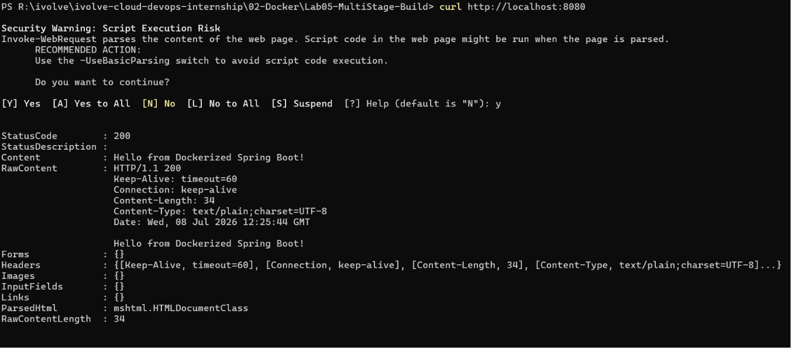

# 🐳 Lab 05: Multi-Stage Docker Build for a Spring Boot Application

## 📌 Overview

This lab demonstrates how to build an optimized Docker image for a Java Spring Boot application using a **multi-stage Docker build**.

Instead of including Maven and the entire source code in the final image, the application is compiled in a builder stage, and only the generated JAR file is copied into a lightweight runtime image.

This approach significantly reduces image size, improves security, and follows Docker best practices.

---

## 🎯 Objectives

- Clone the Spring Boot application.
- Create a multi-stage Dockerfile.
- Build the application using Maven inside Docker.
- Create a lightweight runtime image.
- Run the Spring Boot application inside a container.
- Test the application.
- Compare the image size with previous labs.

---

## 📂 Project Structure

```text
Lab05-MultiStage-Build/
│
├── Dockerfile
├── README.md
├── .gitignore
└── Screenshots/
    ├── docker_build.png
    └── app_running.png
```

---

## 🛠 Technologies Used

- Docker
- Multi-Stage Builds
- Java 17
- Maven
- Spring Boot

---

## 📋 Lab Requirements

### 1. Clone the Repository

```bash
git clone https://github.com/Ibrahim-Adel15/Docker-1.git
```

---

### 2. Create a Multi-Stage Dockerfile

```dockerfile
# ---------- Stage 1: Build ----------
FROM maven:3.9.8-eclipse-temurin-17 AS builder

WORKDIR /app

# Copy application source code
COPY . .

# Build the Spring Boot application
RUN mvn clean package -DskipTests

# ---------- Stage 2: Runtime ----------
FROM eclipse-temurin:17-jre

WORKDIR /app

# Copy the generated JAR from the builder stage
COPY --from=builder /app/target/demo-0.0.1-SNAPSHOT.jar app.jar

# Expose application port
EXPOSE 8080

# Run the application
ENTRYPOINT ["java", "-jar", "app.jar"]
```
---

### 3. Build Docker Image

```bash
docker build -t springboot-multistage .
```

---

### 4. Verify Image

```bash
docker images
```

---

### 5. Run Container

```bash
docker run -d -p 8080:8080 --name springboot-multistage-container springboot-multistage
```

---

### 6. Test Application

```bash
curl http://localhost:8080
```

or open

```
http://localhost:8080
```

---

### 7. Stop and Remove Container

```bash
docker stop springboot-multistage-container
docker rm springboot-multistage-container
```

---

### 8. Delete Image

```bash
docker rmi springboot-multistage
```

---

## 📸 Screenshots

| Description | Image |
|------------|-------|
| Building the multi-stage Docker image |  |
| Running the container and testing the application |  |

---

## 📚 Key Learning Outcomes

- Understand Docker Multi-Stage Builds.
- Separate build and runtime environments.
- Reduce Docker image size.
- Improve security by excluding build tools.
- Follow Docker image optimization best practices.

---

## ✅ Result

Successfully built, optimized, and deployed a Spring Boot application using Docker Multi-Stage Builds.