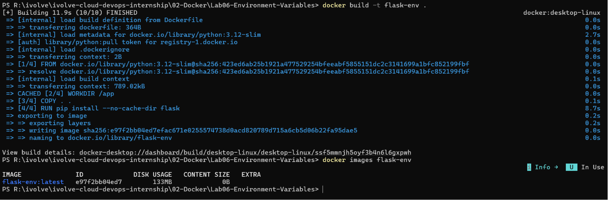
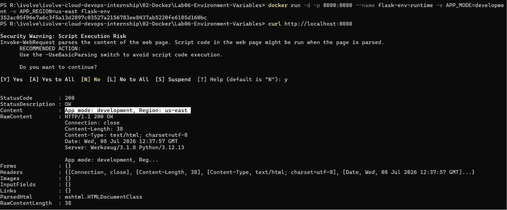
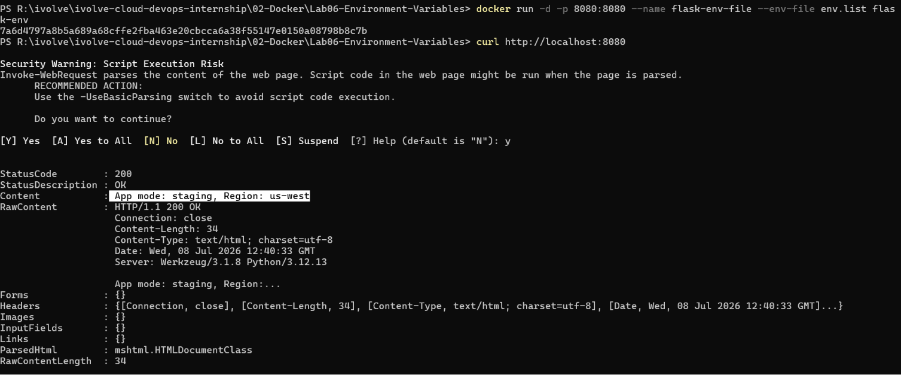
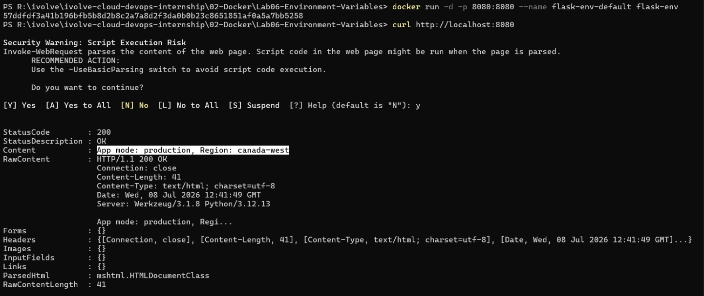

# 🐳 Lab 06: Managing Docker Environment Variables Across Build and Runtime

## 📌 Overview

This lab demonstrates different methods for managing environment variables in Docker containers.

A simple Flask application is containerized, then executed using three different approaches for supplying environment variables:

1. Runtime command-line variables
2. Environment variables from an external file
3. Default environment variables defined in the Dockerfile

---

## 🎯 Objectives

- Clone a Python Flask application.
- Create a Dockerfile.
- Build a Docker image.
- Configure environment variables using different approaches.
- Run and test multiple containers.

---

## 📂 Project Structure

```text
Lab06-Environment-Variables/
│
├── Dockerfile
├── app.py
├── env.list
├── README.md
├── .gitignore
└── Screenshots/
    ├── docker_build.png
    ├── runtime_env.png
    ├── env_file.png
    └── dockerfile_env.png
```

---

## 🛠 Technologies Used

- Docker
- Python
- Flask

---

## 📋 Lab Requirements

### 1. Clone Repository

```bash
git clone https://github.com/Ibrahim-Adel15/Docker-3.git
```

---

### 2. Create the Dockerfile

```dockerfile
FROM python:3.12-slim

WORKDIR /app

# Copy application source code
COPY . .

# Install Flask
RUN pip install --no-cache-dir flask

# Default environment variables
ENV APP_MODE=production
ENV APP_REGION=canada-west

# Expose application port
EXPOSE 8080

# Run the Flask application
CMD ["python", "app.py"]
```

---

### 3. Build Docker Image

```bash
docker build -t flask-env .
```

---

## Running Containers

### Method 1 — Runtime Environment Variables

Run the container while passing variables directly.

Variables

```
APP_MODE=development
APP_REGION=us-east
```

Example

```bash
docker run -d \
-p 8080:8080 \
--name flask-env-runtime \
-e APP_MODE=development \
-e APP_REGION=us-east \
flask-env
```
#### Test

```bash
curl http://localhost:8080
```

**Expected Output**

```text
App Mode: development
App Region: us-east
```

---

### Method 2 — Environment File

Create

```
env.list
```

Example

```text
APP_MODE=staging
APP_REGION=us-west
```

Run

```bash
docker run -d \
-p 8081:8080 \
--name flask-env-file \
--env-file env.list \
flask-env
```
#### Test

```bash
curl http://localhost:8080
```

**Expected Output**

```text
App Mode: staging
App Region: us-west
```

---

### Method 3 — Dockerfile Default Variables

Define inside Dockerfile

```Dockerfile
ENV APP_MODE=production
ENV APP_REGION=canada-west
```

Run

```bash
docker run -d \
-p 8082:8080 \
--name flask-env-default \
flask-env
```
#### Test

```bash
curl http://localhost:8080
```

**Expected Output**

```text
App Mode: production
App Region: canada-west
```
---

### 4. Stop and Remove Containers

```bash
docker stop flask-env-runtime flask-env-file flask-env-default

docker rm flask-env-runtime flask-env-file flask-env-default
```
---

## 📸 Screenshots

| Description | Image |
|------------|-------|
| Building the Docker image | |
| Running the container using runtime environment variables |  |
| Running the container using an environment file |  |
| Running the container using Dockerfile default environment variables |  |

---

## 💡 Best Practices

| Method | Best Use Case |
|---------|---------------|
| **Runtime Environment Variables (`-e`)** | Best for quick testing, development, or overriding a small number of variables. |
| **Environment File (`--env-file`)** | Recommended for development and deployment when managing multiple environment variables. Keeps configuration separate from commands. |
| **Dockerfile `ENV` Instructions** | Best for default values that rarely change. Runtime variables can still override these defaults when needed. |

> **⭐ Recommendation:** Store default configuration in the Dockerfile, keep environment-specific values in an `.env` or `env.list` file, and use runtime variables (`-e`) only when temporary overrides are needed.

---
## 📚 Key Learning Outcomes

- Understand Docker environment variables.
- Configure runtime variables using `-e`.
- Use `--env-file` for managing multiple variables.
- Define default values with Dockerfile `ENV`.
- Understand the precedence of Docker environment variables.

---

## ✅ Result

Successfully containerized a Flask application and configured environment variables using runtime arguments, external environment files, and Dockerfile defaults.