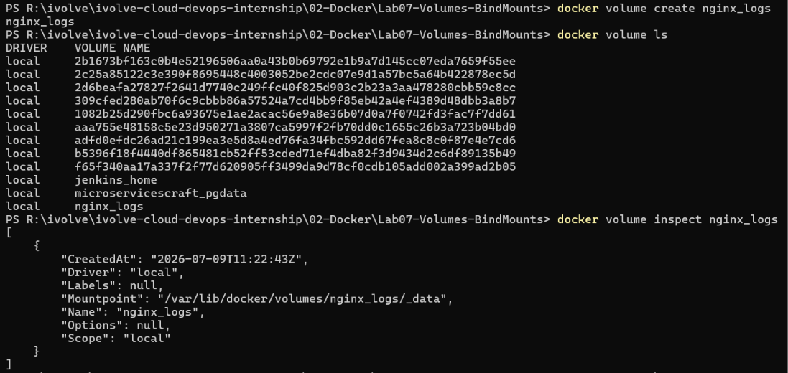
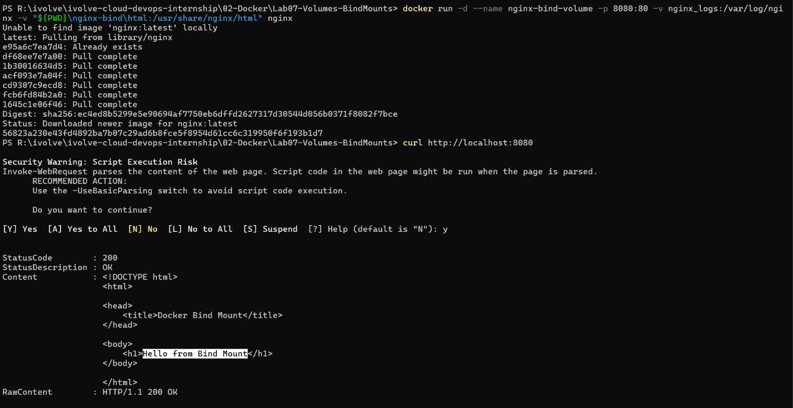
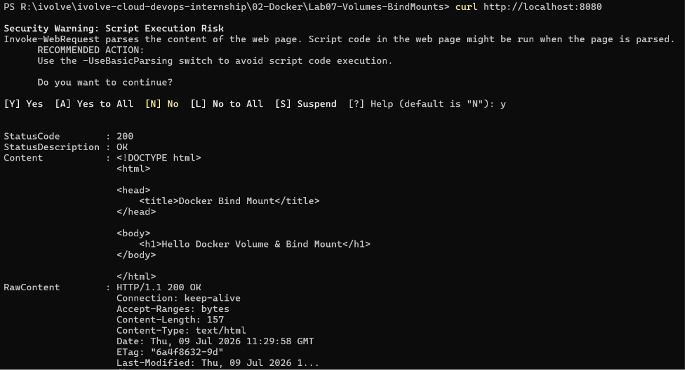
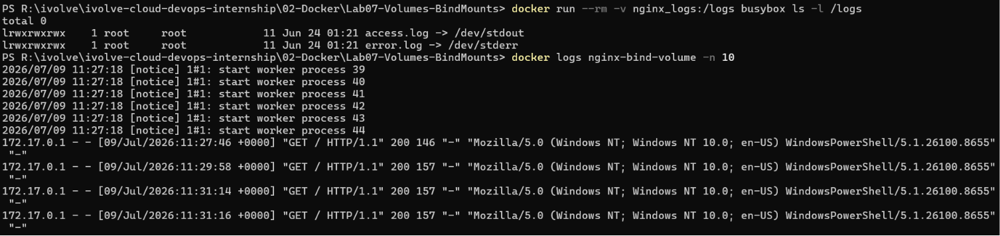

# 🐳 Lab 07: Docker Volumes and Bind Mounts with Nginx

## 📌 Overview

This lab demonstrates how to persist container data using **Docker Volumes** and how to share files between the host machine and a container using **Bind Mounts**.

An Nginx container is configured to:

- Store Nginx log files inside a Docker volume.
- Serve a custom HTML page from a directory on the host machine.
- Reflect file changes instantly without rebuilding the Docker image.

This lab highlights the differences between Docker-managed storage and host-mounted directories.

---

## 🎯 Objectives

- Create a Docker volume for Nginx logs.
- Verify the volume location on the host.
- Create a bind mount for website content.
- Serve a custom HTML page using Nginx.
- Verify live updates without rebuilding the container.
- Confirm logs are persisted inside the Docker volume.
- Remove the volume after completing the lab.

---

## 📂 Project Structure

```text
Lab07-Volumes-BindMounts/
│
├── nginx-bind/
│   └── html/
│       └── index.html
│
├── README.md
├── .gitignore
└── Screenshots/
    ├── run_container.png
    ├── first_page.png
    ├── updated_page.png
    ├── volume_logs.png
```

---

## 🛠 Technologies Used

- Docker
- Docker Volumes
- Docker Bind Mounts
- Nginx

---

# 📋 Lab Requirements

### 1. Create a Docker Volume

```bash
docker volume create nginx_logs
```

---

### 2. Verify the Volume

List available volumes:

```bash
docker volume ls
```

Inspect the volume:

```bash
docker volume inspect nginx_logs
```

The output contains the volume's mount point, typically:

```text
/var/lib/docker/volumes/nginx_logs/_data
```

---

### 3. Create the Bind Mount Directory

```bash
mkdir -p nginx-bind/html
```

---

### 4. Create the HTML Page

Create the file:

```text
nginx-bind/html/index.html
```

Content:

```html
<!DOCTYPE html>
<html>
<head>
    <title>Docker Bind Mount</title>
</head>
<body>
    <h1>Hello from Bind Mount</h1>
</body>
</html>
```

---

### 5. Run the Nginx Container

```bash
docker run -d \
-p 8080:80 \
--name nginx-bind-volume \
-v nginx_logs:/var/log/nginx \
-v $(pwd)/nginx-bind/html:/usr/share/nginx/html \
nginx
```

---

## Test the Application

```bash
curl http://localhost:8080
```

or open

```
http://localhost:8080
```

**Expected Output**

```html
Hello from Bind Mount
```

---

### 6. Modify the HTML File

Edit

```
nginx-bind/html/index.html
```

Replace

```html
<h1>Hello from Bind Mount</h1>
```

with

```html
<h1>Hello Docker Volume & Bind Mount</h1>
```

Save the file.

No container restart is required.

---

## Verify the Changes

```bash
curl http://localhost:8080
```

Expected Output

```html
Hello Docker Volume & Bind Mount
```

The webpage updates immediately because the directory is mounted directly from the host.

---

### 7. Verify the Docker Volume

Inspect the contents of the `nginx_logs` volume:

```bash
docker run --rm -v nginx_logs:/logs busybox ls -l /logs
```

Expected output:

```text
lrwxrwxrwx access.log -> /dev/stdout
lrwxrwxrwx error.log -> /dev/stderr
```

This confirms that the Nginx log files exist inside the mounted volume.

To verify that HTTP requests are being logged, inspect the running container logs:

```bash
docker logs nginx-bind-volume
```

After sending requests with:

```bash
curl http://localhost:8080
```

you should see access log entries similar to:

```text
127.0.0.1 - - [09/Jul/2026:18:45:12 +0000] "GET / HTTP/1.1" 200 22 "-" "curl/8.x"
```

> **Note:** The official Nginx Docker image redirects `access.log` and `error.log` to Docker's logging system (`stdout` and `stderr`). As a result, the mounted volume contains symbolic links rather than physical log files. Use `docker logs <container-name>` to inspect request logs.

```bash
docker stop nginx-bind-volume
docker rm nginx-bind-volume
```

---

### 8. Delete the Docker Volume

```bash
docker volume rm nginx_logs
```

Verify:

```bash
docker volume ls
```

The `nginx_logs` volume should no longer exist.

---

## 💡 Best Practice

Choose the appropriate storage option depending on your use case:

| Storage Type | Recommended Use |
|--------------|-----------------|
| **Docker Volume** | Persist application data, databases, logs, and production workloads. |
| **Bind Mount** | Development environments where source files need to be edited directly from the host. |

In production, Docker Volumes are generally preferred because Docker manages their lifecycle and portability, while Bind Mounts are ideal during development for live code updates.

---

## 📸 Screenshots

| Description | Image |
|------------|-------|
| Creating the Docker volume |  |
| Running the Nginx container and verifying the initial web page |  |
| Updated page after editing `index.html` |  |
| Verifying logs stored in the Docker volume |  |

---

## 📚 Key Learning Outcomes

- Understand Docker Volumes and Bind Mounts.
- Persist container data independently of the container lifecycle.
- Share files between the host machine and containers.
- Verify data persistence using Docker Volumes.
- Enable live content updates using Bind Mounts.
- Apply Docker storage best practices for development and production.

---

## ✅ Result

Successfully configured an Nginx container to use a Docker Volume for persistent log storage and a Bind Mount for serving website content, demonstrating persistent storage, live file synchronization, and Docker storage best practices.