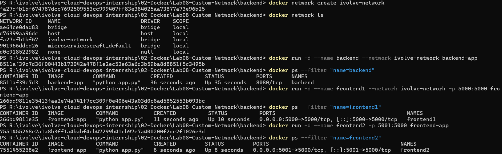
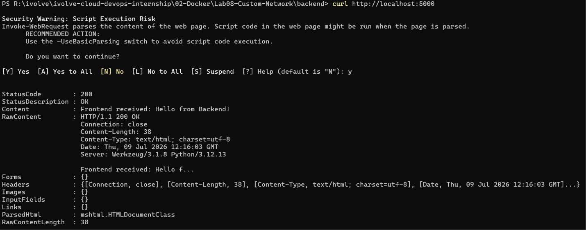
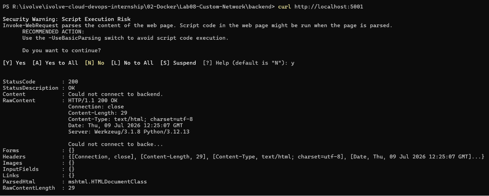

# 🐳 Lab 08: Custom Docker Network for Microservices

## 📌 Overview

This lab demonstrates how to connect multiple Docker containers using a **custom bridge network**.

A simple microservices application consisting of a **frontend** and **backend** is containerized. Both services communicate through a user-defined Docker network, allowing containers to resolve each other by name without exposing internal services directly.

The lab also compares communication between containers attached to the same custom network versus the default bridge network.

---

## 🎯 Objectives

- Clone the frontend and backend application.
- Create a Dockerfile for the frontend service.
- Create a Dockerfile for the backend service.
- Build Docker images for both services.
- Create a custom Docker bridge network.
- Run frontend and backend containers on the custom network.
- Verify communication between containers.
- Compare behavior with the default bridge network.
- Remove containers, images, and the custom network.

---

## 📂 Project Structure

```text
Lab08-Custom-Network/
│
├── frontend/
│   ├── Dockerfile
│   ├── app.py
│   ├── requirements.txt
│   └── ...
│
├── backend/
│   ├── Dockerfile
│   ├── app.py
│   └── ...
│
├── README.md
├── .gitignore
└── Screenshots/
    ├── network_and_build.png
    ├── frontend1_test.png
    ├── frontend2_test.png
```

---

## 🛠 Technologies Used

- Docker
- Docker Networks
- Python
- Flask
- Custom Bridge Network

---

## 📋 Lab Requirements

### 1. Clone the Repository

```bash
git clone https://github.com/Ibrahim-Adel15/Docker5.git
```

---

## Frontend

### 2. Create the Frontend Dockerfile

```dockerfile
FROM python:3.12-slim

WORKDIR /app

COPY requirements.txt .

RUN pip install --no-cache-dir -r requirements.txt

COPY . .

EXPOSE 5000

CMD ["python", "app.py"]
```

---

### 3. Build the Frontend Image

```bash
docker build -t frontend-app .
```

---

## Backend

### 4. Create the Backend Dockerfile

```dockerfile
FROM python:3.12-slim

WORKDIR /app

COPY . .

RUN pip install --no-cache-dir flask

EXPOSE 5000

CMD ["python", "app.py"]
```

---

### 5. Build the Backend Image

```bash
docker build -t backend-app .
```

---

## Docker Network

### 6. Create a Custom Network

```bash
docker network create ivolve-network
```

Verify:

```bash
docker network ls
```

---

## Run Containers

### 7. Run Backend Container

```bash
docker run -d \
--name backend \
--network ivolve-network \
backend-app
```

Verify:

```bash
docker ps
```

---

### 8. Run Frontend Container (Connected to Custom Network)

```bash
docker run -d \
--name frontend1 \
--network ivolve-network \
-p 5000:5000 \
frontend-app
```

Verify:

```bash
docker ps
```

---

### 9. Run Another Frontend Container (Default Network)

```bash
docker run -d \
--name frontend2 \
-p 5001:5000 \
frontend-app
```

Verify:

```bash
docker ps
```

---

## 🧪 Verify Container Communication

### Test 1 — Frontend1 (Connected to `ivolve-network`)

Since **frontend1** and **backend** are attached to **ivolve-network**, the frontend can communicate with the backend successfully.

Run:

```bash
curl http://localhost:5000
```

**Expected Output**

```text
Successful response from the application
```

or the HTML/JSON returned by the frontend, indicating that it successfully communicated with the backend.

---

### Test 2 — Frontend2 (Default Bridge Network)

Since **frontend2** is attached to Docker's default **bridge** network, it cannot communicate with the backend container on **ivolve-network**.

Run:

```bash
curl http://localhost:5001
```

**Expected Output**

```text
Could not connect to backend
```

or

```text
Backend unavailable
```

or another application-specific error message indicating that the frontend could not reach the backend.

This confirms that containers on different Docker bridge networks cannot communicate using Docker DNS.

---

## 🔍 Inspect the Custom Network

```bash
docker network inspect ivolve-network
```

Expected:

- backend container listed
- frontend1 container listed
- frontend2 not listed

---

## 🧹 Cleanup

### Stop Containers

```bash
docker stop frontend1 frontend2 backend
```

---

### Remove Containers

```bash
docker rm frontend1 frontend2 backend
```

---

### Remove Images

```bash
docker rmi frontend-app backend-app
```

---

### Remove Network

```bash
docker network rm ivolve-network
```

---

## 📸 Screenshots

| Description | Image |
|------------|-------|
| Creating the custom Docker network and building the frontend and backend Docker images |  |
| Testing communication through **frontend1** (connected to **ivolve-network**) using `curl` |  |
| Testing communication through **frontend2** (connected to the default **bridge** network) using `curl` |  |
---

## 📚 Key Learning Outcomes

- Understand Docker bridge networks.
- Create custom Docker networks.
- Connect multiple containers securely.
- Enable container-to-container communication using Docker DNS.
- Understand container name resolution.
- Compare custom bridge networks with the default bridge network.
- Inspect Docker network configuration.
- Follow Docker networking best practices for microservices.

---

## 💡 Best Practices

- Use custom bridge networks instead of the default bridge for multi-container applications.
- Communicate using container names instead of IP addresses.
- Keep backend services isolated from the host unless external access is required.
- Separate unrelated applications into different Docker networks.
- Remove unused containers, images, and networks to keep the Docker environment clean.
- Use Docker Compose for managing multi-container applications in production environments.

---

## ✅ Result

Successfully containerized a frontend and backend microservices application, connected them through a custom Docker bridge network, verified inter-container communication, compared behavior with the default bridge network, and cleaned up all Docker resources.