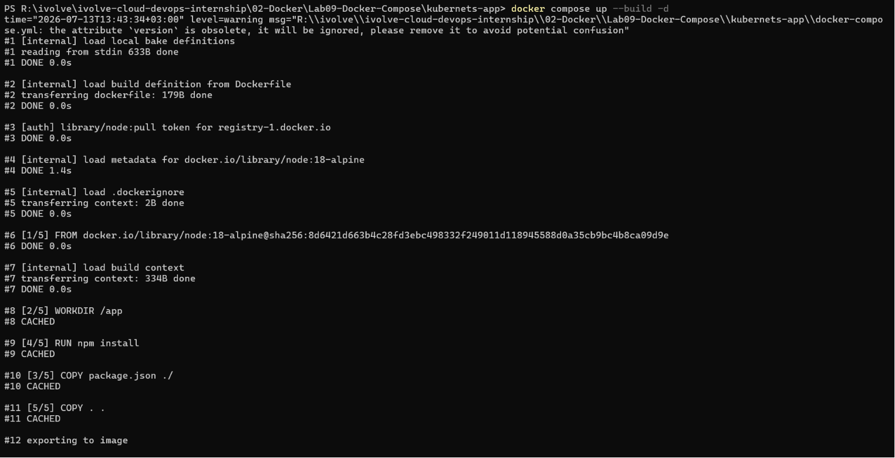
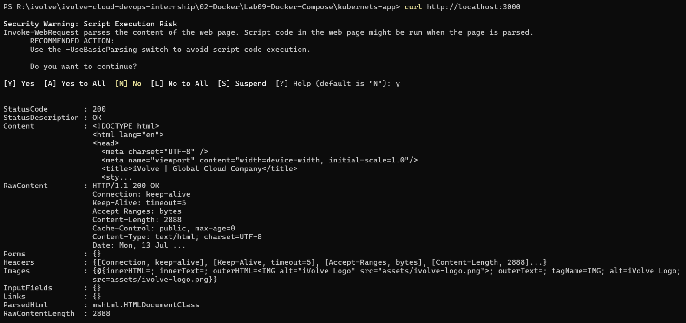
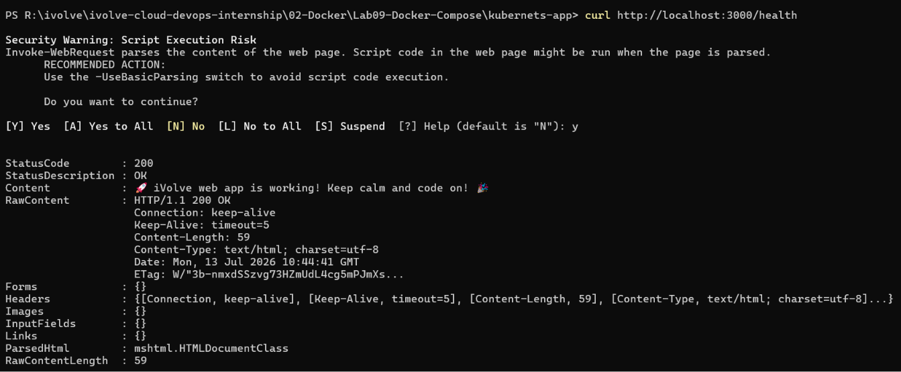
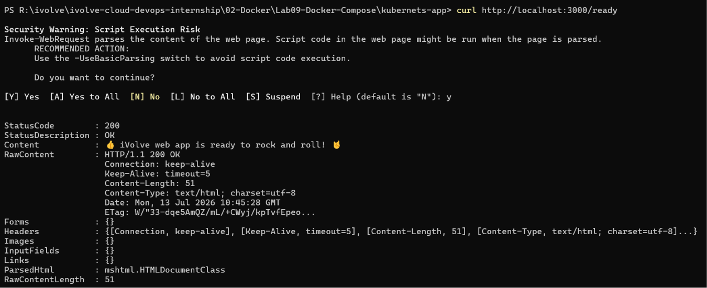
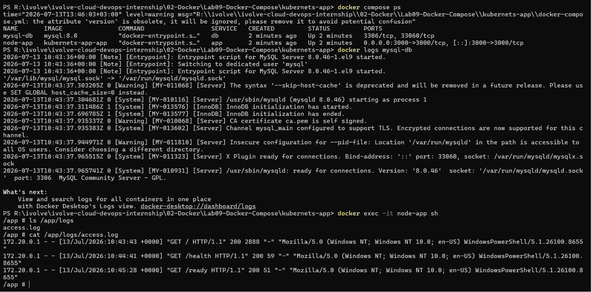
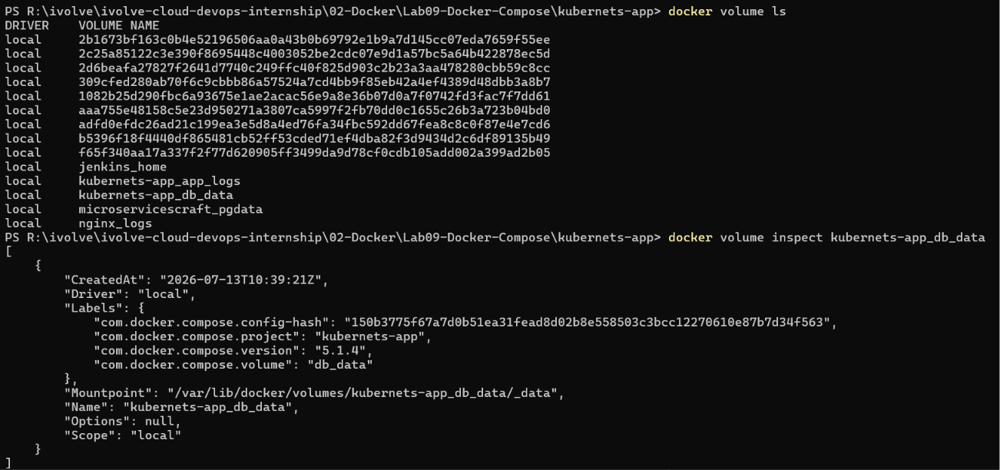
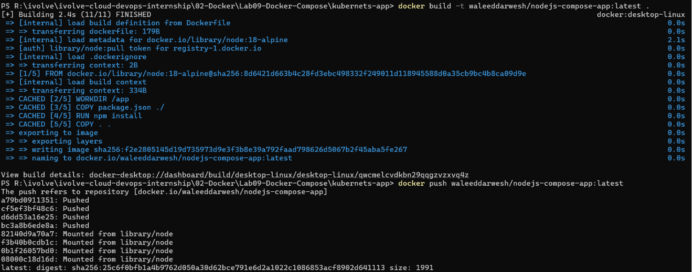

# 🐳 Lab 09: Containerized Node.js and MySQL Stack Using Docker Compose

## 📌 Overview

This lab demonstrates how to deploy a multi-container application using **Docker Compose**.

A **Node.js** application is containerized and connected to a **MySQL** database through Docker Compose. The application and database are configured using a shared **`.env`** file, while Docker Compose manages networking, persistent storage, and service orchestration.

The application connects to a MySQL database named **ivolve**, exposes port **3000**, provides health and readiness endpoints, stores application logs, and uses a Docker volume to persist database data.

---

## 🎯 Objectives

- Clone the application source code.
- Create a Dockerfile for the Node.js application.
- Create a `.env` file for configuration.
- Create a `docker-compose.yml` file.
- Configure a MySQL database service.
- Persist database data using Docker volumes.
- Build and run the application using Docker Compose.
- Verify the application is working.
- Verify `/health` and `/ready` endpoints.
- Verify application logs.
- Push the Docker image to Docker Hub.

---

## 📂 Project Structure

```text
Lab09-Docker-Compose/
│
├── kubernets-app/
│   ├── frontend/
│   │   ├── assets/
│   │   ├── index.html
│   │   └── ...
│   ├── package.json
│   ├── server.js
│   ├── db.js
│   ├── .env
|   ├── Dockerfile
│   └── docker-compose.yml
│   
├── .gitignore
├── README.md
└── Screenshots/
    ├── app_healthy.png
    ├── app_home.png
    ├── app_ready.png
    ├── compose_up.png
    ├── dockerhub_push.png
    ├── logs.png
    └── volumes.png

```

---

## 🛠 Technologies Used

- Docker
- Docker Compose
- Node.js
- MySQL 8
- Docker Volumes

---

## 📋 Lab Requirements

### 1. Clone the Repository

```bash
git clone https://github.com/Ibrahim-Adel15/kubernets-app.git
```

```bash
cd kubernets-app
```

---

## Create the Dockerfile

### 2. Dockerfile

```dockerfile
FROM node:20-alpine

WORKDIR /app

COPY package*.json ./

RUN npm install

COPY . .

EXPOSE 3000

CMD ["npm", "start"]
```

---

## Configure Environment Variables

### 3. Create `.env`

```env
# Application Configuration
DB_HOST=db
DB_USER=root
DB_PASSWORD=root123

# Database Configuration
MYSQL_ROOT_PASSWORD=root123
MYSQL_DATABASE=ivolve
```

---

## Create Docker Compose Configuration

### 4. docker-compose.yml

```yaml
version: "3.9"

services:
  app:
    build: .
    container_name: node-app

    ports:
      - "3000:3000"

    environment:
      DB_HOST: ${DB_HOST}
      DB_USER: ${DB_USER}
      DB_PASSWORD: ${DB_PASSWORD}

    depends_on:
      - db

    volumes:
      - app_logs:/app/logs

  db:
    image: mysql:8.0
    container_name: mysql-db

    environment:
      MYSQL_ROOT_PASSWORD: ${MYSQL_ROOT_PASSWORD}
      MYSQL_DATABASE: ${MYSQL_DATABASE}

    volumes:
      - db_data:/var/lib/mysql

volumes:
  db_data:
  app_logs:
```
> **Note:** Docker Compose automatically reads variables from the `.env` file located in the same directory as `docker-compose.yml`. By mapping only the required variables using the `environment` section, each container receives only the environment variables it needs instead of the entire `.env` file.
---

## ▶️ Build and Run the Application

Build and start all services:

```bash
docker compose up --build -d
```

Verify the running containers:

```bash
docker compose ps
```

---

## 🧪 Verify the Application

### Verify the Home Page

```bash
curl http://localhost:3000
```

Expected Output

```text
application's home page
```

---

### Verify Health Endpoint

```bash
curl http://localhost:3000/health
```

Expected Output

```text
🚀 iVolve web app is working! Keep calm and code on! 🎉
```

---

### Verify Readiness Endpoint

```bash
curl http://localhost:3000/ready
```

Expected Output

```text
👍 iVolve web app is ready to rock and roll! 🤘
```

---

### Verify Database Connection

Check that the MySQL container is running:

```bash
docker compose ps
```

Check database logs:

```bash
docker logs mysql-db
```

---

### Verify Application Logs

Open a shell inside the application container:

```bash
docker exec -it node-app sh
```

List available logs:

```bash
ls /app/logs
```

View the application log:

```bash
cat /app/logs/app.log
```

---

## 💾 Verify Persistent Storage

List Docker volumes:

```bash
docker volume ls
```

Inspect the database volume:

```bash
docker volume inspect db_data
```

The `db_data` volume stores the MySQL database files, ensuring data remains available even after the database container is recreated.

---

## 🐳 Push the Image to Docker Hub

### Build the Image

```bash
docker build -t your-dockerhub-username/nodejs-compose-app:latest .
```

---

### Login to Docker Hub

```bash
docker login
```

---

### Push the Image

```bash
docker push your-dockerhub-username/nodejs-compose-app:latest
```

Verify:

```bash
docker images
```

---

## 🧹 Cleanup

### Stop the Containers

```bash
docker compose down
```

---

### Remove Containers and Volumes

```bash
docker compose down -v
```

---

### Remove the Docker Image

```bash
docker rmi your-dockerhub-username/nodejs-compose-app:latest
```

---

## 📸 Screenshots

| Description | Image |
|------------|-------|
| Building and starting the multi-container application using Docker Compose (`docker compose up --build -d`) |  |
| Verifying the Node.js application is accessible on port **3000** |  |
| Verifying the application **health** endpoint (`/health`) |  |
| Verifying the application **readiness** endpoint (`/ready`) |  |
| Viewing the application logs stored in `/app/logs` |  |
| Inspecting the persistent Docker volume used by the MySQL database |  |
| Successfully tagging and pushing the Docker image to Docker Hub |  |
---

## 📚 Key Learning Outcomes

- Understand Docker Compose architecture.
- Build and run multi-container applications.
- Connect containers using Docker Compose networking.
- Configure applications using a shared `.env` file.
- Store sensitive configuration outside the Compose file.
- Persist database data using Docker volumes.
- Verify application health and readiness endpoints.
- Inspect application logs inside containers.
- Publish Docker images to Docker Hub.

---

## 💡 Best Practices

- Store configuration in a `.env` file instead of hardcoding values.
- Never commit production secrets to version control.
- Use Docker volumes for persistent database storage.
- Separate application and database services.
- Use `depends_on` to control startup order.
- Verify application health using dedicated health endpoints.
- Keep Docker images lightweight with Alpine-based images.
- Push versioned Docker images instead of relying only on the `latest` tag.

---

## ✅ Result

Successfully containerized a Node.js application and a MySQL database using Docker Compose, configured both services through a shared `.env` file, persisted database data with Docker volumes, verified application functionality, health and readiness endpoints, inspected application logs, and published the Docker image to Docker Hub.