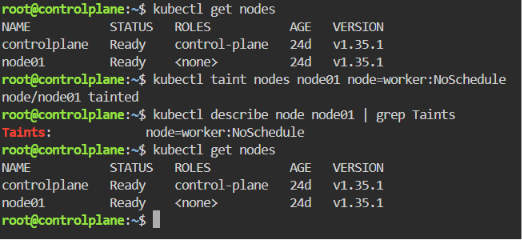

# ☸️ Lab 10: Node Isolation Using Taints in Kubernetes

## 📌 Overview

Kubernetes **Taints** provide a powerful scheduling mechanism that allows cluster administrators to control **where Pods can and cannot run**.

In this lab, a **two-node Kubernetes cluster** is used to demonstrate node isolation by applying a custom taint (`node=worker:NoSchedule`) to a worker node. This prevents Kubernetes from scheduling new Pods on that node unless they explicitly define a matching **Toleration**.

Taints are commonly used in production environments to reserve nodes for dedicated workloads, isolate infrastructure services, and improve workload placement across a Kubernetes cluster.

---

## 🎯 Objectives

- Create a Kubernetes cluster with two nodes.
- Verify the cluster nodes are healthy.
- Apply a custom taint to the worker node.
- Verify the taint configuration.
- Describe all cluster nodes.
- Understand how taints influence Pod scheduling.
- Learn the relationship between **Taints** and **Tolerations**.

---

## 📂 Project Structure

```text
Lab10-Taints/
│
├── README.md
└── Screenshots/
    └── taints_lab.png
```

---

## 🛠 Technologies Used

- Kubernetes
- kubectl
- Minikube (Multi-Node Cluster)

---

## ✅ Prerequisites

Before starting this lab, ensure you have one of the following Kubernetes environments:

### Option 1 — Local Environment (Recommended)

- Kubernetes installed
- `kubectl` configured
- Minikube running
- A Kubernetes cluster with:
  - 1 Control Plane node
  - 1 Worker node

Verify your cluster:

```bash
kubectl get nodes
```

### Option 2 — Killercoda (Browser-Based)

If you don't have **Minikube** or a local Kubernetes cluster, you can use the free interactive Kubernetes playground provided by Killercoda:

🔗 https://killercoda.com/kubernetes/scenario/pod-intro

This lab can be completed entirely within the Killercoda environment using the provided Kubernetes cluster and terminal, without installing any software locally.

> **Note:** All commands demonstrated in this lab work the same way in both Minikube and Killercoda.

---

## 📖 Understanding Kubernetes Taints

A **Taint** is a scheduling rule applied to a Kubernetes node.

Instead of selecting where Pods should run, a taint tells Kubernetes:

> **"Do not schedule Pods on this node unless they explicitly tolerate this taint."**

A taint consists of three components:

| Component | Value |
|-----------|-------|
| Key | `node` |
| Value | `worker` |
| Effect | `NoSchedule` |

Kubernetes supports **three taint effects**:

| Effect | Description |
|--------|-------------|
| **NoSchedule** | Prevents Kubernetes from scheduling **new Pods** onto the node unless they define a matching **Toleration**. Existing Pods continue running. |
| **PreferNoSchedule** | A soft scheduling rule. Kubernetes **tries to avoid** placing Pods on the node, but may still schedule them if no better node is available. |
| **NoExecute** | Prevents new Pods from being scheduled **and** evicts existing Pods that do not have a matching **Toleration**. Pods with a toleration may remain on the node, optionally for a specified period (`tolerationSeconds`). |

In this lab, the **`NoSchedule`** effect is used to isolate the worker node while allowing any existing workloads on that node to continue running.

---

## 📋 Lab Requirements

### 1. Verify the Cluster Nodes

Ensure the cluster contains two healthy nodes.

```bash
kubectl get nodes
```

Expected Output 

```text
NAME           STATUS   ROLES           AGE   VERSION
minikube       Ready    control-plane   ...
minikube-m02   Ready    <none>          ...
```

---

### 2. Apply a Taint to the Worker Node

Run:

```bash
kubectl taint nodes minikube-m02 node=worker:NoSchedule
```

Command Breakdown

| Part | Description |
|------|-------------|
| `kubectl taint` | Applies a taint to a Kubernetes node |
| `nodes` | Specifies the target resource |
| `minikube-m02` | Worker node name |
| `node` | Taint key |
| `worker` | Taint value |
| `NoSchedule` | Prevents new Pods from being scheduled |

Expected Output

```text
node/minikube-m02 tainted
```

---

### 3. Verify the Taint

Describe the worker node:

```bash
kubectl describe node minikube-m02 | grep Taints
```

Expected section:

```text
Taints: node=worker:NoSchedule
```

---

### 4. Verify Cluster Health

Run:

```bash
kubectl get nodes
```

Expected Output

```text
NAME           STATUS
minikube       Ready
minikube-m02   Ready
```

The taint only affects scheduling and does **not** impact the health or availability of the node.

---

## 🚦 Scheduling Behavior

After applying the taint:

| Pod Configuration | Scheduling Result |
|------------------|-------------------|
| No toleration | ❌ Pod will not be scheduled |
| Matching toleration | ✅ Pod can be scheduled |

This demonstrates that Kubernetes evaluates node taints before scheduling Pods.

---

## 🧪 Verification

Verify the configured taint:

```bash
kubectl describe node minikube-m02 | grep Taints
```

Expected Output

```text
Taints: node=worker:NoSchedule
```

Verify the cluster:

```bash
kubectl get nodes
```

Expected:

- Two nodes
- Both nodes are **Ready**
- Worker node contains the configured taint

---

## 🌍 Real-World Use Cases

Taints are commonly used to:

- Reserve GPU nodes for AI/ML workloads.
- Dedicate nodes to databases.
- Prevent applications from running on infrastructure nodes.
- Separate production and development workloads.
- Isolate monitoring and logging services.
- Protect critical system components from general workloads.

---

## 🧹 Cleanup

> **Note:** Skip this section if you are continuing to the next lab, as the resources created here are required in subsequent labs. 

Remove the taint:

```bash
kubectl taint nodes minikube-m02 node=worker:NoSchedule-
```

Verify:

```bash
kubectl describe node minikube-m02
```

The **Taints** section should no longer contain:

```text
node=worker:NoSchedule
```

---

## 📸 Screenshots

| Description | Image |
|------------|-------|
| Verifying the two-node Kubernetes cluster, applying the `node=worker:NoSchedule` taint, describing the worker node to confirm the taint, and ensuring both nodes remain in the **Ready** state |  |

---

## 📚 Key Learning Outcomes

After completing this lab, you will be able to:

- Understand Kubernetes scheduling fundamentals.
- Apply taints to Kubernetes nodes.
- Verify node configuration using `kubectl describe`.
- Control workload placement using scheduling constraints.
- Explain the difference between **Taints** and **Node Selectors**.
- Understand the relationship between **Taints** and **Tolerations**.
- Troubleshoot scheduling behavior.
- Prepare Kubernetes clusters for dedicated workloads.

---

## 💡 Best Practices

- Use taints to reserve nodes for specialized workloads.
- Pair taints with matching tolerations instead of manually selecting nodes.
- Use descriptive taint keys that clearly identify node purpose.
- Verify node configuration after applying scheduling constraints.
- Remove temporary taints after testing.
- Combine taints with labels and affinity rules for advanced scheduling strategies.

---

## ✅ Result

Successfully configured a **two-node Kubernetes cluster**, isolated the worker node using the **`node=worker:NoSchedule`** taint, verified the configuration using Kubernetes inspection commands, confirmed both nodes remained healthy, and demonstrated how **Taints** provide fine-grained control over Pod scheduling within a Kubernetes cluster.