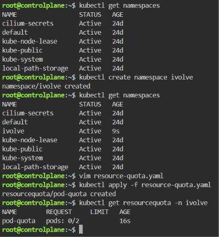

# ☸️ Lab 11: Namespace Management and Resource Quota Enforcement

## 📌 Overview

This lab demonstrates how to organize Kubernetes resources using **Namespaces** and control resource consumption using **Resource Quotas**.

A dedicated namespace named **`ivolve`** is created to isolate application resources. A **ResourceQuota** is then applied to restrict the namespace to a maximum of **2 Pods**, ensuring workloads stay within the defined resource limits.

Namespaces and resource quotas are fundamental Kubernetes features used in multi-tenant environments to provide isolation, governance, and fair resource allocation.

---

## 🎯 Objectives

- Create a Kubernetes namespace named `ivolve`.
- Verify the namespace was created successfully.
- Create a ResourceQuota.
- Limit the namespace to a maximum of **2 Pods**.
- Verify the applied ResourceQuota.
- Understand namespace isolation and resource governance.

---

## 📂 Project Structure

```text
Lab11-Namespaces/
│
├── manifests/
│   └── resource-quota.yaml
│
├── README.md
└── Screenshots/
    └── Namespaces_and_ResourceQuotas.png
```

---

## 🛠 Technologies Used

- Kubernetes
- kubectl
- Minikube
- YAML

---

## ✅ Prerequisites

Before starting this lab, ensure you have one of the following Kubernetes environments:

### Option 1 — Local Environment (Recommended)

- Kubernetes installed
- `kubectl` configured
- Minikube running
- A Kubernetes cluster with:
  - 1 Control Plane node
  - 1 Worker node

Verify your cluster:

```bash
kubectl get nodes
```

### Option 2 — Killercoda (Browser-Based)

If you don't have **Minikube** or a local Kubernetes cluster, you can use the free interactive Kubernetes playground provided by Killercoda:

🔗 https://killercoda.com/kubernetes/scenario/pod-intro

This lab can be completed entirely within the Killercoda environment using the provided Kubernetes cluster and terminal, without installing any software locally.

> **Note:** All commands demonstrated in this lab work the same way in both Minikube and Killercoda.

---

## 📖 Understanding Kubernetes Namespaces

A **Namespace** is a logical partition inside a Kubernetes cluster.

Namespaces help organize resources by grouping related objects together while isolating them from other applications.

Common use cases include:

- Production
- Development
- Testing
- Different teams
- Multi-tenant environments

For example:

```text
Cluster
├── default
├── kube-system
├── monitoring
└── ivolve
```
---

## 📖 Understanding Resource Quotas

A **ResourceQuota** limits the amount of resources that can be created or consumed inside a namespace.

Administrators commonly use ResourceQuotas to prevent a single namespace from exhausting cluster resources.

ResourceQuotas can limit:

| Resource | Example |
|----------|---------|
| Pods | 2 Pods |
| CPU Requests | 4 CPU |
| Memory | 8Gi |
| Persistent Volume Claims | 10 |
| Services | 5 |
| Secrets | 20 |
| ConfigMaps | 20 |

In this lab, the quota limits the namespace to **2 Pods**.

## 📋 Lab Requirements

### 1. Create the Namespace

Run:

```bash
kubectl create namespace ivolve
```

Verify:

```bash
kubectl get namespaces
```

Expected Output

```text
NAME              STATUS   AGE
default           Active   ...
kube-system       Active   ...
ivolve            Active   ...
```

---

### 2. Create `resource-quota.yaml`

```yaml
apiVersion: v1
kind: ResourceQuota
metadata:
  name: pod-quota
  namespace: ivolve
spec:
  hard:
    pods: "2"
```

---

### 3. Apply the ResourceQuota

Run:

```bash
kubectl apply -f manifests/resource-quota.yaml
```

Expected Output

```text
resourcequota/pod-quota created
```

---

### 4. Verify the ResourceQuota

Run:

```bash
kubectl get resourcequota -n ivolve
```

Expected Output

```text
NAME         AGE   REQUEST   LIMIT
pod-quota    ...
```

---

## 🧪 Verification

Verify the namespace:

```bash
kubectl get namespace ivolve
```

Verify the ResourceQuota:

```bash
kubectl get resourcequota -n ivolve
```

Describe the ResourceQuota:

```bash
kubectl describe resourcequota pod-quota -n ivolve
```

The output should confirm that the namespace is limited to **2 Pods**.

---

## 🧹 Cleanup

> **Note:** Skip this section if you are continuing to the next lab, as the resources created here are required in subsequent labs. 

Delete the ResourceQuota:

```bash
kubectl delete resourcequota pod-quota -n ivolve
```

Delete the namespace:

```bash
kubectl delete namespace ivolve
```

---

## 📸 Screenshots

| Description | Image |
|------------|-------|
| Creating the **`ivolve`** namespace, applying the **`pod-quota`** ResourceQuota, and verifying the successful creation of both the namespace and the enforced quota using `kubectl get namespaces` and `kubectl get resourcequota` |  |

---

## 📚 Key Learning Outcomes
After completing this lab, you will be able to:

- Create and manage Kubernetes namespaces.
- Organize workloads using namespace isolation.
- Configure ResourceQuota objects.
- Enforce resource limits within a namespace.
- Verify resource policies using `kubectl`.
- Understand Kubernetes resource governance.
- Prevent resource exhaustion in shared clusters.

---

## 💡 Best Practices

- Create separate namespaces for different applications or environments.
- Apply ResourceQuotas to prevent uncontrolled resource consumption.
- Store Kubernetes manifests in version control.
- Use descriptive names for namespaces and quota objects.
- Verify applied policies using `kubectl describe`.

---

## ✅ Result

Successfully created the **`ivolve`** namespace, applied a **ResourceQuota** limiting the namespace to **2 Pods**, verified the quota using Kubernetes commands, and demonstrated how namespaces and resource quotas provide workload isolation and resource governance.