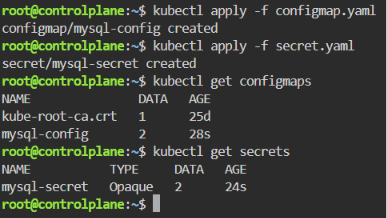

# ☸️ Lab 12: Managing Configuration and Sensitive Data with ConfigMaps and Secrets

## 📌 Overview

Kubernetes applications often require configuration values such as database hostnames, usernames, and passwords. To simplify application management while improving security, Kubernetes provides **ConfigMaps** and **Secrets**.

In this lab, a **ConfigMap** is used to store non-sensitive MySQL connection settings, while a **Secret** securely stores sensitive database credentials using **Base64-encoded** values.

Separating configuration from application code makes workloads more portable, easier to maintain, and more secure across different environments.

---

## 🎯 Objectives

- Understand the difference between ConfigMaps and Secrets.
- Create a ConfigMap for non-sensitive MySQL configuration.
- Create a Secret for sensitive MySQL credentials.
- Encode secret values using Base64.
- Apply both resources to the Kubernetes cluster.
- Verify the created ConfigMap and Secret.
- Understand how applications consume configuration data securely.

---

## 📂 Project Structure

```text
Lab12-ConfigMaps-Secrets/
│
├── manifests/
│   ├── configmap.yaml
│   └── secret.yaml
│
├── README.md
└── Screenshots/
    └── configmap_secret_lab.png
```

---

## 🛠 Technologies Used

- Kubernetes
- kubectl
- YAML
- Base64 Encoding
- Minikube

---

## ✅ Prerequisites

Before starting this lab, ensure you have one of the following Kubernetes environments:

### Option 1 — Local Environment (Recommended)

- Kubernetes installed
- `kubectl` configured
- Minikube running

Verify your cluster:

```bash
kubectl get nodes
```

### Option 2 — Killercoda (Browser-Based)

If you don't have **Minikube** or a local Kubernetes cluster, you can use the free interactive Kubernetes playground provided by Killercoda:

🔗 https://killercoda.com/kubernetes/scenario/pod-intro

This lab can be completed entirely within the Killercoda environment using the provided Kubernetes cluster and terminal, without installing any software locally.

> **Note:** All commands demonstrated in this lab work the same way in both Minikube and Killercoda.

---

## 📖 Understanding ConfigMaps

A **ConfigMap** stores **non-sensitive configuration data** as key-value pairs.

Instead of hardcoding configuration values inside application images, ConfigMaps allow applications to retrieve configuration dynamically.

Typical examples include:

- Database hostname
- Database username
- Application configuration
- Feature flags
- Environment settings

In this lab, the ConfigMap stores:

| Key | Description |
|-----|-------------|
| `DB_HOST` | Hostname of the MySQL StatefulSet Service |
| `DB_USER` | Database username used by the application |

---

## 📖 Understanding Secrets

A **Secret** stores **sensitive information** that should not be exposed inside application manifests or source code.

Unlike ConfigMaps, Secret values are stored as **Base64-encoded strings**.

Common examples include:

- Database passwords
- API Keys
- Tokens
- Certificates
- SSH Keys

In this lab, the Secret stores:

| Key | Description |
|-----|-------------|
| `DB_PASSWORD` | Password for the application database user |
| `MYSQL_ROOT_PASSWORD` | Root password for MySQL |

> **Note:** Base64 encoding is **not encryption**. It only converts binary or text data into an ASCII representation. For production environments, consider using solutions such as **HashiCorp Vault**, **AWS Secrets Manager**, or **Kubernetes Secret Encryption at Rest**.

---

## 📋 Lab Requirements

### 1. Create the ConfigMap Manifest

Create `configmap.yaml`

```yaml
apiVersion: v1
kind: ConfigMap
metadata:
  name: mysql-config
data:
  DB_HOST: mysql
  DB_USER: ivolve
```

Manifest Breakdown

| Field | Description |
|--------|-------------|
| `kind` | Creates a ConfigMap |
| `metadata.name` | ConfigMap name |
| `data` | Stores key-value configuration |

---

### 2. Encode the Secret Values

Encode the database passwords using Base64.

Example:

```bash
echo -n "mypassword" | base64
```

Expected Output

```text
bXlwYXNzd29yZA==
```

Repeat the process for:

- DB_PASSWORD
- MYSQL_ROOT_PASSWORD

---

### 3. Create the Secret Manifest

Create `secret.yaml`

```yaml
apiVersion: v1
kind: Secret
metadata:
  name: mysql-secret
type: Opaque
data:
  DB_PASSWORD: bXlwYXNzd29yZA==
  MYSQL_ROOT_PASSWORD: cm9vdDEyMw==
```

Manifest Breakdown

| Field | Description |
|--------|-------------|
| `kind` | Creates a Secret |
| `type: Opaque` | Generic Secret type |
| `data` | Stores Base64-encoded values |

---

### 4. Apply the ConfigMap

Run:

```bash
kubectl apply -f manifests/configmap.yaml
```

Expected Output

```text
configmap/mysql-config created
```

---

### 5. Apply the Secret

Run:

```bash
kubectl apply -f manifests/secret.yaml
```

Expected Output

```text
secret/mysql-secret created
```

---

### 6. Verify the Resources

Verify the ConfigMap:

```bash
kubectl get configmaps
```

Expected Output

```text
NAME             DATA
mysql-config     2
```

Verify the Secret:

```bash
kubectl get secrets
```

Expected Output

```text
NAME             TYPE
mysql-secret     Opaque
```

---

## 🚦 ConfigMap vs Secret

| Feature | ConfigMap | Secret |
|----------|-----------|---------|
| Stores configuration | ✅ | ✅ |
| Stores sensitive data | ❌ | ✅ |
| Values encoded with Base64 | ❌ | ✅ |
| Used for passwords | ❌ | ✅ |
| Used for application settings | ✅ | ❌ |

---

## 🧪 Verification

Verify the ConfigMap:

```bash
kubectl describe configmap mysql-config
```

Verify the Secret:

```bash
kubectl describe secret mysql-secret
```

List all resources:

```bash
kubectl get configmaps
kubectl get secrets
```

Expected:

- ConfigMap exists.
- Secret exists.
- Secret values are stored as Base64-encoded data.

---

## 🌍 Real-World Use Cases

ConfigMaps are commonly used to:

- Store application configuration.
- Configure database connections.
- Manage feature flags.
- Configure logging.
- Externalize environment-specific settings.

Secrets are commonly used to:

- Store database passwords.
- Store API tokens.
- Store TLS certificates.
- Store OAuth credentials.
- Manage SSH keys securely.

---

## 🧹 Cleanup

> **Note:** Skip this section if you are continuing to the next lab, as the resources created here are required in subsequent labs. 

Delete the ConfigMap:

```bash
kubectl delete configmap mysql-config
```

Delete the Secret:

```bash
kubectl delete secret mysql-secret
```

---

## 📸 Screenshots

| Description | Image |
|------------|-------|
| Creating the ConfigMap, encoding sensitive values using Base64, creating the Secret, applying both resources, and verifying them using `kubectl get configmaps` and `kubectl get secrets` |  |

---

## 📚 Key Learning Outcomes

After completing this lab, you will be able to:

- Understand the purpose of ConfigMaps.
- Understand the purpose of Secrets.
- Separate application configuration from source code.
- Store sensitive credentials securely using Kubernetes Secrets.
- Encode secret values using Base64.
- Verify ConfigMaps and Secrets using `kubectl`.
- Understand when to use ConfigMaps versus Secrets.
- Prepare Kubernetes applications for production-ready configuration management.

---

## 💡 Best Practices

- Store non-sensitive configuration in ConfigMaps.
- Store passwords, tokens, and credentials in Secrets.
- Never hardcode credentials inside application images.
- Never commit plain-text secrets to version control.
- Use external secret management solutions for production environments.
- Mount ConfigMaps and Secrets as environment variables or volumes instead of embedding values in application code.

---

## ✅ Result

Successfully created a **ConfigMap** to manage non-sensitive MySQL configuration, created a **Secret** containing Base64-encoded database credentials, applied both resources to the Kubernetes cluster, verified their creation using `kubectl`, and demonstrated Kubernetes best practices for separating application configuration from sensitive data.