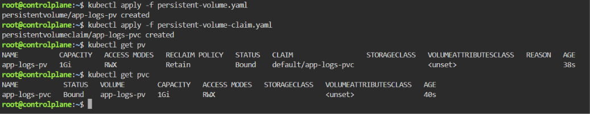

# ☸️ Lab 13: Persistent Storage Setup for Application Logging

## 📌 Overview

Containers are designed to be ephemeral, meaning any data stored inside a container's filesystem is lost when the container is restarted or recreated. To provide persistent storage, Kubernetes uses **Persistent Volumes (PVs)** and **Persistent Volume Claims (PVCs)**.

In this lab, a **Persistent Volume (PV)** is created using the **hostPath** storage type to provide **1Gi** of persistent storage for application logs. A **Persistent Volume Claim (PVC)** is then created to request that storage using the **ReadWriteMany** access mode, allowing multiple application replicas to share the same logging volume.

Persistent storage is essential for preserving logs, databases, uploaded files, and other stateful application data across Pod restarts.

---

## 🎯 Objectives

- Understand Kubernetes Persistent Volumes (PVs).
- Understand Persistent Volume Claims (PVCs).
- Create a Persistent Volume with a capacity of **1Gi**.
- Configure the PV using the **hostPath** storage type.
- Configure the PV with **ReadWriteMany** access.
- Set the reclaim policy to **Retain**.
- Create a Persistent Volume Claim requesting **1Gi**.
- Verify the PV and PVC are successfully bound.

---

## 📂 Project Structure

```text
Lab13-Persistent-Storage/
│
├── manifests/
│   ├── persistent-volume.yaml
│   └── persistent-volume-claim.yaml
│
├── README.md
└── Screenshots/
    └── persistent_storage_lab.png
```

---

## 🛠 Technologies Used

- Kubernetes
- kubectl
- YAML
- Persistent Volumes (PV)
- Persistent Volume Claims (PVC)
- Minikube

---

## ✅ Prerequisites

Before starting this lab, ensure you have one of the following Kubernetes environments:

### Option 1 — Local Environment (Recommended)

- Kubernetes installed
- `kubectl` configured
- Minikube running

Verify your cluster:

```bash
kubectl get nodes
```

### Option 2 — Killercoda (Browser-Based)

If you don't have **Minikube** or a local Kubernetes cluster, you can use the free interactive Kubernetes playground provided by Killercoda:

🔗 https://killercoda.com/kubernetes/scenario/pod-intro

This lab can be completed entirely within the Killercoda environment using the provided Kubernetes cluster and terminal, without installing any software locally.

> **Note:** All commands demonstrated in this lab work the same way in both Minikube and Killercoda.

---

## 📖 Understanding Persistent Volumes

A **Persistent Volume (PV)** is a storage resource managed by Kubernetes that exists independently of Pods.

Unlike a Pod's local filesystem, a Persistent Volume remains available even if the Pod is deleted or recreated.

Common storage backends include:

- hostPath
- NFS
- AWS EBS
- Azure Disk
- Google Persistent Disk
- Ceph
- CSI Drivers

In this lab, the storage backend is **hostPath**, which stores data on the node's local filesystem.

---

## 📖 Understanding Persistent Volume Claims

A **Persistent Volume Claim (PVC)** is a request for storage made by a Pod.

Instead of referencing a specific disk directly, applications request storage through a PVC. Kubernetes then binds the claim to a compatible Persistent Volume.

This abstraction allows applications to remain independent of the underlying storage implementation.

---

## 📋 Lab Requirements

### 1. Create the Persistent Volume

Create `persistent-volume.yaml`

```yaml
apiVersion: v1
kind: PersistentVolume
metadata:
  name: app-logs-pv
spec:
  capacity:
    storage: 1Gi
  accessModes:
    - ReadWriteMany
  persistentVolumeReclaimPolicy: Retain
  hostPath:
    path: /mnt/app-logs
```

Manifest Breakdown

| Field | Description |
|--------|-------------|
| `capacity.storage` | Storage size (1Gi) |
| `hostPath.path` | Node directory used for storage |
| `accessModes` | Allows multiple Pods to read and write |
| `persistentVolumeReclaimPolicy` | Retains data after PVC deletion |

---

### 2. Create the Persistent Volume Claim

Create `persistent-volume-claim.yaml`

```yaml
apiVersion: v1
kind: PersistentVolumeClaim
metadata:
  name: app-logs-pvc
spec:
  storageClassName: ""
  accessModes:
    - ReadWriteMany
  resources:
    requests:
      storage: 1Gi
```

Manifest Breakdown

| Field | Description |
|--------|-------------|
| `accessModes` | Must match the Persistent Volume |
| `requests.storage` | Requested storage capacity |

---

### 3. Apply the Persistent Volume

Run:

```bash
kubectl apply -f manifests/persistent-volume.yaml
```

Expected Output

```text
persistentvolume/app-logs-pv created
```

---

### 4. Apply the Persistent Volume Claim

Run:

```bash
kubectl apply -f manifests/persistent-volume-claim.yaml
```

Expected Output

```text
persistentvolumeclaim/app-logs-pvc created
```

---

### 5. Verify the Binding

Verify the PV:

```bash
kubectl get pv
```

Expected Output

```text
NAME          CAPACITY   ACCESS MODES   STATUS
app-logs-pv   1Gi        RWX            Bound
```

Verify the PVC:

```bash
kubectl get pvc
```

Expected Output

```text
NAME            STATUS   VOLUME
app-logs-pvc    Bound    app-logs-pv
```

---

## 🚦 Persistent Volume Lifecycle

A Persistent Volume passes through several states during its lifecycle.

| Status | Description |
|--------|-------------|
| Available | Ready to be claimed |
| Bound | Connected to a PVC |
| Released | PVC deleted but data retained |
| Failed | Volume failed |

In this lab, both the PV and PVC should reach the **Bound** state.

---

## 🧪 Verification

Verify the Persistent Volume:

```bash
kubectl describe pv app-logs-pv
```

Verify the Persistent Volume Claim:

```bash
kubectl describe pvc app-logs-pvc
```

List storage resources:

```bash
kubectl get pv
kubectl get pvc
```

Expected:

- PV exists.
- PVC exists.
- Both resources are **Bound**.
- Access mode is **ReadWriteMany**.
- Capacity is **1Gi**.

---

## 🌍 Real-World Use Cases

Persistent Volumes are commonly used for:

- Application logs
- MySQL and PostgreSQL databases
- Uploaded user files
- Shared application storage
- Stateful applications
- Backup storage
- Content Management Systems

---

## 🧹 Cleanup

Delete the Persistent Volume Claim:

```bash
kubectl delete pvc app-logs-pvc
```

Delete the Persistent Volume:

```bash
kubectl delete pv app-logs-pv
```

> **Note:** Because the reclaim policy is **Retain**, deleting the PVC does **not** remove the data stored in `/mnt/app-logs`. Manual cleanup may be required if the storage is no longer needed.

---

## 📸 Screenshots

| Description | Image |
|------------|-------|
| Creating the Persistent Volume and Persistent Volume Claim, applying both manifests, and verifying that the PV and PVC are successfully bound using `kubectl get pv` and `kubectl get pvc` |  |

---

## 📚 Key Learning Outcomes

After completing this lab, you will be able to:

- Understand Kubernetes Persistent Volumes.
- Understand Persistent Volume Claims.
- Configure persistent storage using hostPath.
- Create Persistent Volumes and Persistent Volume Claims.
- Match PVC requests with available PVs.
- Verify PV/PVC binding.
- Configure storage for stateful applications.
- Understand Kubernetes persistent storage architecture.

---

## 💡 Best Practices

- Use PVCs instead of referencing Persistent Volumes directly.
- Match storage size and access modes between PVs and PVCs.
- Use `Retain` reclaim policy for critical data.
- Avoid using `hostPath` in production clusters.
- Prefer cloud-native storage classes or CSI drivers in production.
- Monitor storage usage and capacity regularly.

---

## ✅ Result

Successfully created a **Persistent Volume** using the **hostPath** storage type with **1Gi** of storage, configured it with the **ReadWriteMany** access mode and **Retain** reclaim policy, created a matching **Persistent Volume Claim**, verified that both resources were successfully **Bound**, and demonstrated how Kubernetes provides persistent storage for application data and logs.