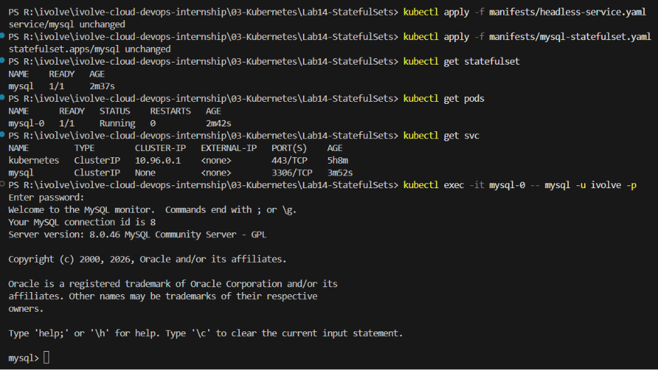

# ☸️ Lab 14: Deploying MySQL with a StatefulSet and Headless Service

## 📌 Overview

Unlike Deployments, which are designed for stateless applications, **StatefulSets** are used to manage applications that require **stable identities, persistent storage, and ordered deployment**. Databases such as MySQL, PostgreSQL, MongoDB, and Cassandra are common examples of stateful workloads.

In this lab, a **MySQL StatefulSet** is deployed with a single replica. The database securely consumes its configuration from Kubernetes **ConfigMaps** and **Secrets**, automatically creates the **ivolve** database and a non-root **ivolve** user during initialization, stores its data using a **Persistent Volume Claim (PVC)**, and includes a **Node Selector** and **Toleration** to schedule the Pod on the tainted worker node.

A **Headless Service** is also created to provide stable DNS records for the StatefulSet Pods, enabling reliable communication between stateful applications.

Finally, the MySQL database is verified by connecting with the **ivolve** user and confirming that the database is operational.

---

## 🎯 Objectives

- Understand Kubernetes StatefulSets.
- Deploy MySQL using a StatefulSet.
- Create a Headless Service.
- Consume configuration from Kubernetes ConfigMaps and Secrets.
- Automatically initialize a MySQL database and application user.
- Configure both a Node Selector and Toleration for scheduling.
- Mount persistent storage using a Persistent Volume Claim.
- Verify stable networking provided by a Headless Service.
- Confirm the MySQL database is operational.

---

## 📂 Project Structure

```text
Lab14-StatefulSet/
│
├── manifests/
│   ├── headless-service.yaml
│   └── mysql-statefulset.yaml
│
├── README.md
└── Screenshots/
    └── statefulset_lab.png
```

---

## 🛠 Technologies Used

- Kubernetes
- kubectl
- YAML
- StatefulSet
- Headless Service
- Persistent Volume Claim (PVC)
- ConfigMaps
- Kubernetes Secrets
- MySQL
- Minikube

---

## ✅ Prerequisites

Before starting this lab, ensure you have one of the following Kubernetes environments:

### Option 1 — Local Environment (Recommended)

- Kubernetes installed
- `kubectl` configured
- Minikube running

Verify your cluster:

```bash
kubectl get nodes
```

### Option 2 — Killercoda (Browser-Based)

If you don't have **Minikube** or a local Kubernetes cluster, you can use the free interactive Kubernetes playground provided by Killercoda:

🔗 https://killercoda.com/kubernetes/scenario/pod-intro

This lab can be completed entirely within the Killercoda environment using the provided Kubernetes cluster and terminal.

> **Note:** All commands demonstrated in this lab work the same way in both Minikube and Killercoda.

---

# 📖 Understanding StatefulSets

A **StatefulSet** is a Kubernetes workload designed for applications that require:

- Stable Pod names
- Persistent storage
- Ordered deployment
- Ordered scaling
- Ordered termination
- Stable network identities

Unlike Deployments, StatefulSets preserve the identity of each Pod even after restarts.

Example:

```text
mysql-0
mysql-1
mysql-2
```

Each Pod keeps:

- Its own hostname
- Its own storage
- Its own network identity

This makes StatefulSets ideal for databases.

---

# 📖 Understanding Headless Services

A **Headless Service** is a Kubernetes Service with:

```yaml
clusterIP: None
```

Instead of providing a single virtual IP address, Kubernetes creates DNS records for each Pod.

Example:

```text
mysql-0.mysql
mysql-1.mysql
mysql-2.mysql
```

This allows applications to communicate directly with individual Pods.

Headless Services are commonly used with:

- StatefulSets
- Databases
- Distributed systems
- Clusters requiring stable Pod identities

---

# 📖 Understanding Pod Scheduling

In **Lab 10**, a dedicated worker node was configured with the following taint:

```text
node=worker:NoSchedule
```

Pods are **not scheduled** onto this node unless they explicitly tolerate the taint.

In this lab, the StatefulSet uses both a **Node Selector** and a **Toleration**:

- **Node Selector** targets the worker node by matching its label.
- **Toleration** allows the Pod to be scheduled onto the tainted node.

Example:

```yaml
nodeSelector:
  node: worker

tolerations:
  - key: node
    operator: Equal
    value: worker
    effect: NoSchedule
```

Using both ensures that the Pod is scheduled **only** on the intended worker node, providing greater control over workload placement.

---

# 📖 Understanding Persistent Storage

Databases require persistent storage because their data must survive Pod restarts.

The StatefulSet mounts the previously created PVC to:

```text
/var/lib/mysql
```

This directory stores all MySQL databases and files.

Without persistent storage, deleting the Pod would permanently remove all database data.

---

## 📋 Lab Requirements

### 1. Create the Headless Service

Create `headless-service.yaml`

```yaml
apiVersion: v1
kind: Service
metadata:
  name: mysql
  namespace: ivolve
spec:
  clusterIP: None
  selector:
    app: mysql
  ports:
    - port: 3306
```

Manifest Breakdown

| Field | Description |
|---------|-------------|
| `clusterIP: None` | Creates a Headless Service |
| `selector` | Selects MySQL Pods |
| `port` | MySQL service port |

---

### 2. Create the StatefulSet

Create `mysql-statefulset.yaml`

The StatefulSet should include:

- One MySQL replica
- Headless Service
- Persistent Volume Claim
- Root password from Secret
- Database user from ConfigMap
- User password from Secret
- Automatic database initialization
- Node Selector
- Toleration

Example:

```yaml
apiVersion: apps/v1
kind: StatefulSet
metadata:
  name: mysql
  namespace: ivolve
spec:
  serviceName: mysql
  replicas: 1

  selector:
    matchLabels:
      app: mysql

  template:
    metadata:
      labels:
        app: mysql

    spec:
      nodeSelector:
        node: worker

      tolerations:
        - key: node
          operator: Equal
          value: worker
          effect: NoSchedule

      containers:
        - name: mysql
          image: mysql:8.0

          ports:
            - containerPort: 3306

          env:
            - name: MYSQL_ROOT_PASSWORD
              valueFrom:
                secretKeyRef:
                  name: mysql-secret
                  key: MYSQL_ROOT_PASSWORD

            - name: DB_HOST
              valueFrom:
                configMapKeyRef:
                  name: mysql-config
                  key: DB_HOST

            - name: MYSQL_DATABASE
              value: ivolve

            - name: MYSQL_USER
              valueFrom:
                configMapKeyRef:
                  name: mysql-config
                  key: DB_USER

            - name: MYSQL_PASSWORD
              valueFrom:
                secretKeyRef:
                  name: mysql-secret
                  key: DB_PASSWORD

          volumeMounts:
            - name: mysql-storage
              mountPath: /var/lib/mysql

      volumes:
        - name: mysql-storage
          persistentVolumeClaim:
            claimName: app-logs-pvc
```

---

### 3. Apply the Headless Service

```bash
kubectl apply -f manifests/headless-service.yaml -n ivolve
```

Expected Output

```text
service/mysql created
```

---

### 4. Apply the StatefulSet

```bash
kubectl apply -f manifests/mysql-statefulset.yaml -n ivolve
```

Expected Output

```text
statefulset.apps/mysql created
```

---

### 5. Verify the StatefulSet

```bash
kubectl get statefulsets -n ivolve
```

Expected Output

```text
NAME    READY
mysql   1/1
```

---

### 6. Verify the Pod

```bash
kubectl get pods -n ivolve
```

Expected Output

```text
mysql-0   Running
```

---

### 7. Verify the Headless Service

```bash
kubectl get svc -n ivolve
```

Expected Output

```text
NAME    TYPE        CLUSTER-IP   PORT(S)
mysql   ClusterIP   None         3306/TCP
```

Notice that the **Cluster-IP** is **None**, confirming the Service is headless.

---

### 8. Connect to MySQL

Execute a shell inside the Pod:

```bash
kubectl exec -it mysql-0 -n ivolve -- mysql -u ivolve -p
```

Enter the password defined by the `DB_PASSWORD` key in the `mysql-secret` Secret.

The MySQL Docker image automatically creates the database and user during the first initialization when the following variables are provided:

- MYSQL_DATABASE
- MYSQL_USER
- MYSQL_PASSWORD
Verify the connection:

```sql
SHOW DATABASES;
```

Expected Output

```text
+--------------------+
| Database           |
+--------------------+
| information_schema |
| ivolve             |
| performance_schema |
+--------------------+
```

This confirms the database is operational.

---

## 🚦 Why StatefulSets?

| Deployment | StatefulSet |
|------------|-------------|
| Stateless applications | Stateful applications |
| Random Pod names | Stable Pod names |
| Shared identity | Unique identity |
| Optional storage | Persistent storage |
| Independent Pods | Ordered Pods |

Examples of StatefulSet workloads:

- MySQL
- PostgreSQL
- MongoDB
- Redis Cluster
- Elasticsearch
- Cassandra
- Kafka

---

## 🧪 Verification

Verify the StatefulSet:

```bash
kubectl get statefulset -n ivolve
```

Verify the Pods:

```bash
kubectl get pods -n ivolve
```

Verify the Service:

```bash
kubectl get svc -n ivolve
```

Verify the mounted PVC:

```bash
kubectl describe pod mysql-0 -n ivolve
```

Verify the database:

```bash
kubectl exec -it mysql-0 -n ivolve -- mysql -u ivolve -p
```

Expected:

- StatefulSet is Ready
- Pod is Running
- PVC is mounted
- Secret injected successfully
- Headless Service created
- MySQL accepts connections

---

## 🌍 Real-World Use Cases

StatefulSets are commonly used for:

- MySQL
- PostgreSQL
- MongoDB
- Cassandra
- Elasticsearch
- Redis Cluster
- ZooKeeper
- Kafka
- RabbitMQ Clusters

---

## 🧹 Cleanup

> **Note:** Skip this section if you are continuing to the next lab, as the resources created here are required in subsequent labs. 

Delete the StatefulSet:

```bash
kubectl delete statefulset mysql -n ivolve
```

Delete the Headless Service:

```bash
kubectl delete service mysql -n ivolve
```

> **Note:** The Persistent Volume Claim and Persistent Volume are not deleted automatically, ensuring that the database data remains available even after the StatefulSet is removed.


---

## 📸 Screenshots

| Description | Image |
|------------|-------|
| Creating the Headless Service and MySQL StatefulSet, verifying the Pod, Service, and Persistent Volume Claim, and successfully connecting to the MySQL database using the MySQL client |  |

---

## 📚 Key Learning Outcomes

After completing this lab, you will be able to:

- Understand StatefulSets and their use cases.
- Deploy stateful applications in Kubernetes.
- Configure Headless Services.
- Mount Persistent Volume Claims.
- Consume Secrets securely.
- Configure Pod tolerations.
- Verify stable Pod identities.
- Connect to and validate a running MySQL database.

---

## 💡 Best Practices

- Use StatefulSets for databases and stateful applications.
- Store credentials in Kubernetes Secrets instead of hardcoding them.
- Use Headless Services for StatefulSets.
- Mount persistent storage for all database workloads.
- Use tolerations only when Pods should run on tainted nodes.
- Prefer StorageClasses and CSI drivers over `hostPath` in production.
- Regularly back up persistent data stored by StatefulSets.

---

## ✅ Result

Successfully deployed **MySQL** using a **StatefulSet** with **persistent storage**, securely injected the root password from a **Kubernetes Secret**, mounted a **Persistent Volume Claim** to preserve database data, configured a **Pod Toleration** for scheduling on a tainted worker node, exposed the database through a **Headless Service** for stable network identities, and verified the database by connecting with the MySQL client.