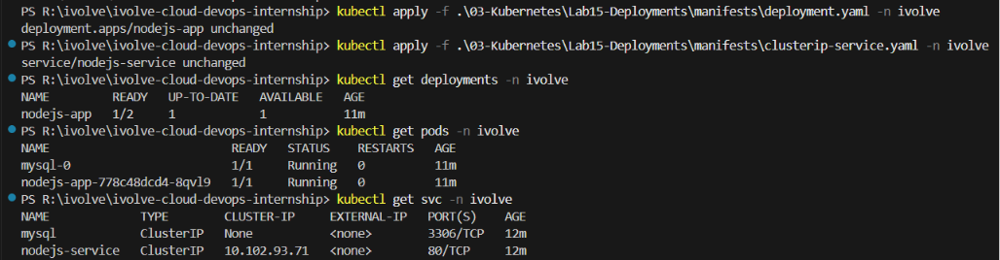

# ☸️ Lab 15: Deploying a Node.js Application with a Deployment and ClusterIP Service

## 📌 Overview

Kubernetes **Deployments** provide a declarative way to manage stateless applications by handling Pod creation, scaling, updates, and self-healing. Unlike StatefulSets, Deployments are ideal for applications that do not require persistent identities.

In this lab, a **Node.js application** is deployed using a Kubernetes **Deployment** with **2 replicas**. However, due to a **ResourceQuota** applied to the namespace, only **one Pod** can be scheduled while the second remains in the **Pending** state. The application uses a **custom Docker image** hosted on Docker Hub, consumes configuration from **ConfigMaps** and **Secrets**, mounts a previously created **Persistent Volume Claim (PVC)** for persistent storage, and is scheduled onto the tainted worker node using a **Node Selector** and **Toleration**.

Finally, the application is exposed internally using a **ClusterIP Service**, allowing other Pods within the cluster to communicate with the application through a stable virtual IP and DNS name.

---

## 🎯 Objectives

- Understand Kubernetes Deployments.
- Deploy a Node.js application using a custom Docker image.
- Configure application settings using ConfigMaps and Secrets.
- Mount persistent storage using an existing Persistent Volume Claim.
- Configure both a Node Selector and Toleration for scheduling.
- Expose the application using a ClusterIP Service.
- Verify Pod deployment and Service connectivity.

---

## 📂 Project Structure

```text
Lab15-NodeJS-Deployment/
│
├── manifests/
│   ├── deployment.yaml
│   └── clusterip-service.yaml
│
├── README.md
└── Screenshots/
    └── nodejs_deployment_lab.png
```

---

## 🛠 Technologies Used

- Kubernetes
- kubectl
- YAML
- Deployment
- ClusterIP Service
- Persistent Volume Claim (PVC)
- ConfigMaps
- Kubernetes Secrets
- Docker Hub
- Node.js
- Minikube

---

## ✅ Prerequisites

Before starting this lab, ensure you have one of the following Kubernetes environments:

### Option 1 — Local Environment (Recommended)

- Kubernetes installed
- `kubectl` configured
- Minikube running

Verify your cluster:

```bash
kubectl get nodes
```

### Option 2 — Killercoda (Browser-Based)

If you don't have **Minikube** or a local Kubernetes cluster, you can use the free interactive Kubernetes playground provided by Killercoda:

🔗 https://killercoda.com/kubernetes/scenario/pod-intro

This lab can be completed entirely within the Killercoda environment using the provided Kubernetes cluster and terminal.

> **Note:** All commands demonstrated in this lab work the same way in both Minikube and Killercoda.

---
# 📖 Understanding Stateless Applications

A **stateless application** is an application that **does not store persistent data or user session information inside the Pod or container**. Each request is handled independently, allowing any replica to process any incoming request.

Instead of storing data locally, stateless applications rely on external services such as databases, caches, or object storage.

Common characteristics include:

- No persistent application state
- Easy horizontal scaling
- Interchangeable Pods
- Fast recovery after failures
- Externalized data storage

For example, a Node.js API may retrieve data from a MySQL database, process the request, return a response, and then discard all request-specific information.

```text
Client
   │
   ▼
Node.js Pod
   │
   ▼
MySQL Database
```

Because no important data is stored inside the Pod, Kubernetes can safely terminate and recreate Pods at any time without affecting the application.

Stateless applications are ideal candidates for **Deployments**, while applications that manage persistent data, such as databases, are better suited for **StatefulSets**.

--- 

# 📖 Understanding Deployments

A **Deployment** manages stateless applications by ensuring that the desired number of Pod replicas are always running.

Deployments provide:

- Replica management
- Rolling updates
- Rollbacks
- Self-healing
- Declarative configuration

If a Pod crashes, Kubernetes automatically creates a replacement.

Example:

```text
nodejs-app-6c85f9d6d8-abc12
nodejs-app-6c85f9d6d8-def34
```

Unlike StatefulSets, Pod names are dynamically generated and Pods are interchangeable.

---

# 📖 Understanding ClusterIP Services

A **ClusterIP Service** is the default Kubernetes Service type.

It provides:

- Stable virtual IP
- Internal DNS name
- Built-in load balancing
- Communication between Pods

Example:

```text
nodejs-service.ivolve.svc.cluster.local
```

Applications communicate with the Service instead of individual Pods.

---

# 📖 Understanding Pod Scheduling

In **Lab 10**, the worker node was configured with the following taint:

```text
node=worker:NoSchedule
```

Pods are **not scheduled** onto this node unless they explicitly tolerate the taint.

In this lab, the Deployment uses both a **Node Selector** and a **Toleration**:

- **Node Selector** targets the worker node by matching its label.
- **Toleration** allows the Pod to be scheduled onto the tainted node.

Example:

```yaml
nodeSelector:
  node: worker

tolerations:
  - key: node
    operator: Equal
    value: worker
    effect: NoSchedule
```

Using both ensures that the Pod is scheduled only on the intended worker node.

---

# 📖 Understanding ConfigMaps and Secrets

Applications often require configuration values such as database hosts, usernames, API keys, or passwords.

Kubernetes provides:

- **ConfigMaps** for non-sensitive configuration.
- **Secrets** for sensitive information.

In this lab:

ConfigMap stores:

- Database Host
- Database User

Secret stores:

- Database Password

The application consumes these values as environment variables.

---

# 📖 Understanding Persistent Storage

Although Node.js applications are generally stateless, they sometimes require persistent storage for:

- Uploaded files
- Application logs
- Cached data
- Shared assets

The Deployment mounts the previously created PVC to a directory inside the container.

Example:

```text
/app/storage
```

The data remains available even if the Pod is recreated.

---
# 📖 Understanding ResourceQuota

A **ResourceQuota** limits the total amount of compute resources that can be consumed within a namespace.

In this lab, a ResourceQuota has already been configured to limit the available CPU and memory resources.

Although the Deployment requests **2 replicas**, only **one Pod** can be scheduled because there are not enough remaining resources for the second Pod.

The second Pod stays in the **Pending** state until additional resources become available or the ResourceQuota is increased.

This demonstrates how Kubernetes enforces namespace-level resource limits while still maintaining the Deployment's desired state.

Example:

```text
Desired replicas: 2
Running Pods:     1
Pending Pods:     1
```

The Deployment continuously attempts to create the missing replica, but scheduling is blocked by the ResourceQuota.

---

## 📋 Lab Requirements

### 1. Create the Deployment

Create `deployment.yaml`

The Deployment should include:

- Deployment named **nodejs-app**
- 2 replicas
- Custom Docker Hub image
- ConfigMap environment variables
- Secret environment variables
- Existing PVC
- Node Selector
- Toleration

Example:

```yaml
apiVersion: apps/v1
kind: Deployment
metadata:
  name: nodejs-app
  namespace: ivolve

spec:
  replicas: 2

  selector:
    matchLabels:
      app: nodejs-app

  template:
    metadata:
      labels:
        app: nodejs-app

    spec:
      nodeSelector:
        node: worker

      tolerations:
        - key: node
          operator: Equal
          value: worker
          effect: NoSchedule
          
      containers:
        - name: nodejs-app
          image: waleeddarwesh/nodejs-compose-app:latest

          ports:
            - containerPort: 3000

          env:
            - name: DB_HOST
              valueFrom:
                configMapKeyRef:
                  name: mysql-config
                  key: DB_HOST

            - name: DB_USER
              valueFrom:
                configMapKeyRef:
                  name: mysql-config
                  key: DB_USER

            - name: DB_PASSWORD
              valueFrom:
                secretKeyRef:
                  name: mysql-secret
                  key: DB_PASSWORD

          resources:
            requests:
              cpu: 250m
              memory: 256Mi
            limits:
              cpu: 500m
              memory: 512Mi

          volumeMounts:
            - name: app-storage
              mountPath: /app/storage

      volumes:
        - name: app-storage
          persistentVolumeClaim:
            claimName: app-logs-pvc
```

---

### 2. Create the ClusterIP Service

Create `clusterip-service.yaml`

```yaml
apiVersion: v1
kind: Service

metadata:
  name: nodejs-service
  namespace: ivolve

spec:
  selector:
    app: nodejs-app

  ports:
    - port: 80
      targetPort: 3000

  type: ClusterIP
```

Manifest Breakdown

| Field | Description |
|---------|-------------|
| `type: ClusterIP` | Creates an internal Service |
| `selector` | Selects Deployment Pods |
| `targetPort` | Node.js application port |
| `port` | Service port exposed inside the cluster |

---

### 3. Apply the Deployment

```bash
kubectl apply -f manifests/deployment.yaml -n ivolve
```

Expected Output

```text
deployment.apps/nodejs-app created
```

---

### 4. Apply the Service

```bash
kubectl apply -f manifests/clusterip-service.yaml -n ivolve
```

Expected Output

```text
service/nodejs-service created
```

---

### 5. Verify the Deployment

```bash
kubectl get deployments -n ivolve
```

Expected Output

```text
NAME         READY
nodejs-app   1/2
```

> **Note:** Due to the ResourceQuota applied to the `ivolve` namespace, only one Pod can be scheduled. The second replica remains in the **Pending** state until additional resources become available.

---

### 6. Verify the Pods

```bash
kubectl get pods -n ivolve
```

Expected Output

```text
NAME                          READY   STATUS
mysql-0                       1/1     Running   
nodejs-app-xxxxxxxxxxx        1/1     Running   
```

---

### 7. Verify the ClusterIP Service

```bash
kubectl get svc -n ivolve
```

Expected Output

```text
NAME             TYPE        CLUSTER-IP      PORT(S)
mysql            ClusterIP   None            <none>        3306/TCP   
nodejs-service   ClusterIP   10.xxx.xxx.xx   <none>        80/TCP     
```

---

### 8. Verify Environment Variables

```bash
kubectl exec -it <running-pod> -n ivolve -- printenv
```

Verify that the Pod contains values loaded from:

- ConfigMap
- Secret

---

### 9. Verify the Mounted Storage

```bash
kubectl describe pod <running-pod> -n ivolve
```

Confirm that:

- PVC is mounted
- Volume is attached
- Mount path is correct

---

## 🚦 Why Deployments?

| Deployment | StatefulSet |
|------------|-------------|
| Stateless applications | Stateful applications |
| Dynamic Pod names | Stable Pod names |
| Rolling updates | Ordered updates |
| Easy scaling | Ordered scaling |
| Shared identity | Unique identity |

Deployments are commonly used for:

- Web APIs
- Node.js applications
- Python applications
- Java Spring Boot services
- Frontend applications
- Microservices

---

## 🧪 Verification

Verify the Deployment:

```bash
kubectl get deployment -n ivolve
```

Verify the Pods:

```bash
kubectl get pods -n ivolve
```

Verify the Service:

```bash
kubectl get svc -n ivolve
```

Verify mounted storage:

```bash
kubectl describe pod <running-pod> -n ivolve
```

Verify environment variables:

```bash
kubectl exec -it <running-pod> -n ivolve -- printenv
```

Expected:

- Deployment exists
- One Pod is Running
- Service is created
- ConfigMap values loaded
- Secret values loaded
- PVC mounted successfully
- Application reachable through the ClusterIP Service

---

## 🌍 Real-World Use Cases

Deployments are commonly used for:

- REST APIs
- Node.js applications
- Django applications
- Spring Boot services
- React backends
- Authentication services
- Microservices
- Internal APIs

---

## 🧹 Cleanup

Delete the Deployment:

```bash
kubectl delete deployment nodejs-app -n ivolve
```

Delete the Service:

```bash
kubectl delete service nodejs-service -n ivolve
```

> **Note:** The Persistent Volume Claim and Persistent Volume are not deleted automatically, ensuring that application data remains available for future deployments.

---

## 📸 Screenshots

| Description | Image |
|------------|-------|
| Creating the Node.js Deployment and ClusterIP Service, verifying the Deployment, Pods, mounted Persistent Volume Claim, injected ConfigMap and Secret environment variables, and confirming the ClusterIP Service |  |

---

## 📚 Key Learning Outcomes

After completing this lab, you will be able to:

- Understand Kubernetes Deployments.
- Deploy stateless applications.
- Use custom Docker Hub images.
- Consume ConfigMaps and Secrets.
- Configure ClusterIP Services.
- Mount Persistent Volume Claims.
- Configure Pod scheduling with Node Selectors and Tolerations.
- Verify application deployment and connectivity.

---

## 💡 Best Practices

- Use Deployments for stateless workloads.
- Store sensitive information in Kubernetes Secrets.
- Keep application configuration in ConfigMaps.
- Use Services instead of connecting directly to Pods.
- Mount persistent storage only when required.
- Use Node Selectors and Tolerations intentionally.
- Prefer StorageClasses over static volumes in production.
- Keep container images versioned instead of relying on `latest`.

---

## ✅ Result

Successfully deployed a **Node.js application** using a **Deployment** with a custom Docker Hub image, configured the application using **ConfigMaps** and **Secrets**, mounted a **Persistent Volume Claim** for persistent storage, scheduled the Pod onto the tainted worker node using a **Node Selector** and **Toleration**, exposed the application internally through a **ClusterIP Service**, and observed how a **ResourceQuota** limits the number of running replicas within the namespace.