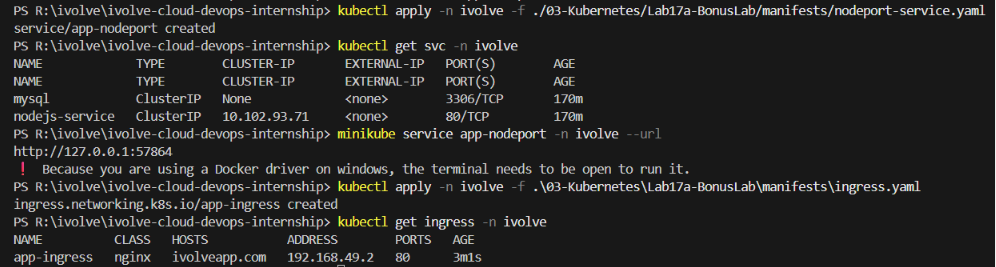
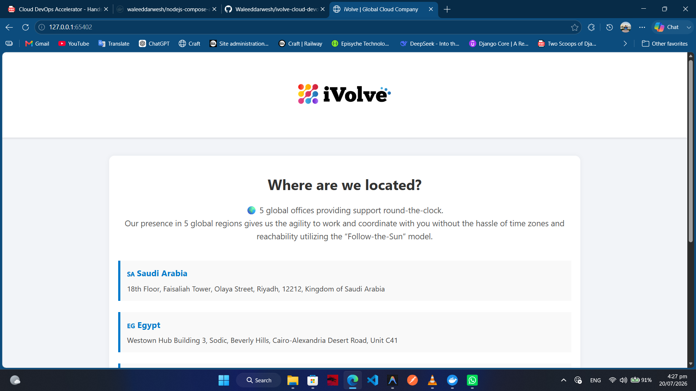
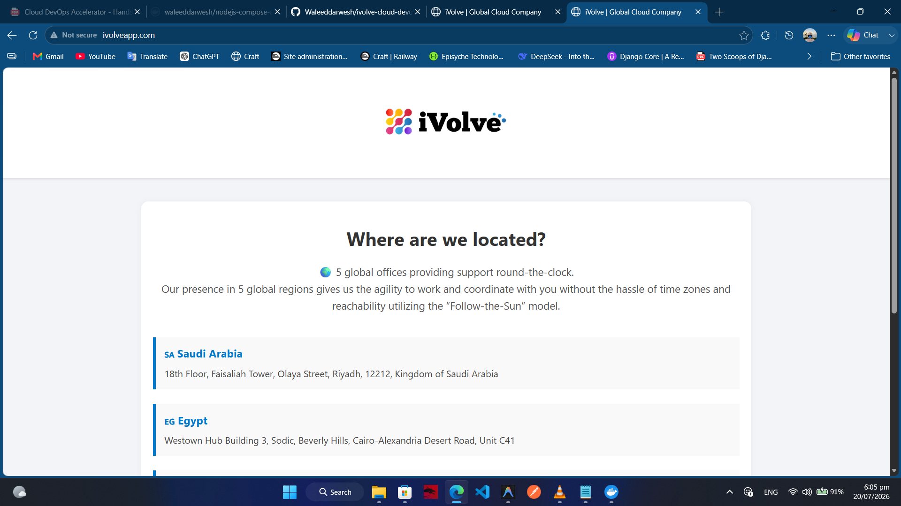

# ☸️ Bonus Lab: Exposing Applications Using NodePort and Ingress

## 📌 Overview

By default, Kubernetes applications are only accessible from within the cluster. To allow users or external systems to access an application, Kubernetes provides multiple methods for exposing Services.

In this bonus lab, the previously deployed Node.js application is exposed using two different approaches:

1. **NodePort Service** – exposes the existing application by making the Service available on a static port on every Kubernetes node.
2. **Ingress** – routes incoming HTTP/HTTPS requests through an Ingress Controller to the existing ClusterIP Service.

These methods demonstrate two common approaches for exposing Kubernetes applications outside the cluster.

---

## 🎯 Objectives

- Understand different Kubernetes Service exposure methods.
- Expose an application using a NodePort Service.
- Configure an Ingress resource.
- Route HTTP traffic using host-based rules.
- Compare NodePort and Ingress.
- Verify external access to the application.

---

## 📂 Project Structure

```text
Lab17-Expose-Application/
│
├── manifests/
│   ├── nodeport-service.yaml
│   └── ingress.yaml
│
├── README.md
└── Screenshots/
    ├── expose_application.png
    ├── nodeport_access.png
    └── ingress_access.png
```

---

## 🛠 Technologies Used

- Kubernetes
- kubectl
- YAML
- NodePort Service
- ClusterIP Service
- Ingress
- Ingress Controller
- Minikube

---

## ✅ Prerequisites

Before starting this lab, ensure you have:

- Kubernetes cluster running
- kubectl configured
- Existing Node.js Deployment
- Existing ClusterIP Service (`nodejs-service`)
- Ingress Controller installed

Verify the application is running:

```bash
kubectl get pods
kubectl get svc
```

---

# 📖 Understanding Service Types

Kubernetes provides several Service types for exposing applications.

| Service Type | Description |
|--------------|-------------|
| ClusterIP | Internal communication within the cluster |
| NodePort | Exposes the application on every node using a static port |
| LoadBalancer | Creates an external load balancer (Cloud providers) |
| ExternalName | Maps a Service to an external DNS name |

In previous labs, the application was exposed internally using a **ClusterIP** Service.

This lab demonstrates two additional methods for exposing applications externally.

---

# 📖 Understanding NodePort

A **NodePort Service** automatically creates a ClusterIP Service and extends it by exposing the Service on a static port on every Kubernetes node.

Traffic flow:

```text
Client
    │
    ▼
Node IP:30080
    │
    ▼
NodePort Service
    │
    ▼
Application Pod
```

Example:

```text
http://192.168.49.2:30080
```

NodePort characteristics:

- Accessible using any node IP
- Uses ports between **30000–32767**
- Simple to configure
- Suitable for development and testing

---

# 📖 Understanding Ingress

An **Ingress** provides HTTP and HTTPS routing into the cluster.

Instead of exposing every application using a different NodePort, a single Ingress Controller receives incoming requests and forwards them to the correct Service.

Traffic flow:

```text
Client
    │
    ▼
Ingress Controller
    │
    ▼
Ingress Resource
    │
    ▼
ClusterIP Service
    │
    ▼
Application Pod
```

Example:

```text
http://ivolveapp.com
```

Ingress benefits:

- Host-based routing
- Path-based routing
- TLS/HTTPS support
- Centralized traffic management
- Multiple applications can share one external IP

---

## 📋 Lab Requirements

### 1. Create a NodePort Service

Create `nodeport-service.yaml`

```yaml
apiVersion: v1
kind: Service
metadata:
  name: app-nodeport
  namespace: ivolve

spec:
  type: NodePort

  selector:
    app: nodejs-app

  ports:
    - port: 80
      targetPort: 3000
      nodePort: 30080
```

### Manifest Breakdown

| Field | Description |
|---------|-------------|
| `type: NodePort` | Exposes the Service externally |
| `targetPort` | Node.js container port |
| `port` | Internal Service port |
| `nodePort` | External port on every node |

---

### 2. Apply the NodePort Service

```bash
kubectl apply -f manifests/nodeport-service.yaml -n ivolve
```

Expected Output

```text
service/app-nodeport created
```

---

### 3. Verify the Service

```bash
kubectl get svc -n ivolve
```

Expected Output

```text
NAME           TYPE       CLUSTER-IP      PORT(S)
app-nodeport   NodePort   10.xx.xx.xx     80:30080/TCP
```

---

### 4. Access the Application

Retrieve the Minikube IP:

```bash
minikube ip
```

Open the application:

```text
http://<MINIKUBE-IP>:30080
```

The Node.js application should be displayed.

> **⚠️ Note (Minikube with Docker Driver on Windows)**
>
> If you are running **Minikube using the Docker driver on Windows**, the NodePort Service is **not directly accessible** using the Minikube IP (for example, `http://192.168.49.2:30080`).
>
> Instead, use the following command to create a local tunnel to the NodePort Service:
>
> ```bash
> minikube service app-nodeport -n ivolve --url
> ```
>
> Example output:
>
> ```text
> http://127.0.0.1:65402
> ```
> Access the application using the generated URL.
>
> **Important:** Keep the terminal running while accessing the application, as the tunnel is active only while the command is running.
>

---
### 5. Enable the NGINX Ingress Controller

Before creating an Ingress resource, enable the **NGINX Ingress Controller** in Minikube.

```bash
minikube addons enable ingress
```

Expected Output

```text
🌟 The 'ingress' addon is enabled
```

> **Note:** The Ingress Controller watches Ingress resources and routes external HTTP/HTTPS traffic to Kubernetes Services. Without an Ingress Controller, the Ingress resource will be created, but it will not receive an external address or route any traffic.

Verify that the controller is running:

```bash
kubectl get pods -n ingress-nginx
```

Expected Output

```text
NAME                                        READY   STATUS    RESTARTS   AGE
ingress-nginx-controller-xxxxxxxxxx         1/1     Running   0          1m
```

---

### 6. Create the Ingress Resource

Create `ingress.yaml`

```yaml
apiVersion: networking.k8s.io/v1
kind: Ingress

metadata:
  name: app-ingress

spec:
  ingressClassName: nginx

  rules:
    - host: ivolveapp.com

      http:
        paths:
          - path: /
            pathType: Prefix

            backend:
              service:
                name: nodejs-service

                port:
                  number: 80
```

### Manifest Breakdown

| Field | Description |
|---------|-------------|
| `ingressClassName` | Specifies that the NGINX Ingress Controller should manage this Ingress |
| `host` | Domain name used to access the application |
| `path` | URL path to match |
| `backend` | Destination Service |
| `service.name` | Existing ClusterIP Service |

---

### 7. Apply the Ingress

```bash
kubectl apply -f manifests/ingress.yaml -n ivolve
```

Expected Output

```text
ingress.networking.k8s.io/app-ingress created
```

---

### 8. Verify the Ingress

```bash
kubectl get ingress -n ivolve
```

Expected Output

```text
NAME          CLASS   HOSTS           ADDRESS         PORTS   AGE
app-ingress   nginx   ivolveapp.com   192.168.xx.xx    80      10s
```

---

### 9. Configure Local DNS Resolution

Add the following entry to your local **hosts** file:

**Windows**

```text
C:\Windows\System32\drivers\etc\hosts
```

**Linux / macOS**

```text
/etc/hosts
```

Add:

```text
192.168.49.2 ivolveapp.com
```

Replace `192.168.49.2` with the IP returned by:

```bash
minikube ip
```

> **⚠️ Note (Minikube with Docker Driver on Windows)**
>
> If you are running **Minikube using the Docker driver on Windows**, the Minikube IP is isolated inside the Docker VM and cannot be reached directly from the host.
> 
> To access the Ingress, you must run `minikube tunnel` in a separate terminal and map the hostname to localhost (`127.0.0.1`) instead:
>
> ```text
> 127.0.0.1 ivolveapp.com
> ```
>
> Ensure `minikube tunnel` remains running while you access the application.

You can now access the application at:

```text
http://ivolveapp.com
```
---

### 10. Access the Application

Open your browser and navigate to:

```text
http://ivolveapp.com
```

The request is routed through the Ingress Controller to the ClusterIP Service and finally to the Node.js application.

---

## 🔄 Traffic Flow Comparison

### NodePort

```text
Client
    │
    ▼
Node IP:30080
    │
    ▼
NodePort Service
    │
    ▼
Application Pod
```

---

### Ingress

```text
Client
    │
    ▼
Ingress Controller
    │
    ▼
Ingress Resource
    │
    ▼
ClusterIP Service
    │
    ▼
Application Pod
```

---

## 🚦 NodePort vs Ingress

| Feature | NodePort | Ingress |
|----------|----------|----------|
| External Access | ✅ | ✅ |
| HTTP Routing | ❌ | ✅ |
| HTTPS Support | ❌ | ✅ |
| Multiple Applications | ❌ | ✅ |
| Single External Entry Point | ❌ | ✅ |
| Production Ready | Limited | Recommended |

---

## 🧪 Verification

### Verify the NodePort Service

```bash
kubectl get svc -n ivolve
```

### Verify the Ingress

```bash
kubectl get ingress -n ivolve
```

### Describe the Ingress

```bash
kubectl describe ingress app-ingress -n ivolve
```

### Test External Access

#### Linux / macOS

Test the NodePort Service:

```bash
curl http://<MINIKUBE-IP>:30080
```

Test the Ingress:

```bash
curl -H "Host: ivolveapp.com" http://<MINIKUBE-IP>
```

---

#### Windows (Minikube with Docker Driver)

**NodePort**

Since the Minikube IP is not directly reachable when using the Docker driver on Windows, expose the service through Minikube:

```bash
minikube service app-nodeport -n ivolve --url
```

Example output:

```text
http://127.0.0.1:65402
```

You can also verify using:

```bash
curl http://127.0.0.1:<generated-port>
```

> **Note:** Keep the terminal running while using `minikube service`, as it creates a temporary tunnel.

---

**Ingress**

Start the Minikube tunnel:

```bash
minikube tunnel
```

Ensure your hosts file contains:

```text
127.0.0.1 ivolveapp.com
```

Then verify the Ingress:

```bash
curl -H "Host: ivolveapp.com" http://127.0.0.1
```

> **Note:** Keep the `minikube tunnel` terminal open while accessing the application.

---

### Expected Result

- ✅ NodePort Service created successfully.
- ✅ Ingress resource configured successfully.
- ✅ Application accessible through the NodePort Service.
- ✅ Application accessible through the configured Ingress hostname.
- ✅ Requests correctly routed to the Node.js application.

---

## 🌍 Real-World Use Cases

### NodePort

- Local development
- Testing environments
- Small Kubernetes clusters
- Learning Kubernetes networking

### Ingress

- Production environments
- Microservices architectures
- Multi-domain applications
- HTTPS termination
- API Gateways

---

## 🧹 Cleanup

> **Note:** Skip this section if you are continuing to the next lab.

Delete the NodePort Service:

```bash
kubectl delete service app-nodeport -n ivolve
```

Delete the Ingress:

```bash
kubectl delete ingress app-ingress -n ivolve
```

---

## 📸 Screenshots

| Description | Image |
|------------|-------|
| Creating and verifying **NodePort Service** and **Ingress** resources |  |
| Successfully accessing the Node.js application through the **NodePort Service** |  |
| Successfully accessing the Node.js application through **NGINX Ingress** using the configured host (`ivolveapp.com`) |  |

---

## 📚 Key Learning Outcomes

After completing this lab, you will be able to:

- Expose Kubernetes applications externally.
- Configure a NodePort Service.
- Configure an Ingress resource.
- Understand HTTP routing in Kubernetes.
- Compare NodePort and Ingress.
- Access applications using both approaches.

---

## 💡 Best Practices

- Use **ClusterIP** for internal communication.
- Use **NodePort** for development and testing.
- Use **Ingress** for production workloads.
- Configure TLS for public applications.
- Keep Services decoupled from application Pods.
- Use meaningful hostnames and DNS records.
- Prefer Ingress over multiple NodePort Services for web applications.

---

## ✅ Result

Successfully exposed the existing **Node.js application** using two Kubernetes networking mechanisms.

- Configured a **NodePort Service** to expose the application on a static port for external access.
- Configured an **NGINX Ingress** resource to route HTTP requests from a custom hostname to the existing **ClusterIP Service**.
- Verified that both exposure methods correctly routed client requests to the application Pod.

This lab demonstrates the difference between basic Service exposure using **NodePort** and production-oriented traffic management using **Ingress**.