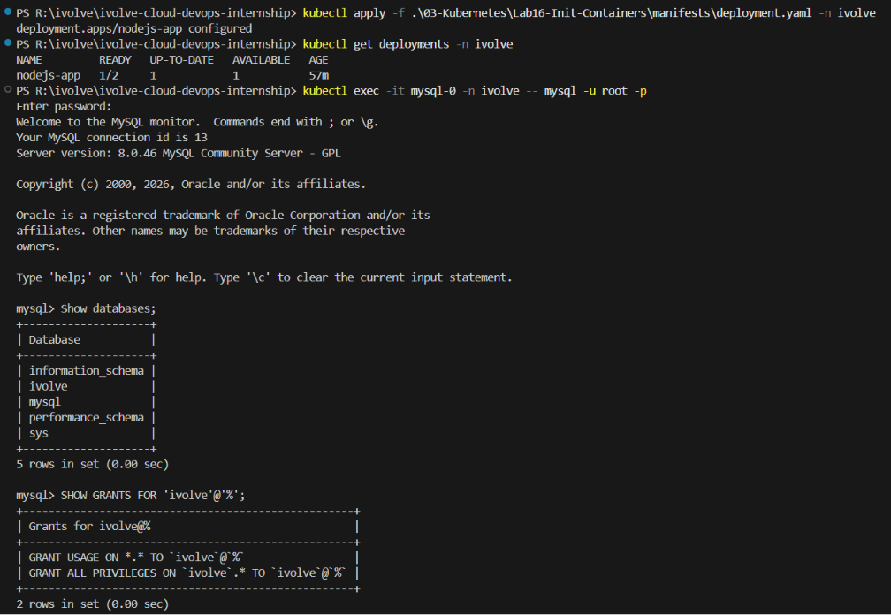

# ☸️ Lab 16: Kubernetes Init Container for Pre-Deployment Database Setup

## 📌 Overview

Applications often depend on external resources such as databases before they can start successfully. Instead of embedding database initialization logic inside the application, Kubernetes **Init Containers** allow setup tasks to be completed before the main application container starts.

In this lab, the existing **Node.js Deployment** is enhanced with an **Init Container** that connects to the MySQL database before the application starts. The Init Container creates the **ivolve** database (if it does not already exist) and grants the **ivolve** application user the required privileges.

Database connection information is securely provided through Kubernetes **ConfigMaps** and **Secrets**, while the main application continues using the same Deployment, Persistent Volume, and ClusterIP Service from the previous lab.

Finally, the application is verified by confirming that the Deployment, Service, and Pods are running correctly. Because a ResourceQuota is applied to the namespace, only one replica is able to run while the second replica remains pending until additional resources become available.

---

## 🎯 Objectives

- Understand Kubernetes Init Containers.
- Execute database initialization before application startup.
- Use the MySQL client inside an Init Container.
- Consume configuration from ConfigMaps and Secrets.
- Create a database only if it does not already exist.
- Grant application user privileges automatically.
- Verify database initialization manually.
- Understand the execution order of Init Containers.
- Observe how a ResourceQuota affects Deployment replica scheduling.

---

## 📂 Project Structure

```text
Lab16-InitContainers/
│
├── manifests/
│   └── deployment.yaml
│
├── README.md
└── Screenshots/
    └── init-container_lab.png
```

---

## 🛠 Technologies Used

- Kubernetes
- kubectl
- YAML
- Deployment
- Init Container
- MySQL Client
- ConfigMaps
- Kubernetes Secrets
- ClusterIP Service
- Persistent Volume Claim (PVC)
- Node.js
- MySQL
- Minikube

---

## ✅ Prerequisites

Before starting this lab, ensure the following resources already exist:

- Kubernetes cluster
- Running MySQL StatefulSet (Lab 14)
- ConfigMap (`mysql-config`)
- Secret (`mysql-secret`)
- Persistent Volume
- Persistent Volume Claim
- ClusterIP Service
- Docker image for the Node.js application

Verify the MySQL Pod:

```bash
kubectl get pods -n ivolve
```

Expected:

```text
mysql-0   Running
```

---

# 📖 Understanding Init Containers

An **Init Container** is a special container that runs **before** the main application container starts.

Unlike regular containers:

- It always runs first.
- It must complete successfully.
- The application container does not start until every Init Container exits successfully.

This makes Init Containers ideal for:

- Database initialization
- Schema migrations
- Waiting for dependencies
- Downloading configuration
- Performing setup tasks

Execution order:

```text
Init Container
      │
      ▼
Completed Successfully
      │
      ▼
Application Container Starts
```

---

# 📖 Why Use an Init Container?

Without an Init Container, the application may start before the database is ready.

Instead of embedding initialization logic into the application code, Kubernetes allows setup tasks to run independently.

Benefits include:

- Separation of responsibilities
- Simpler application code
- Reliable startup sequence
- Repeatable initialization
- Easier maintenance

---

# 📖 Database Initialization

The Init Container connects to the MySQL server using the root account and executes SQL statements to prepare the application database.

It performs the following operations:

- Creates the **ivolve** database if it does not already exist.
- Grants all privileges on the database to the **ivolve** user.
- Flushes MySQL privileges.

Example SQL:

```sql
CREATE DATABASE IF NOT EXISTS ivolve;

GRANT ALL PRIVILEGES
ON ivolve.*
TO 'ivolve'@'%';

FLUSH PRIVILEGES;
```

Using `IF NOT EXISTS` makes the initialization **idempotent**, meaning it can run multiple times without causing errors.

---

# 📖 Environment Variables

The Init Container retrieves database connection information from existing Kubernetes resources.

Configuration comes from:

**ConfigMap**

- DB_HOST
- DB_USER

**Secret**

- DB_PASSWORD
- MYSQL_ROOT_PASSWORD

This avoids hardcoding sensitive information inside the Deployment manifest.

---

## 📋 Lab Requirements

### 1. Modify the Existing Deployment

Update `deployment.yaml` to include an Init Container before the Node.js application container.

The Deployment should include:

- Two replicas
- Init Container using `mysql:8.0`
- MySQL root password from Secret
- Database host from ConfigMap
- SQL commands executed before startup
- Environment variables from ConfigMap and Secret
- Persistent Volume Claim
- Node Selector
- Toleration

Example Init Container:

```yaml
initContainers:
  - name: create-db
    image: mysql:8.0
    env:
      - name: DB_HOST
      valueFrom:
        configMapKeyRef:
          name: mysql-config
          key: DB_HOST
      - name: MYSQL_ROOT_PASSWORD
        valueFrom:
          secretKeyRef:
            name: mysql-secret
            key: MYSQL_ROOT_PASSWORD
    resources:
      requests:
        cpu: 100m
        memory: 128Mi
      limits:
        cpu: 200m
        memory: 256Mi
    command:
      - sh
      - -c
      - |
        mysql -h "$DB_HOST" -uroot -p"$MYSQL_ROOT_PASSWORD" \
        -e "CREATE DATABASE IF NOT EXISTS ivolve;"
```
Full Updated `deployment.yaml`:

```yaml
apiVersion: apps/v1
kind: Deployment
metadata:
  name: nodejs-app
  namespace: ivolve

spec:
  replicas: 2

  selector:
    matchLabels:
      app: nodejs-app

  template:
    metadata:
      labels:
        app: nodejs-app

    spec:
      nodeSelector:
        node: worker

      tolerations:
        - key: node
          operator: Equal
          value: worker
          effect: NoSchedule

      initContainers:
        - name: create-db
          image: mysql:8.0
          env:
            - name: DB_HOST
              valueFrom:
                configMapKeyRef:
                  name: mysql-config
                  key: DB_HOST
            - name: MYSQL_ROOT_PASSWORD
              valueFrom:
                secretKeyRef:
                  name: mysql-secret
                  key: MYSQL_ROOT_PASSWORD
          resources:
            requests:
              cpu: 100m
              memory: 128Mi
            limits:
              cpu: 200m
              memory: 256Mi
          command:
            - sh
            - -c
            - |
              mysql -h "$DB_HOST" -uroot -p"$MYSQL_ROOT_PASSWORD" \
              -e "CREATE DATABASE IF NOT EXISTS ivolve;"

      containers:
        - name: nodejs-app
          image: waleeddarwesh/nodejs-compose-app:latest

          ports:
            - containerPort: 3000

          env:
            - name: DB_HOST
              valueFrom:
                configMapKeyRef:
                  name: mysql-config
                  key: DB_HOST

            - name: DB_USER
              valueFrom:
                configMapKeyRef:
                  name: mysql-config
                  key: DB_USER

            - name: DB_PASSWORD
              valueFrom:
                secretKeyRef:
                  name: mysql-secret
                  key: DB_PASSWORD

          resources:
            requests:
              cpu: 250m
              memory: 256Mi
            limits:
              cpu: 500m
              memory: 512Mi

          volumeMounts:
            - name: app-storage
              mountPath: /app/storage

      volumes:
        - name: app-storage
          persistentVolumeClaim:
            claimName: app-logs-pvc
```
---

### 2. Apply the Updated Deployment

```bash
kubectl apply -f manifests/deployment.yaml -n ivolve
```

Expected Output

```text
deployment.apps/nodejs-app configured
```

---

### 3. Verify the Init Container

Check Pod initialization:

```bash
kubectl describe pod <pod-name> -n ivolve
```

Expected:

```text
Init Containers:
  create-db:
    State: Terminated
    Reason: Completed
```

---

### 4. Verify the Deployment

```bash
kubectl get deployments -n ivolve
```

Expected Output

```text
NAME         READY
nodejs-app   1/2
```

> **Note:** Due to the ResourceQuota applied to the `ivolve` namespace, only one Pod can be scheduled. The second replica remains in the **Pending** state until additional resources become available.

---

### 5. Verify the Pods

```bash
kubectl get pods -n ivolve
```

Expected Output

```text
NAME                          READY   STATUS
mysql-0                       1/1     Running   
nodejs-app-xxxxxxxxxxx        1/1     Running   
```

---

### 6. Verify the Database

Connect to MySQL:

```bash
kubectl exec -it mysql-0 -n ivolve -- mysql -u root -p
```

Show databases:

```sql
SHOW DATABASES;
```

Expected Output

```text
+--------------------+
| Database           |
+--------------------+
| information_schema |
| ivolve             |
| mysql              |
| performance_schema |
| sys                |
+--------------------+
```

---

### 7. Verify User Privileges

Execute:

```sql
SHOW GRANTS FOR 'ivolve'@'%';
```

Expected Output

```text
+----------------------------------------------------+
| Grants for ivolve@%                                |
+----------------------------------------------------+
| GRANT USAGE ON *.* TO `ivolve`@`%`                 |
| GRANT ALL PRIVILEGES ON `ivolve`.* TO `ivolve`@`%` |
+----------------------------------------------------+
```

This confirms the Init Container successfully configured the database.

---

## 🚦 Why Init Containers?

| Init Container | Application Container |
|---------------|-----------------------|
| Runs before the application | Runs after initialization |
| Executes setup tasks | Runs the application |
| Must complete successfully | Starts only after Init Containers finish |
| Temporary | Long-running |
| Ideal for initialization | Handles application traffic |

---

## 🧪 Verification

Verify the Deployment:

```bash
kubectl get deployment -n ivolve
```

Verify the Pods:

```bash
kubectl get pods -n ivolve
```

Verify Init Container status:

```bash
kubectl describe pod <pod-name> -n ivolve
```

Verify database creation:

```bash
SHOW DATABASES;
```

Verify privileges:

```sql
SHOW GRANTS FOR 'ivolve'@'%';
```

Expected:

- Deployment is Ready
- Pods are Running
- Init Container completed successfully
- Database created
- User privileges granted
- Application starts successfully

---

## 🌍 Real-World Use Cases

Init Containers are commonly used for:

- Database initialization
- Database schema migrations
- Waiting for external services
- Downloading configuration files
- Preparing shared storage
- Registering services
- Bootstrapping distributed applications

---

## 🧹 Cleanup

> **Note:** Skip this section if you are continuing to the next lab.

Delete the Deployment:

```bash
kubectl delete deployment nodejs-app -n ivolve
```

Delete the Service:

```bash
kubectl delete service nodejs-service -n ivolve
```

---

## 📸 Screenshots

| Description | Image |
|------------|-------|
| Deploying the updated Node.js application with an Init Container, verifying successful initialization, and confirming the database and user privileges in MySQL |  |

---

## 📚 Key Learning Outcomes

After completing this lab, you will be able to:

- Understand Kubernetes Init Containers.
- Execute initialization tasks before application startup.
- Configure Init Containers using ConfigMaps and Secrets.
- Automate MySQL database creation.
- Grant database privileges programmatically.
- Verify Init Container execution.
- Separate initialization logic from application code.

---

## 💡 Best Practices

- Keep Init Containers focused on a single task.
- Make initialization scripts idempotent using `IF NOT EXISTS`.
- Store credentials in Kubernetes Secrets.
- Avoid embedding initialization logic inside the application.
- Use Init Containers for dependency checks and database preparation.
- Keep SQL initialization scripts lightweight and repeatable.

---

## ✅ Result

Successfully enhanced the existing **Node.js Deployment** by adding an **Init Container** that automatically prepares the MySQL environment before the application starts. The Init Container securely consumed configuration from **ConfigMaps** and **Secrets**, created the **ivolve** database if it did not already exist, granted the application user the required privileges, and completed successfully before the main application container was started. Due to the **ResourceQuota** applied to the `ivolve` namespace, only one replica was able to run while the second remained in the **Pending** state.