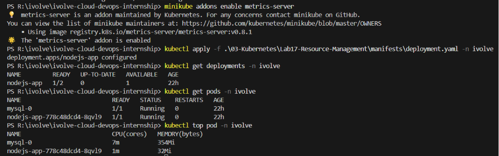
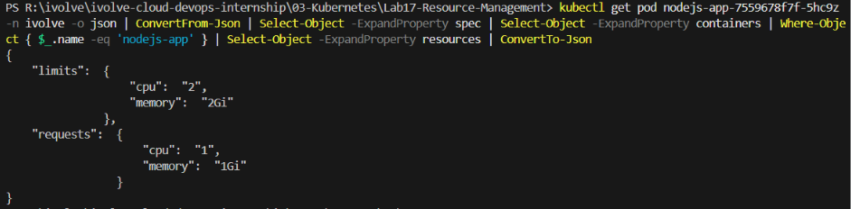

# ☸️ Lab 17: Pod Resource Management with CPU and Memory Requests and Limits

## 📌 Overview

Kubernetes allows administrators to control how much **CPU** and **memory** each container can consume by defining **resource requests** and **resource limits**. Requests guarantee a minimum amount of resources for a container, while limits define the maximum amount a container is allowed to use.

In this lab, the existing **Node.js Deployment** is updated to include explicit **resource requests** and **resource limits** for both CPU and memory. After applying the updated configuration, `kubectl describe pod` is used to verify that the resource specifications are correctly applied, and `kubectl top pod` is used to monitor real-time resource consumption.

Properly managing Pod resources is essential for cluster stability, preventing resource contention, and ensuring fair resource distribution across workloads.

---

## 🎯 Objectives

- Understand Kubernetes resource requests and limits.
- Update the existing Node.js Deployment with resource specifications.
- Configure CPU and memory requests.
- Configure CPU and memory limits.
- Verify applied resource configurations using `kubectl describe pod`.
- Monitor real-time resource usage using `kubectl top pod`.
- Understand the difference between requests and limits.
- Understand how the Kubernetes scheduler uses resource requests.

---

## 📂 Project Structure

```text
Lab17-Resource-Management/
│
├── manifests/
│   └── deployment.yaml
│
├── README.md
└── Screenshots/
    └── resource-management_lab.png
```

---

## 🛠 Technologies Used

- Kubernetes
- kubectl
- YAML
- Deployment
- Resource Requests
- Resource Limits
- Metrics Server
- ConfigMaps
- Kubernetes Secrets
- Persistent Volume Claim (PVC)
- Node.js
- Minikube

---

## ✅ Prerequisites

Before starting this lab, ensure the following resources already exist:

- Kubernetes cluster
- Running MySQL StatefulSet (Lab 14)
- Node.js Deployment with Init Container (Lab 16)
- ConfigMap (`mysql-config`)
- Secret (`mysql-secret`)
- Persistent Volume Claim
- ClusterIP Service
- Metrics Server installed and running

Verify the current Deployment:

```bash
kubectl get deployments -n ivolve
```

Expected:

```text
NAME         READY
nodejs-app   1/2
```

Verify the Metrics Server:

```bash
kubectl top nodes
```

> **Note:** If the Metrics Server is not installed, enable it on Minikube using:
> ```bash
> minikube addons enable metrics-server
> ```

---

# 📖 Understanding Resource Requests

A **resource request** specifies the **minimum** amount of CPU or memory that a container needs to run.

The Kubernetes scheduler uses resource requests to decide which node to place the Pod on. A Pod is only scheduled on a node that has enough available resources to satisfy the request.

Key characteristics:

- Guaranteed minimum resources
- Used for Pod scheduling decisions
- Does not limit actual resource consumption
- Affects which node the Pod is assigned to
- Contributes to the node's resource allocation

Example:

```yaml
resources:
  requests:
    cpu: "1"
    memory: 1Gi
```

This guarantees the container will have at least **1 vCPU** and **1 GiB** of memory available.

---

# 📖 Understanding Resource Limits

A **resource limit** specifies the **maximum** amount of CPU or memory that a container is allowed to consume.

If a container exceeds its memory limit, Kubernetes terminates the container with an **OOMKilled** (Out of Memory Killed) status. If a container exceeds its CPU limit, Kubernetes **throttles** the container's CPU usage.

Key characteristics:

- Maximum resource consumption boundary
- CPU exceeding the limit causes throttling
- Memory exceeding the limit causes termination (OOMKilled)
- Prevents a single container from consuming all node resources
- Protects other workloads on the same node

Example:

```yaml
resources:
  limits:
    cpu: "2"
    memory: 2Gi
```

This allows the container to use up to **2 vCPUs** and **2 GiB** of memory.

---

# 📖 Understanding CPU Units

Kubernetes measures CPU resources in **CPU units**.

| Value | Description |
|-------|-------------|
| `1` | 1 full vCPU core |
| `500m` | 500 millicores (0.5 vCPU) |
| `250m` | 250 millicores (0.25 vCPU) |
| `100m` | 100 millicores (0.1 vCPU) |

The `m` suffix stands for **millicores**. One vCPU equals 1000 millicores.

---

# 📖 Understanding Memory Units

Kubernetes measures memory in **bytes** using standard suffixes.

| Suffix | Description |
|--------|-------------|
| `Ki` | Kibibytes (1024 bytes) |
| `Mi` | Mebibytes (1024 Ki) |
| `Gi` | Gibibytes (1024 Mi) |
| `Ti` | Tebibytes (1024 Gi) |

Example: `1Gi` equals 1,073,741,824 bytes.

---

# 📖 Understanding Requests vs Limits

The relationship between resource requests and limits determines how Kubernetes manages container resources:

```text
                  Request                    Limit
                    │                          │
    ────────────────┼──────────────────────────┼────────────────
                    │                          │
              Guaranteed                 Maximum Allowed
              Minimum                    Consumption
```

| Aspect | Request | Limit |
|--------|---------|-------|
| Purpose | Minimum guaranteed resources | Maximum allowed resources |
| Scheduling | Used by the scheduler | Not used for scheduling |
| CPU behavior | Guaranteed CPU time | CPU throttling if exceeded |
| Memory behavior | Guaranteed memory | OOMKilled if exceeded |
| Required | No (but recommended) | No (but recommended) |

Best practice is to set the request lower than or equal to the limit:

```text
Request ≤ Limit
```

---

# 📖 Understanding the Kubernetes Scheduler

When a Pod is created, the Kubernetes scheduler evaluates each node's available resources.

Scheduling flow:

```text
Pod Created
    │
    ▼
Scheduler Reads Resource Requests
    │
    ▼
Evaluates Available Node Resources
    │
    ▼
Selects Suitable Node
    │
    ▼
Pod Scheduled on Node
```

If no node has enough available resources, the Pod remains in the **Pending** state.

---

## 📋 Lab Requirements

### 1. Update the Existing Deployment

Update `deployment.yaml` to include resource requests and limits for the Node.js application container.

The updated resource configuration:

**Resource Requests:**

| Resource | Value | Description |
|----------|-------|-------------|
| CPU      | `1`   | 1 vCPU (1000 millicores) |
| Memory   | `1Gi` | 1 Gibibyte |

**Resource Limits:**

| Resource | Value | Description |
|----------|-------|-------------|
| CPU      | `2`   | 2 vCPUs (2000 millicores) |
| Memory   | `2Gi` | 2 Gibibytes |

Updated container specification:

```yaml
containers:
  - name: nodejs-app
    image: waleeddarwesh/nodejs-compose-app:latest

    ports:
      - containerPort: 3000

    env:
      - name: DB_HOST
        valueFrom:
          configMapKeyRef:
            name: mysql-config
            key: DB_HOST

      - name: DB_USER
        valueFrom:
          configMapKeyRef:
            name: mysql-config
            key: DB_USER

      - name: DB_PASSWORD
        valueFrom:
          secretKeyRef:
            name: mysql-secret
            key: DB_PASSWORD

    resources:
      requests:
        cpu: "1"
        memory: 1Gi
      limits:
        cpu: "2"
        memory: 2Gi

    volumeMounts:
      - name: app-storage
        mountPath: /app/storage
```

Full Updated `deployment.yaml`:

```yaml
apiVersion: apps/v1
kind: Deployment
metadata:
  name: nodejs-app
  namespace: ivolve

spec:
  replicas: 2

  selector:
    matchLabels:
      app: nodejs-app

  template:
    metadata:
      labels:
        app: nodejs-app

    spec:
      imagePullSecrets:
        - name: dockerhub-secret

      nodeSelector:
        node: worker

      tolerations:
        - key: node
          operator: Equal
          value: worker
          effect: NoSchedule

      initContainers:
        - name: create-db
          image: mysql:8.0
          env:
            - name: DB_HOST
              valueFrom:
                configMapKeyRef:
                  name: mysql-config
                  key: DB_HOST
            - name: MYSQL_ROOT_PASSWORD
              valueFrom:
                secretKeyRef:
                  name: mysql-secret
                  key: MYSQL_ROOT_PASSWORD
          resources:
            requests:
              cpu: 100m
              memory: 128Mi
            limits:
              cpu: 200m
              memory: 256Mi
          command:
            - sh
            - -c
            - |
              mysql -h "$DB_HOST" -uroot -p"$MYSQL_ROOT_PASSWORD" \
              -e "CREATE DATABASE IF NOT EXISTS ivolve;"

      containers:
        - name: nodejs-app
          image: waleeddarwesh/nodejs-compose-app:latest

          ports:
            - containerPort: 3000

          env:
            - name: DB_HOST
              valueFrom:
                configMapKeyRef:
                  name: mysql-config
                  key: DB_HOST

            - name: DB_USER
              valueFrom:
                configMapKeyRef:
                  name: mysql-config
                  key: DB_USER

            - name: DB_PASSWORD
              valueFrom:
                secretKeyRef:
                  name: mysql-secret
                  key: DB_PASSWORD

          resources:
            requests:
              cpu: "1"
              memory: 1Gi
            limits:
              cpu: "2"
              memory: 2Gi

          volumeMounts:
            - name: app-storage
              mountPath: /app/storage

      volumes:
        - name: app-storage
          persistentVolumeClaim:
            claimName: app-logs-pvc
```

---

### 2. Apply the Updated Deployment

```bash
kubectl apply -f manifests/deployment.yaml -n ivolve
```

Expected Output

```text
deployment.apps/nodejs-app configured
```

---

### 3. Resolve the Rolling Update Deadlock

After applying the updated Deployment, the rollout may appear stuck. The new Pod cannot be created because the **ResourceQuota** (`pods: "2"`) is fully consumed by the existing `mysql-0` and the old `nodejs-app` Pod.

Check the ReplicaSets:

```bash
kubectl get rs -n ivolve
```

Expected Output

```text
NAME                    DESIRED   CURRENT   READY   AGE
nodejs-app-xxxxxxxxxx   1         0         0       1m
nodejs-app-yyyyyyyyyy   1         1         1       23h
```

The new ReplicaSet has `DESIRED: 1` but `CURRENT: 0` because the ResourceQuota prevents creating additional Pods. The rolling update strategy does not terminate the old Pod until the new one is ready, causing a **deadlock**.

To resolve this, temporarily increase the ResourceQuota:

```bash
kubectl patch resourcequota pod-quota -n ivolve --type merge -p '{"spec":{"hard":{"pods":"4"}}}'
```

> **⚠️ Note for Windows (PowerShell) Users:**
> PowerShell processes single quotes differently, which causes JSON parsing errors. If using PowerShell, escape the double quotes with backticks instead:
> ```powershell
> kubectl patch resourcequota pod-quota -n ivolve --type merge -p "{\`"spec\`":{\`"hard\`":{\`"pods\`":\`"4\`"}}}"
> ```

Expected Output

```text
resourcequota/pod-quota patched
```

Wait for the rollout to complete:

```bash
kubectl rollout status deployment nodejs-app -n ivolve --timeout=60s
```

Expected Output

```text
deployment "nodejs-app" successfully rolled out
```

After the rollout completes, restore the original ResourceQuota:

```bash
kubectl patch resourcequota pod-quota -n ivolve --type merge -p '{"spec":{"hard":{"pods":"2"}}}'
```

> **⚠️ Note for Windows (PowerShell) Users:**
> Like before, use the escaped syntax if running in PowerShell:
> ```powershell
> kubectl patch resourcequota pod-quota -n ivolve --type merge -p "{\`"spec\`":{\`"hard\`":{\`"pods\`":\`"2\`"}}}"
> ```

Expected Output

```text
resourcequota/pod-quota patched
```

> **Note:** Restoring the ResourceQuota does **not** evict already running Pods. Both replicas remain running even though the quota is now `2` (mysql-0 + 2 nodejs-app = 3 Pods). To return to the expected state, delete one of the extra Pods:

```bash
kubectl delete pod <extra-pod-name> -n ivolve
```

The Deployment will attempt to recreate the deleted Pod, but the ResourceQuota will block it, leaving the second replica in the **Pending** state as expected.

> **Note:** This deadlock occurs because the rolling update strategy requires the new Pod to be running before terminating the old one. When the ResourceQuota has no room for an additional Pod, neither the new Pod can be created nor the old Pod can be terminated. Temporarily increasing the quota breaks the deadlock and allows the rollout to proceed.

---

### 4. Verify the Deployment

```bash
kubectl get deployments -n ivolve
```

Expected Output

```text
NAME         READY
nodejs-app   1/2
```

> **Note:** Due to the ResourceQuota applied to the `ivolve` namespace, only one Pod can be scheduled. The second replica remains in the **Pending** state until additional resources become available.

---

### 5. Verify the Pods

```bash
kubectl get pods -n ivolve
```

Expected Output

```text
NAME                          READY   STATUS
mysql-0                       1/1     Running   
nodejs-app-xxxxxxxxxxx        1/1     Running   
```

---

### 6. Verify Resource Requests and Limits

Use `kubectl describe pod` to confirm that the resource requests and limits are correctly applied:

```bash
kubectl describe pod <pod-name> -n ivolve
```

Look for the **Containers** section in the output:

Expected:

```text
Containers:
  nodejs-app:
    ...
    Limits:
      cpu:     2
      memory:  2Gi
    Requests:
      cpu:     1
      memory:  1Gi
    ...
```

This confirms that the Pod is running with:
- **Requests:** 1 vCPU and 1Gi memory (guaranteed minimum)
- **Limits:** 2 vCPUs and 2Gi memory (maximum allowed)

---

### 7. Monitor Real-Time Resource Usage

Use `kubectl top pod` to monitor the actual CPU and memory consumption of the Pod:

```bash
kubectl top pod -n ivolve
```

Expected Output

```text
NAME                          CPU(cores)   MEMORY(bytes)
mysql-0                       5m           350Mi
nodejs-app-xxxxxxxxxxx        2m           50Mi
```

> **Note:** The `kubectl top` command requires the **Metrics Server** to be installed and running in the cluster. The actual values will vary based on real-time application load.

Compare actual usage against the configured requests and limits:

| Metric | Request | Actual Usage | Limit |
|--------|---------|-------------|-------|
| CPU | 1 (1000m) | ~2m | 2 (2000m) |
| Memory | 1Gi | ~50Mi | 2Gi |

This shows that the application is currently using far less resources than requested, which is normal for idle or low-traffic applications.

---

## 🚦 Why Resource Requests and Limits?

| With Resources Configured | Without Resources Configured |
|--------------------------|------------------------------|
| Predictable scheduling | Unpredictable scheduling |
| Guaranteed minimum resources | No resource guarantees |
| Protection against resource exhaustion | Risk of node resource exhaustion |
| Fair resource distribution | Uncontrolled resource consumption |
| OOMKill protection | Silent memory pressure |
| CPU throttling instead of starvation | CPU starvation possible |

---

## 🧪 Verification

Verify the Deployment:

```bash
kubectl get deployment -n ivolve
```

Verify the Pods:

```bash
kubectl get pods -n ivolve
```

Verify resource requests and limits:

```bash
kubectl describe pod <pod-name> -n ivolve
```

Monitor real-time resource usage:

```bash
kubectl top pod -n ivolve
```

Expected:

- Deployment is Ready
- Pods are Running
- Resource requests are set to 1 CPU and 1Gi memory
- Resource limits are set to 2 CPU and 2Gi memory
- `kubectl top pod` shows real-time resource consumption
- Actual usage is within the configured limits

---

## 🌍 Real-World Use Cases

Resource requests and limits are commonly used for:

- Production workload stability
- Multi-tenant cluster resource isolation
- Cost optimization and capacity planning
- Preventing noisy neighbor problems
- Enforcing resource budgets per team or namespace
- Autoscaling based on resource utilization
- Quality of Service (QoS) classification
- Cluster rightsizing

---

## 🧹 Cleanup

> **Note:** Skip this section if you are continuing to the next lab.

Delete the Deployment:

```bash
kubectl delete deployment nodejs-app -n ivolve
```

Delete the Service:

```bash
kubectl delete service nodejs-service -n ivolve
```

---

## 📸 Screenshots

| Description | Image |
|------------|-------|
| Updating the Node.js Deployment with resource requests and limits, and monitoring real-time resource usage using `kubectl top pod` |  |
| verifying the new Pod resources using `kubectl describe pod`, and confirming the updated resource requests and limits are applied |  |

---

## 📚 Key Learning Outcomes

After completing this lab, you will be able to:

- Understand Kubernetes resource requests and limits.
- Configure CPU and memory requests for containers.
- Configure CPU and memory limits for containers.
- Verify resource configurations using `kubectl describe pod`.
- Monitor real-time resource usage using `kubectl top pod`.
- Understand CPU units (cores and millicores).
- Understand memory units (Ki, Mi, Gi).
- Understand the difference between requests and limits.
- Understand how the scheduler uses resource requests for placement decisions.

---

## 💡 Best Practices

- Always set both resource requests and limits for production workloads.
- Set requests based on actual application resource needs.
- Set limits to prevent runaway resource consumption.
- Monitor actual usage with `kubectl top` and adjust requests accordingly.
- Avoid setting requests equal to limits unless guaranteed QoS is required.
- Use the Metrics Server or Prometheus for long-term resource monitoring.
- Right-size containers by analyzing historical resource usage.
- Consider using Vertical Pod Autoscaler (VPA) for automatic resource tuning.
- Keep resource requests realistic to avoid wasting cluster capacity.

---

## ✅ Result

Successfully updated the existing **Node.js Deployment** to include **resource requests** of **1 vCPU** and **1Gi memory** and **resource limits** of **2 vCPUs** and **2Gi memory**. Verified the applied resource configuration using `kubectl describe pod` and monitored real-time resource consumption using `kubectl top pod`. The Deployment continues to operate with the **Init Container**, **ConfigMaps**, **Secrets**, **Persistent Volume Claim**, **Node Selector**, and **Toleration** from previous labs.
