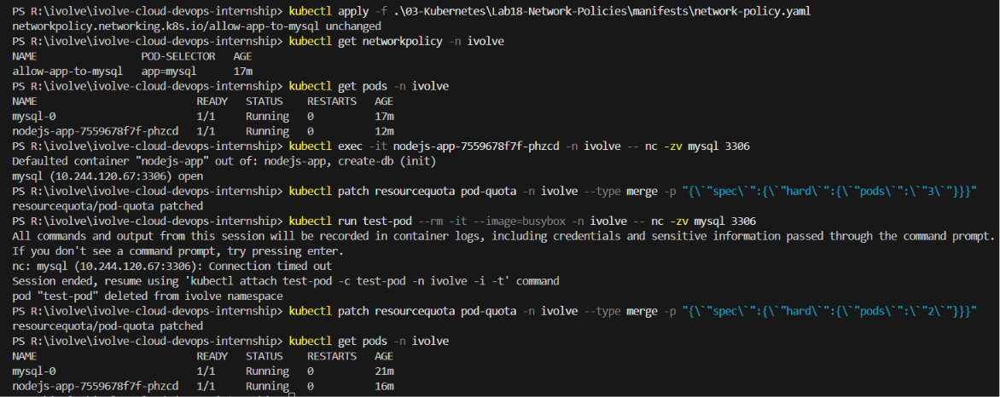

# ☸️ Lab 18: Securing Pod Communication Using Kubernetes Network Policies

## 📌 Overview

By default, Kubernetes allows unrestricted communication between Pods within the same cluster. While this behavior simplifies application connectivity, it is not suitable for production environments where workloads should follow the principle of least privilege.

In this lab, a NetworkPolicy is created to secure communication with the existing MySQL database by allowing only the Node.js application Pods to establish inbound connections on the MySQL port (`3306`). All other Pods are denied access, demonstrating how Kubernetes Network Policies can be used to implement micro-segmentation and strengthen cluster security.

---

## 🎯 Objectives
- Understand Kubernetes Network Policies.
- Restrict Pod-to-Pod communication.
- Create an Ingress NetworkPolicy.
- Allow database access only from authorized application Pods.
- Restrict traffic to the MySQL port (`3306`).
- Verify policy enforcement.
- Understand Kubernetes network isolation.

---

## 📂 Project Structure
```text
Lab18-Network-Policies/
│
├── manifests/
│   └── network-policy.yaml
│
├── README.md
└── Screenshots/
    └── network_policy_lab.png
```

---

## 🛠 Technologies Used
- Kubernetes
- kubectl
- YAML
- NetworkPolicy
- MySQL
- Node.js
- Minikube
- CNI Plugin

---

## ✅ Prerequisites

Before starting this lab, ensure you have:
- Kubernetes cluster running
- `kubectl` configured
- Existing MySQL StatefulSet
- Existing Node.js Deployment
- Existing ClusterIP Services
- A CNI plugin that supports Network Policies (e.g., Calico or Cilium)

Verify the existing resources:
```bash
kubectl get pods -n ivolve
kubectl get svc -n ivolve
```

---

## 📖 Understanding Network Policies

A NetworkPolicy controls how Pods communicate with each other and with external network endpoints.
- Without any NetworkPolicy, Pods can communicate freely inside the cluster.
- Once a NetworkPolicy selects a Pod, all traffic not explicitly allowed by the policy is denied.

This enables Kubernetes administrators to enforce secure communication between workloads.

### Default Kubernetes Networking
By default:
```text
Pod A
   │
   ▼
Pod B
```
Every Pod can communicate with every other Pod. This default behavior is convenient for development but introduces unnecessary security risks in production environments.

### Principle of Least Privilege
Production environments should allow only the communication that is actually required. Instead of allowing every Pod to connect to the MySQL database, only the application Pods should have access.

```text
Node.js Pods
      │
      ▼
   MySQL Pod
```

Other Pods:
```text
Test Pod
      │
      ✖
   MySQL Pod
```

### Understanding Ingress Policies
This lab creates an Ingress NetworkPolicy.
- Ingress policies define which incoming connections are allowed to reach selected Pods.
- Traffic that does not match any rule is automatically denied.

### Traffic Flow

**Without NetworkPolicy**
```text
Any Pod
   │
   ▼
MySQL Pod
```

**With NetworkPolicy**
```text
Node.js Pod          Other Pods
      │                   │
      ▼                   ✖
 MySQL Pod          Access Denied
```

---

## 📋 Lab Requirements

### 1. Create the Network Policy

Create `network-policy.yaml`

**Requirements:**
- **Name:** allow-app-to-mysql
- Select MySQL Pods
- **Policy Type:** Ingress
- Allow traffic only from Pods labeled `app=nodejs-app`
- Allow only TCP port `3306`

**Example:**
```yaml
apiVersion: networking.k8s.io/v1
kind: NetworkPolicy
metadata:
  name: allow-app-to-mysql
  namespace: ivolve
spec:
  podSelector:
    matchLabels:
      app: mysql
  policyTypes:
    - Ingress
  ingress:
    - from:
        - podSelector:
            matchLabels:
              app: nodejs-app
      ports:
        - protocol: TCP
          port: 3306
```

**Manifest Breakdown:**

| Field | Description |
|-------|-------------|
| `podSelector` | Selects the MySQL Pods |
| `policyTypes` | Applies only to incoming traffic |
| `from` | Allows only Node.js Pods |
| `port` | Restricts access to MySQL port 3306 |

### 2. Apply the Network Policy

```bash
kubectl apply -f manifests/network-policy.yaml
```

**Expected Output:**
```text
networkpolicy.networking.k8s.io/allow-app-to-mysql created
```

### 3. Verify the Network Policy

```bash
kubectl get networkpolicy -n ivolve
```

**Expected Output:**
```text
NAME                   POD-SELECTOR
allow-app-to-mysql     app=mysql
```

### 4. Describe the Network Policy

```bash
kubectl describe networkpolicy allow-app-to-mysql -n ivolve
```

Verify that:
- The policy targets MySQL Pods.
- Only Node.js Pods are allowed.
- Only TCP port 3306 is permitted.

---

## 🧪 Verification

Verify the policy exists:
```bash
kubectl get networkpolicy -n ivolve
```

Describe the policy:
```bash
kubectl describe networkpolicy allow-app-to-mysql -n ivolve
```

**Test database connectivity from the Node.js Pod:**
```bash
kubectl exec -it <nodejs-pod> -n ivolve -- nc -zv mysql 3306
```

**Expected:**
```text
mysql (10.x.x.x:3306) open
```

**Test connectivity from another Pod:**

Since the `ivolve` namespace has a strict ResourceQuota of 2 Pods, we must temporarily increase it to spawn a test pod, and then restore it.

1. Temporarily increase the quota to 3:
```bash
kubectl patch resourcequota pod-quota -n ivolve --type merge -p '{"spec":{"hard":{"pods":"3"}}}'
```
*(Windows PowerShell Users: use `kubectl patch resourcequota pod-quota -n ivolve --type merge -p "{\`"spec\`":{\`"hard\`":{\`"pods\`":\`"3\`"}}}"`)*

2. Run the test pod to attempt a connection:
```bash
kubectl run test-pod --rm -it --image=busybox -n ivolve -- nc -zv mysql 3306
```

**Expected:**
```text
nc: mysql (10.x.x.x:3306): Connection timed out
```

3. Restore the strict quota back to 2:
```bash
kubectl patch resourcequota pod-quota -n ivolve --type merge -p '{"spec":{"hard":{"pods":"2"}}}'
```
*(Windows PowerShell Users: use `kubectl patch resourcequota pod-quota -n ivolve --type merge -p "{\`"spec\`":{\`"hard\`":{\`"pods\`":\`"2\`"}}}"`)*

---

## 🔒 Why Network Policies?

| Without NetworkPolicy | With NetworkPolicy |
|-----------------------|--------------------|
| All Pods communicate freely | Only authorized Pods communicate |
| Larger attack surface | Reduced attack surface |
| No traffic filtering | Fine-grained traffic control |
| Less secure | More secure |

---

## 🌍 Real-World Use Cases

Network Policies are commonly used for:
- Protecting databases
- Microservices security
- Zero Trust networking
- Multi-tenant Kubernetes clusters
- PCI-DSS compliance
- Financial systems
- Healthcare workloads
- Internal service isolation

---

## 🧹 Cleanup

Delete the Network Policy:
```bash
kubectl delete networkpolicy allow-app-to-mysql -n ivolve
```

---

## 📸 Screenshots

| Description | Image |
|-------------|-------|
| Creating the NetworkPolicy, verifying its configuration, and confirming that only the Node.js application can access the MySQL database on port 3306 |  |

---

## 📚 Key Learning Outcomes

After completing this lab, you will be able to:
- Understand Kubernetes Network Policies.
- Control Pod-to-Pod communication.
- Restrict database access.
- Configure Ingress Network Policies.
- Apply the principle of least privilege.
- Verify NetworkPolicy enforcement.

---

## 💡 Best Practices
- Apply the principle of least privilege.
- Restrict database access to trusted workloads only.
- Use labels consistently for policy selection.
- Test Network Policies after deployment.
- Use a CNI plugin that supports Network Policies.
- Separate frontend, backend, and database traffic using dedicated policies.
- Combine Network Policies with RBAC and Pod Security Standards for layered security.

---

## ✅ Result

Successfully secured communication with the MySQL database by creating a Kubernetes NetworkPolicy that allows inbound traffic only from authorized Node.js application Pods on TCP port `3306`. All other Pod-to-Pod access to the database is denied, demonstrating how Kubernetes Network Policies provide fine-grained network segmentation and improve the overall security posture of the cluster.
