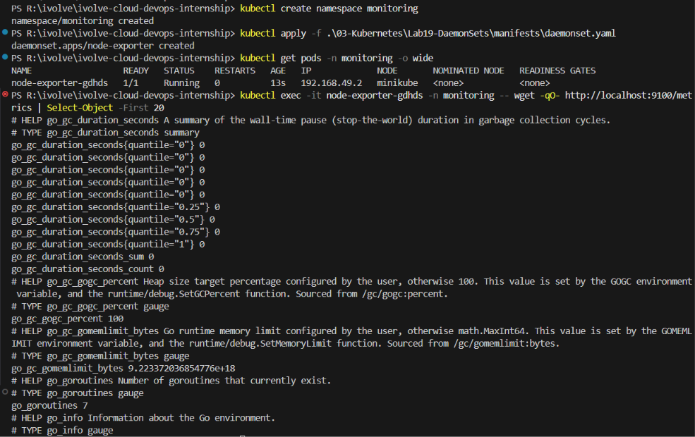

# ☸️ Lab 19: Node-Wide Pod Management with DaemonSet

## 📌 Overview

In production Kubernetes environments, certain workloads must run on **every node** in the cluster. Examples include log collectors, monitoring agents, and network proxies. Kubernetes provides the **DaemonSet** controller to guarantee that exactly one copy of a Pod runs on each node (or a subset of nodes).

In this lab, a DaemonSet is created to deploy the **Prometheus Node Exporter** across all nodes in the cluster. The DaemonSet is configured to tolerate all existing taints, ensuring the exporter runs even on tainted nodes. This demonstrates how DaemonSets provide node-wide coverage for infrastructure-level workloads such as monitoring and observability.

---

## 🎯 Objectives
- Understand Kubernetes DaemonSets and their use cases.
- Create a dedicated `monitoring` namespace.
- Deploy a DaemonSet for Prometheus Node Exporter.
- Configure tolerations to schedule Pods on all nodes, including tainted ones.
- Validate that a node-exporter Pod is scheduled on each node.
- Confirm correct metrics exposure by accessing `:9100/metrics` on any node.
- Understand the difference between DaemonSets and Deployments.

---

## 📂 Project Structure
```text
Lab19-DaemonSets/
│
├── manifests/
│   └── daemonset.yaml
│
├── README.md
└── Screenshots/
    └── daemonset_lab.png
```

---

## 🛠 Technologies Used
- Kubernetes
- kubectl
- YAML
- DaemonSet
- Prometheus Node Exporter
- Minikube

---

## ✅ Prerequisites

Before starting this lab, ensure you have:
- Kubernetes cluster running
- `kubectl` configured
- Minikube or a multi-node cluster

Verify the cluster nodes:
```bash
kubectl get nodes
```

---

## 📖 Understanding DaemonSets

A DaemonSet ensures that a copy of a Pod runs on **every node** (or a selected subset) in the cluster. When a new node joins the cluster, the DaemonSet controller automatically schedules a Pod on it. When a node is removed, the Pod is garbage collected.

### DaemonSet vs Deployment

| Feature | DaemonSet | Deployment |
|---------|-----------|------------|
| Pod placement | One Pod per node | Pods distributed by scheduler |
| Scaling | Automatic (tied to node count) | Manual (via `replicas`) |
| Use case | Node-level agents (monitoring, logging) | Application workloads |
| New node behavior | Automatically schedules a Pod | No automatic scheduling |

### Common DaemonSet Use Cases
```text
┌──────────────────────────────────────────────┐
│              Kubernetes Cluster              │
│                                              │
│  Node 1          Node 2          Node 3      │
│  ┌──────────┐    ┌──────────┐    ┌──────────┐│
│  │ exporter │    │ exporter │    │ exporter ││
│  │  :9100   │    │  :9100   │    │  :9100   ││
│  └──────────┘    └──────────┘    └──────────┘│
│                                              │
│  Every node runs exactly one Pod             │
└──────────────────────────────────────────────┘
```

### Understanding Tolerations

By default, the Kubernetes scheduler does **not** place Pods on tainted nodes. To ensure the DaemonSet runs on **all** nodes (including tainted ones), we use a wildcard toleration:

```yaml
tolerations:
  - operator: Exists
```

This tells Kubernetes: "This Pod tolerates **any** taint on any node," guaranteeing full cluster coverage.

### What is Prometheus Node Exporter?

Prometheus Node Exporter is a lightweight agent that exposes hardware and OS-level metrics (CPU, memory, disk, network) on port `9100`. It is the standard way to collect node-level metrics in a Prometheus monitoring stack.

---

## 📋 Lab Requirements

### 1. Create the Monitoring Namespace

Create a dedicated namespace for monitoring workloads:

```bash
kubectl create namespace monitoring
```

**Expected Output:**
```text
namespace/monitoring created
```

### 2. Create the DaemonSet Manifest

Create `daemonset.yaml`

**Requirements:**
- **Name:** node-exporter
- **Namespace:** monitoring
- **Image:** `prom/node-exporter:latest`
- **Tolerations:** Tolerate all existing taints
- **Port:** `9100` (exposed via `hostPort`)
- **Host Network:** Enabled for direct node-level metrics access

**Example:**
```yaml
apiVersion: apps/v1
kind: DaemonSet
metadata:
  name: node-exporter
  namespace: monitoring
  labels:
    app: node-exporter
spec:
  selector:
    matchLabels:
      app: node-exporter
  template:
    metadata:
      labels:
        app: node-exporter
    spec:
      tolerations:
        - operator: Exists
      containers:
        - name: node-exporter
          image: prom/node-exporter:latest
          ports:
            - containerPort: 9100
              hostPort: 9100
              protocol: TCP
          resources:
            requests:
              cpu: "100m"
              memory: "64Mi"
            limits:
              cpu: "200m"
              memory: "128Mi"
      hostNetwork: true
      hostPID: true
```

**Manifest Breakdown:**

| Field | Description |
|-------|-------------|
| `kind: DaemonSet` | Ensures one Pod per node |
| `tolerations: - operator: Exists` | Tolerates all taints on any node |
| `hostNetwork: true` | Shares the node's network namespace |
| `hostPID: true` | Shares the node's PID namespace for process metrics |
| `hostPort: 9100` | Exposes the exporter directly on the node's port 9100 |
| `resources` | Sets CPU/memory requests and limits |

### 3. Apply the DaemonSet

```bash
kubectl apply -f manifests/daemonset.yaml
```

**Expected Output:**
```text
daemonset.apps/node-exporter created
```

### 4. Verify Pods are Running on All Nodes

```bash
kubectl get pods -n monitoring -o wide
```

**Expected Output:**
```text
NAME                  READY   STATUS    RESTARTS   AGE   IP             NODE
node-exporter-xxxxx   1/1     Running   0          1m    192.168.x.x    minikube
```

Each node in your cluster should have exactly one `node-exporter` Pod.

### 5. Verify the DaemonSet

```bash
kubectl get daemonset -n monitoring
```

**Expected Output:**
```text
NAME            DESIRED   CURRENT   READY   UP-TO-DATE   AVAILABLE   NODE SELECTOR   AGE
node-exporter   1         1         1       1             1           <none>          1m
```

Verify that `DESIRED`, `CURRENT`, and `READY` all match the number of nodes in your cluster.

### 6. Confirm Metrics Exposure

Access the node-exporter metrics endpoint:

```bash
kubectl exec -it <node-exporter-pod> -n monitoring -- wget -qO- http://localhost:9100/metrics | head -20
```

Or, if using Minikube:
```bash
minikube ssh -- curl -s http://localhost:9100/metrics | head -20
```

**Expected Output:**
```text
# HELP go_gc_duration_seconds A summary of the pause duration of garbage collection cycles.
# TYPE go_gc_duration_seconds summary
go_gc_duration_seconds{quantile="0"} ...
...
# HELP node_cpu_seconds_total Seconds the CPUs spent in each mode.
# TYPE node_cpu_seconds_total counter
node_cpu_seconds_total{cpu="0",mode="idle"} ...
```

---

## 🧪 Verification

Verify the DaemonSet exists:
```bash
kubectl get daemonset -n monitoring
```

Verify Pods are running on all nodes:
```bash
kubectl get pods -n monitoring -o wide
```

Describe the DaemonSet to inspect its configuration:
```bash
kubectl describe daemonset node-exporter -n monitoring
```

Test metrics endpoint:
```bash
minikube ssh -- curl -s http://localhost:9100/metrics | head -20
```

---

## 🔄 DaemonSet vs Deployment

| Without DaemonSet | With DaemonSet |
|-------------------|----------------|
| Must manually ensure coverage on all nodes | Automatic Pod placement on every node |
| New nodes have no monitoring | New nodes automatically get a Pod |
| Uneven distribution possible | Guaranteed one Pod per node |
| Manual scaling required | Scales with cluster size |

---

## 🌍 Real-World Use Cases

DaemonSets are commonly used for:
- Prometheus Node Exporter (node metrics)
- Fluentd / Filebeat (log collection)
- Datadog / New Relic agents (APM)
- kube-proxy (network proxy)
- Calico / Cilium (CNI networking)
- Storage plugins (CSI drivers)
- Security agents (Falco, Sysdig)

---

## 🧹 Cleanup

> **Note:** Skip this section if you are continuing to the next lab.

Delete the DaemonSet and namespace:
```bash
kubectl delete daemonset node-exporter -n monitoring
kubectl delete namespace monitoring
```

---

## 📸 Screenshots

| Description | Image |
|-------------|-------|
| Creating the `monitoring` namespace, deploying the DaemonSet, verifying Pod scheduling on all nodes, and confirming metrics exposure on port 9100 |  |

---

## 📚 Key Learning Outcomes

After completing this lab, you will be able to:
- Understand DaemonSets and their purpose in Kubernetes.
- Deploy node-level monitoring agents across all cluster nodes.
- Configure tolerations to bypass node taints.
- Verify DaemonSet scheduling and Pod distribution.
- Access Prometheus Node Exporter metrics.
- Distinguish between DaemonSets and Deployments.

---

## 💡 Best Practices
- Use DaemonSets for infrastructure-level workloads that must run on every node.
- Always set resource requests and limits on DaemonSet Pods to prevent resource starvation.
- Use tolerations carefully; `operator: Exists` tolerates **all** taints.
- Use `hostNetwork: true` only when the Pod needs direct access to the node's network stack.
- Monitor DaemonSet rollouts with `kubectl rollout status daemonset/<name>`.
- Use node selectors or node affinity to limit DaemonSet Pods to specific node groups when needed.
- Keep DaemonSet images lightweight to minimize node resource consumption.

---

## ✅ Result

Successfully deployed Prometheus Node Exporter as a Kubernetes DaemonSet in the `monitoring` namespace, configured with wildcard tolerations to ensure scheduling on all nodes including tainted ones. Verified that exactly one exporter Pod runs on each node and confirmed correct metrics exposure on port `9100`, demonstrating how DaemonSets provide reliable node-wide coverage for infrastructure monitoring workloads.
