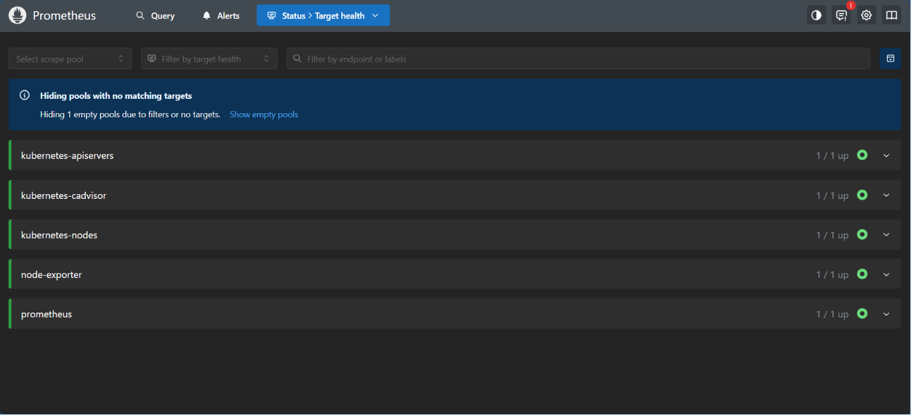
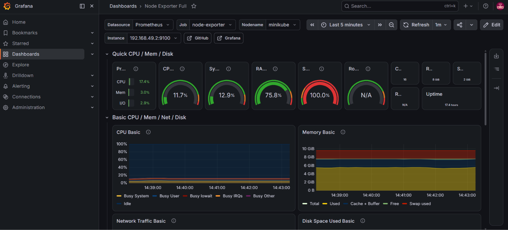

# ☸️ Lab 20 Bonus: End-to-End Monitoring with Prometheus, Grafana, and RBAC

## 📌 Overview

Building on the Node Exporter DaemonSet (Lab 19) and RBAC concepts (Lab 20), this bonus lab deploys a complete **Prometheus + Grafana** monitoring stack on Kubernetes. Prometheus collects and stores metrics from the Node Exporter and other Kubernetes components, while Grafana provides a powerful visualization dashboard for real-time monitoring.

This bonus lab demonstrates how to build an end-to-end observability pipeline entirely within Kubernetes, from metric collection to storage to visualization.

---

## 🎯 Objectives
- Deploy Prometheus as a metrics collection and storage engine.
- Configure Prometheus to scrape Node Exporter, Kubernetes API, cAdvisor, and annotated Pods.
- Set up RBAC permissions for Prometheus service discovery.
- Deploy Grafana with auto-provisioned Prometheus datasource.
- Access Prometheus and Grafana dashboards via NodePort services.
- Verify metrics flow from Node Exporter → Prometheus → Grafana.

---

## 📂 Project Structure
```text
Lab20+Full Monitoring Stack With RBAC/
│
├── manifests/
│   ├── prometheus-rbac.yaml           # ClusterRole & ClusterRoleBinding
│   ├── prometheus-config.yaml         # Prometheus scrape configuration
│   ├── prometheus-deployment.yaml     # Prometheus Deployment & Service
│   ├── grafana-config.yaml            # Grafana datasource & dashboard provider
│   └── grafana-deployment.yaml        # Grafana Deployment & Service
│
├── README.md                          # README File
└── Screenshots/
    ├── prometheus_targets.png
    └── grafana_dashboard.png
```

---

## 🛠 Technologies Used
- Kubernetes
- kubectl
- YAML
- Prometheus
- Grafana
- Node Exporter
- RBAC (ClusterRole, ClusterRoleBinding)
- Minikube

---

## ✅ Prerequisites

Before starting this bonus lab, ensure you have:
- Kubernetes cluster running (with Minikube)
- `kubectl` configured
- `monitoring` namespace created
- Node Exporter DaemonSet deployed (Lab 19) and basic RBAC understanding (Lab 20)

Verify the existing setup:
```bash
kubectl get pods -n monitoring
kubectl get daemonset -n monitoring
```

---

## 📖 Understanding the Monitoring Architecture

### Metrics Flow

```text
┌─────────────────────────────────────────────────────────────┐
│                    Kubernetes Cluster                       │
│                                                             │
│  ┌──────────────┐    ┌──────────────┐    ┌──────────────┐   │
│  │ Node Exporter│───▶│  Prometheus  │───▶│   Grafana   │   │
│  │  (DaemonSet) │    │ (Deployment) │    │ (Deployment) │   │
│  │  Port: 9100  │    │  Port: 9090  │    │  Port: 3000  │   │
│  └──────────────┘    └──────────────┘    └──────────────┘   │
│         │                   │                    │          │
│    Collects node       Scrapes, stores      Visualizes      │
│    hardware metrics    & queries metrics    dashboards      │
│                                                             │
│  ┌──────────────────────────────────────────────────────┐   │
│  │          Other Kubernetes Components                 │   │
│  │  • API Server  • cAdvisor  • Annotated Pods          │   │
│  └──────────────────────────────────────────────────────┘   │
└─────────────────────────────────────────────────────────────┘
```

### Component Responsibilities

| Component | Role | Port |
|-----------|------|------|
| **Node Exporter** | Collects hardware and OS metrics from each node | `9100` |
| **Prometheus** | Scrapes targets, stores time-series data, provides query API | `9090` (NodePort: `30090`) |
| **Grafana** | Queries Prometheus, renders dashboards and visualizations | `3000` (NodePort: `30030`) |

### What Prometheus Scrapes

| Scrape Job | Target | Metrics |
|------------|--------|---------|
| `node-exporter` | Node Exporter Pods | CPU, memory, disk, network |
| `kubernetes-apiservers` | Kubernetes API Server | API request latency, counts |
| `kubernetes-nodes` | Kubelet on each node | Node-level Kubernetes metrics |
| `kubernetes-cadvisor` | cAdvisor on each node | Container CPU, memory, network |
| `kubernetes-pods` | Annotated Pods | Application-specific metrics |

---

## 📋 Lab Steps

### 1. Create Prometheus RBAC

Prometheus needs cluster-wide permissions to discover and scrape targets across all namespaces.

**File:** `manifests/prometheus-rbac.yaml`
```yaml
apiVersion: rbac.authorization.k8s.io/v1
kind: ClusterRole
metadata:
  name: prometheus
rules:
  - apiGroups: [""]
    resources:
      - nodes
      - nodes/proxy
      - nodes/metrics
      - services
      - endpoints
      - pods
    verbs: ["get", "list", "watch"]
  - apiGroups: ["extensions", "networking.k8s.io"]
    resources:
      - ingresses
    verbs: ["get", "list", "watch"]
  - nonResourceURLs: ["/metrics", "/metrics/cadvisor"]
    verbs: ["get"]
---
apiVersion: rbac.authorization.k8s.io/v1
kind: ClusterRoleBinding
metadata:
  name: prometheus
roleRef:
  apiGroup: rbac.authorization.k8s.io
  kind: ClusterRole
  name: prometheus
subjects:
  - kind: ServiceAccount
    name: default
    namespace: monitoring
```

Apply it:
```bash
kubectl apply -f manifests/prometheus-rbac.yaml
```

**Expected Output:**
```text
clusterrole.rbac.authorization.k8s.io/prometheus created
clusterrolebinding.rbac.authorization.k8s.io/prometheus created
```

### 2. Create Prometheus Configuration

The Prometheus configuration defines scrape targets using Kubernetes service discovery.

**File:** `manifests/prometheus-config.yaml`
```yaml
apiVersion: v1
kind: ConfigMap
metadata:
  name: prometheus-config
  namespace: monitoring
data:
  prometheus.yml: |
    global:
      scrape_interval: 15s
      evaluation_interval: 15s

    scrape_configs:
      - job_name: 'prometheus'
        static_configs:
          - targets: ['localhost:9090']

      - job_name: 'node-exporter'
        kubernetes_sd_configs:
          - role: pod
            namespaces:
              names:
                - monitoring
        relabel_configs:
          - source_labels: [__meta_kubernetes_pod_label_app]
            regex: node-exporter
            action: keep
          - source_labels: [__meta_kubernetes_pod_ip]
            target_label: __address__
            replacement: ${1}:9100

      - job_name: 'kubernetes-apiservers'
        kubernetes_sd_configs:
          - role: endpoints
        scheme: https
        tls_config:
          ca_file: /var/run/secrets/kubernetes.io/serviceaccount/ca.crt
        bearer_token_file: /var/run/secrets/kubernetes.io/serviceaccount/token
        relabel_configs:
          - source_labels: [__meta_kubernetes_namespace, __meta_kubernetes_service_name, __meta_kubernetes_endpoint_port_name]
            action: keep
            regex: default;kubernetes;https

      - job_name: 'kubernetes-nodes'
        scheme: https
        tls_config:
          ca_file: /var/run/secrets/kubernetes.io/serviceaccount/ca.crt
          insecure_skip_verify: true
        bearer_token_file: /var/run/secrets/kubernetes.io/serviceaccount/token
        kubernetes_sd_configs:
          - role: node
        relabel_configs:
          - action: labelmap
            regex: __meta_kubernetes_node_label_(.+)

      - job_name: 'kubernetes-cadvisor'
        scheme: https
        tls_config:
          ca_file: /var/run/secrets/kubernetes.io/serviceaccount/ca.crt
          insecure_skip_verify: true
        bearer_token_file: /var/run/secrets/kubernetes.io/serviceaccount/token
        kubernetes_sd_configs:
          - role: node
        relabel_configs:
          - action: labelmap
            regex: __meta_kubernetes_node_label_(.+)
          - target_label: __metrics_path__
            replacement: /metrics/cadvisor

      - job_name: 'kubernetes-pods'
        kubernetes_sd_configs:
          - role: pod
        relabel_configs:
          - source_labels: [__meta_kubernetes_pod_annotation_prometheus_io_scrape]
            action: keep
            regex: true
          - source_labels: [__meta_kubernetes_pod_annotation_prometheus_io_path]
            action: replace
            target_label: __metrics_path__
            regex: (.+)
          - source_labels: [__address__, __meta_kubernetes_pod_annotation_prometheus_io_port]
            action: replace
            regex: ([^:]+)(?::\d+)?;(\d+)
            replacement: $1:$2
            target_label: __address__
          - action: labelmap
            regex: __meta_kubernetes_pod_label_(.+)
          - source_labels: [__meta_kubernetes_namespace]
            action: replace
            target_label: kubernetes_namespace
          - source_labels: [__meta_kubernetes_pod_name]
            action: replace
            target_label: kubernetes_pod_name
```

**Key scrape jobs:**

| Job Name | Discovery Method | What It Scrapes |
|----------|------------------|-----------------|
| `prometheus` | Static | Prometheus itself |
| `node-exporter` | `kubernetes_sd_configs: pod` | Node Exporter DaemonSet Pods |
| `kubernetes-apiservers` | `kubernetes_sd_configs: endpoints` | API Server endpoints |
| `kubernetes-nodes` | `kubernetes_sd_configs: node` | Kubelet metrics on each node |
| `kubernetes-cadvisor` | `kubernetes_sd_configs: node` | Container metrics via cAdvisor |
| `kubernetes-pods` | `kubernetes_sd_configs: pod` | Any Pod with `prometheus.io/scrape: "true"` |

Apply it:
```bash
kubectl apply -f manifests/prometheus-config.yaml
```

**Expected Output:**
```text
configmap/prometheus-config created
```

### 3. Deploy Prometheus

Prometheus is deployed as a single-replica Deployment with the configuration mounted via ConfigMap.

**File:** `manifests/prometheus-deployment.yaml`
```yaml
apiVersion: apps/v1
kind: Deployment
metadata:
  name: prometheus
  namespace: monitoring
  labels:
    app: prometheus
spec:
  replicas: 1
  selector:
    matchLabels:
      app: prometheus
  template:
    metadata:
      labels:
        app: prometheus
    spec:
      tolerations:
        - operator: Exists
      containers:
        - name: prometheus
          image: prom/prometheus:latest
          ports:
            - containerPort: 9090
          args:
            - "--config.file=/etc/prometheus/prometheus.yml"
            - "--storage.tsdb.path=/prometheus"
            - "--storage.tsdb.retention.time=7d"
            - "--web.enable-lifecycle"
          volumeMounts:
            - name: prometheus-config
              mountPath: /etc/prometheus
            - name: prometheus-storage
              mountPath: /prometheus
          resources:
            requests:
              cpu: "250m"
              memory: "256Mi"
            limits:
              cpu: "500m"
              memory: "512Mi"
      volumes:
        - name: prometheus-config
          configMap:
            name: prometheus-config
        - name: prometheus-storage
          emptyDir: {}
---
apiVersion: v1
kind: Service
metadata:
  name: prometheus
  namespace: monitoring
spec:
  type: NodePort
  selector:
    app: prometheus
  ports:
    - port: 9090
      targetPort: 9090
      nodePort: 30090
```

**Manifest Breakdown:**

| Field | Description |
|-------|-------------|
| `image: prom/prometheus:latest` | Official Prometheus Docker image |
| `--storage.tsdb.retention.time=7d` | Retains metrics data for 7 days |
| `--web.enable-lifecycle` | Enables hot-reload of configuration |
| `configMap: prometheus-config` | Mounts the scrape configuration |
| `NodePort: 30090` | Exposes Prometheus UI externally |

Apply it:
```bash
kubectl apply -f manifests/prometheus-deployment.yaml
```

**Expected Output:**
```text
deployment.apps/prometheus created
service/prometheus created
```

### 4. Deploy Grafana

Grafana is deployed with an auto-provisioned Prometheus datasource so it connects immediately without manual configuration.

**File:** `manifests/grafana-config.yaml` — Provisions Prometheus as the default datasource.
```yaml
apiVersion: v1
kind: ConfigMap
metadata:
  name: grafana-datasources
  namespace: monitoring
data:
  datasources.yaml: |
    apiVersion: 1
    datasources:
      - name: Prometheus
        type: prometheus
        access: proxy
        url: http://prometheus:9090
        isDefault: true
        editable: true
---
apiVersion: v1
kind: ConfigMap
metadata:
  name: grafana-dashboards-provider
  namespace: monitoring
data:
  dashboards.yaml: |
    apiVersion: 1
    providers:
      - name: 'default'
        orgId: 1
        folder: ''
        type: file
        disableDeletion: false
        editable: true
        options:
          path: /var/lib/grafana/dashboards
          foldersFromFilesStructure: false
```

**File:** `manifests/grafana-deployment.yaml`
```yaml
apiVersion: apps/v1
kind: Deployment
metadata:
  name: grafana
  namespace: monitoring
  labels:
    app: grafana
spec:
  replicas: 1
  selector:
    matchLabels:
      app: grafana
  template:
    metadata:
      labels:
        app: grafana
    spec:
      tolerations:
        - operator: Exists
      containers:
        - name: grafana
          image: grafana/grafana:latest
          ports:
            - containerPort: 3000
          env:
            - name: GF_SECURITY_ADMIN_USER
              value: "admin"
            - name: GF_SECURITY_ADMIN_PASSWORD
              value: "admin"
          volumeMounts:
            - name: grafana-datasources
              mountPath: /etc/grafana/provisioning/datasources
            - name: grafana-dashboards-provider
              mountPath: /etc/grafana/provisioning/dashboards
            - name: grafana-storage
              mountPath: /var/lib/grafana
          resources:
            requests:
              cpu: "250m"
              memory: "256Mi"
            limits:
              cpu: "500m"
              memory: "512Mi"
      volumes:
        - name: grafana-datasources
          configMap:
            name: grafana-datasources
        - name: grafana-dashboards-provider
          configMap:
            name: grafana-dashboards-provider
        - name: grafana-storage
          emptyDir: {}
---
apiVersion: v1
kind: Service
metadata:
  name: grafana
  namespace: monitoring
spec:
  type: NodePort
  selector:
    app: grafana
  ports:
    - port: 3000
      targetPort: 3000
      nodePort: 30030
```

**Manifest Breakdown:**

| Field | Description |
|-------|-------------|
| `image: grafana/grafana:latest` | Official Grafana Docker image |
| `GF_SECURITY_ADMIN_USER` | Default admin username (`admin`) |
| `GF_SECURITY_ADMIN_PASSWORD` | Default admin password (`admin`) |
| `grafana-datasources` | Auto-provisions Prometheus datasource |
| `NodePort: 30030` | Exposes Grafana UI externally |

Apply it:
```bash
kubectl apply -f manifests/grafana-config.yaml
kubectl apply -f manifests/grafana-deployment.yaml
```

**Expected Output:**
```text
configmap/grafana-datasources created
configmap/grafana-dashboards-provider created
deployment.apps/grafana created
service/grafana created
```

### 5. Verify All Pods Are Running

```bash
kubectl get pods -n monitoring
```

**Expected Output:**
```text
NAME                          READY   STATUS    RESTARTS   AGE
grafana-xxxxxxxxx-xxxxx       1/1     Running   0          ...
node-exporter-xxxxx           1/1     Running   0          ...
prometheus-xxxxxxxxx-xxxxx    1/1     Running   0          ...
```

### 6. Access Prometheus UI

Open the Prometheus web interface:
```bash
minikube service prometheus -n monitoring
```

Or manually navigate to:
```text
http://<minikube-ip>:30090
```

**Verify targets are being scraped:**
Navigate to **Status → Targets** in the Prometheus UI. You should see all scrape targets with status `UP`.

### 7. Access Grafana UI

Open the Grafana web interface:
```bash
minikube service grafana -n monitoring
```

Or manually navigate to:
```text
http://<minikube-ip>:30030
```

**Login credentials:**
- **Username:** `admin`
- **Password:** `admin`

**Verify Prometheus datasource:**
Navigate to **Configuration → Data Sources**. Prometheus should already be listed as the default datasource.

### 8. Import a Node Exporter Dashboard

To visualize Node Exporter metrics in Grafana:

1. Go to **Dashboards → Import**.
2. Enter Dashboard ID: `1860` (Node Exporter Full).
3. Select **Prometheus** as the datasource.
4. Click **Import**.

This provides a comprehensive dashboard with CPU, memory, disk, and network metrics for all nodes.

---

## 🧪 Verification

Verify all monitoring components:
```bash
kubectl get pods -n monitoring
kubectl get svc -n monitoring
kubectl get daemonset -n monitoring
```

Verify Prometheus is scraping targets:
```bash
minikube service prometheus -n monitoring
```
Navigate to **Status → Targets** and confirm all jobs show `UP`.

Verify Grafana connects to Prometheus:
```bash
minikube service grafana -n monitoring
```
Navigate to **Configuration → Data Sources** and verify Prometheus is connected.

Test a PromQL query in Prometheus:
```text
node_cpu_seconds_total{mode="idle"}
```

---

## 🔒 Security Considerations

| Aspect | Configuration |
|--------|---------------|
| Grafana default password | `admin/admin` — Change in production |
| Prometheus RBAC | ClusterRole with read-only access to cluster resources |
| Network access | NodePort exposes services — Use Ingress with TLS in production |
| Data persistence | Using `emptyDir` — Use PersistentVolumes in production |

---

## 🌍 Real-World Use Cases

The Prometheus + Grafana monitoring stack is commonly used for:
- Infrastructure monitoring (CPU, memory, disk, network)
- Application performance monitoring (APM)
- Kubernetes cluster health monitoring
- SLA/SLO tracking and alerting
- Capacity planning and resource optimization
- Incident response and troubleshooting
- Cost optimization through usage analysis

---

## 🧹 Cleanup

> **Note:** Skip this section if you are continuing to the next lab.

Delete the entire monitoring stack:
```bash
kubectl delete -f manifests/grafana-deployment.yaml
kubectl delete -f manifests/grafana-config.yaml
kubectl delete -f manifests/prometheus-deployment.yaml
kubectl delete -f manifests/prometheus-config.yaml
kubectl delete -f manifests/prometheus-rbac.yaml
kubectl delete -f manifests/daemonset.yaml
kubectl delete namespace monitoring
```

---

## 📸 Screenshots

| Description | Image |
|-------------|-------|
| Prometheus UI: Verifying all scrape targets (Node Exporter, API Server, cAdvisor) are UP |  |
| Grafana UI: Visualizing Node Exporter Full Dashboard (CPU, Memory, Network metrics) |  |

---

## 📚 Key Learning Outcomes

After completing this bonus lab, you will be able to:
- Deploy a complete Prometheus + Grafana monitoring stack on Kubernetes.
- Configure Prometheus scrape targets using Kubernetes service discovery.
- Set up RBAC permissions for Prometheus cluster-wide metric collection.
- Auto-provision Grafana datasources using ConfigMaps.
- Import and use pre-built Grafana dashboards.
- Access and query metrics using PromQL.
- Understand the full metrics pipeline from collection to visualization.

---

## 💡 Best Practices
- Always change the default Grafana admin password in production.
- Use PersistentVolumes for Prometheus and Grafana data storage in production.
- Set appropriate retention periods for Prometheus (`--storage.tsdb.retention.time`).
- Use Ingress with TLS instead of NodePort for external access in production.
- Add alerting rules in Prometheus and configure Alertmanager for notifications.
- Use specific image tags instead of `latest` in production environments.
- Implement network policies to restrict access to the monitoring namespace.
- Regularly backup Grafana dashboards and Prometheus configuration.

---

## ✅ Result

Successfully deployed a complete Kubernetes monitoring stack consisting of Prometheus and Grafana alongside the Node Exporter DaemonSet. Prometheus is configured to scrape metrics from Node Exporter, the Kubernetes API Server, cAdvisor, kubelet, and annotated Pods using Kubernetes service discovery. Grafana is auto-provisioned with Prometheus as its default datasource and is accessible via NodePort `30030`. The full observability pipeline — from metric collection to storage to visualization — is operational and demonstrates production-grade monitoring practices on Kubernetes.
