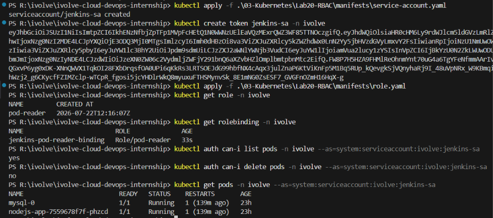

# ☸️ Lab 20: Securing Kubernetes with RBAC and Service Accounts

## 📌 Overview

By default, Kubernetes does not restrict what actions a ServiceAccount or user can perform within the cluster. In production environments, this creates significant security risks. **Role-Based Access Control (RBAC)** allows cluster administrators to define fine-grained permissions, ensuring that each identity only has access to the resources it needs.

In this lab, a `jenkins-sa` ServiceAccount is created in the `ivolve` namespace and granted **read-only access to Pods** using a Role and RoleBinding. A token is generated for the ServiceAccount, and validation is performed to confirm that the account can list Pods but cannot perform unauthorized actions such as deleting Pods or accessing other resources like Deployments.

---

## 🎯 Objectives
- Understand Kubernetes RBAC (Role-Based Access Control).
- Create a ServiceAccount in a specific namespace.
- Generate a token for the ServiceAccount.
- Define a Role with read-only permissions on Pods.
- Create a RoleBinding to bind the Role to the ServiceAccount.
- Validate that the ServiceAccount can only list and get Pods.
- Verify that unauthorized actions are denied.
- Understand the difference between Role and ClusterRole.

---

## 📂 Project Structure
```text
Lab20-RBAC/
│
├── manifests/
│   ├── service-account.yaml
│   ├── role.yaml
│   └── role-binding.yaml
│
├── README.md
└── Screenshots/
    └── RBAC_Lab.png
```

---

## 🛠 Technologies Used
- Kubernetes
- kubectl
- YAML
- RBAC (Role, RoleBinding)
- ServiceAccount
- Minikube

---

## ✅ Prerequisites

Before starting this lab, ensure you have:
- Kubernetes cluster running
- `kubectl` configured
- Existing `ivolve` namespace

Verify the existing resources:
```bash
kubectl get ns ivolve
kubectl get pods -n ivolve
```

---

## 📖 Understanding RBAC

Kubernetes RBAC is a security mechanism that regulates access to the Kubernetes API based on the roles assigned to users or ServiceAccounts.

### RBAC Components

```text
┌──────────────────┐     ┌──────────────────┐     ┌──────────────────┐
│  ServiceAccount  │────▶│   RoleBinding   │────▶│      Role        │
│   (jenkins-sa)   │     │  (binds SA to    │     │  (pod-reader)    │
│                  │     │   the Role)      │     │  get, list pods  │
└──────────────────┘     └──────────────────┘     └──────────────────┘
```

| Component | Description |
|-----------|-------------|
| **ServiceAccount** | An identity for processes running inside Pods |
| **Role** | Defines a set of permissions (verbs) on resources within a namespace |
| **RoleBinding** | Binds a Role to a ServiceAccount, User, or Group |
| **ClusterRole** | Like a Role, but applies across all namespaces |
| **ClusterRoleBinding** | Binds a ClusterRole to an identity cluster-wide |

### Role vs ClusterRole

| Feature | Role | ClusterRole |
|---------|------|-------------|
| Scope | Single namespace | Cluster-wide |
| Use case | Namespace-level access | Cross-namespace or cluster resources |
| Binding | RoleBinding | ClusterRoleBinding (or RoleBinding) |
| Example | Read Pods in `ivolve` | Read Pods in all namespaces |

### Understanding Verbs

Kubernetes API verbs define what actions are allowed:

| Verb | Description |
|------|-------------|
| `get` | Read a single resource |
| `list` | List all resources of a type |
| `watch` | Watch for changes to resources |
| `create` | Create a new resource |
| `update` | Modify an existing resource |
| `patch` | Partially modify a resource |
| `delete` | Delete a resource |

In this lab, the `pod-reader` Role only grants `get` and `list`, making it strictly **read-only**.

### Access Flow

**With RBAC:**
```text
jenkins-sa ──▶ pod-reader Role ──▶ get, list Pods ✅
jenkins-sa ──▶ delete Pods ✖ (Forbidden)
jenkins-sa ──▶ list Deployments ✖ (Forbidden)
jenkins-sa ──▶ list Pods in other namespaces ✖ (Forbidden)
```

---

## 📋 Lab Requirements

### 1. Create the ServiceAccount

Create `service-account.yaml`

```yaml
apiVersion: v1
kind: ServiceAccount
metadata:
  name: jenkins-sa
  namespace: ivolve
```

Apply it:
```bash
kubectl apply -f manifests/service-account.yaml
```

**Expected Output:**
```text
serviceaccount/jenkins-sa created
```

### 2. Create a Token for the ServiceAccount

Generate a token for the `jenkins-sa` ServiceAccount:

```bash
kubectl create token jenkins-sa -n ivolve
```

**Expected Output:**
```text
eyJhbGciOiJSUzI1NiIsInR5cCI6IkpXVCJ9...
```

> **Note:** This token can be used by external tools (e.g., Jenkins) to authenticate with the Kubernetes API. The token is a JWT (JSON Web Token) that contains the ServiceAccount identity.

### 3. Create the Role

Create `role.yaml`

**Requirements:**
- **Name:** pod-reader
- **Namespace:** ivolve
- **Permissions:** `get` and `list` on `pods`

```yaml
apiVersion: rbac.authorization.k8s.io/v1
kind: Role
metadata:
  name: pod-reader
  namespace: ivolve
rules:
  - apiGroups: [""]
    resources: ["pods"]
    verbs: ["get", "list"]
```

**Manifest Breakdown:**

| Field | Description |
|-------|-------------|
| `apiGroups: [""]` | Core API group (Pods, Services, ConfigMaps) |
| `resources: ["pods"]` | Applies only to Pod resources |
| `verbs: ["get", "list"]` | Read-only access (no create, update, or delete) |

Apply it:
```bash
kubectl apply -f manifests/role.yaml
```

**Expected Output:**
```text
role.rbac.authorization.k8s.io/pod-reader created
```

### 4. Create the RoleBinding

Create `role-binding.yaml`

```yaml
apiVersion: rbac.authorization.k8s.io/v1
kind: RoleBinding
metadata:
  name: jenkins-pod-reader-binding
  namespace: ivolve
subjects:
  - kind: ServiceAccount
    name: jenkins-sa
    namespace: ivolve
roleRef:
  kind: Role
  name: pod-reader
  apiGroup: rbac.authorization.k8s.io
```

**Manifest Breakdown:**

| Field | Description |
|-------|-------------|
| `subjects` | The identity receiving the permissions (`jenkins-sa`) |
| `roleRef` | The Role being bound (`pod-reader`) |
| `kind: ServiceAccount` | Specifies the subject is a ServiceAccount |

Apply it:
```bash
kubectl apply -f manifests/role-binding.yaml
```

**Expected Output:**
```text
rolebinding.rbac.authorization.k8s.io/jenkins-pod-reader-binding created
```

### 5. Verify the RBAC Configuration

List the Role:
```bash
kubectl get role -n ivolve
```

**Expected Output:**
```text
NAME         CREATED AT
pod-reader   2026-...
```

Describe the Role:
```bash
kubectl describe role pod-reader -n ivolve
```

List the RoleBinding:
```bash
kubectl get rolebinding -n ivolve
```

**Expected Output:**
```text
NAME                         ROLE              AGE
jenkins-pod-reader-binding   Role/pod-reader   1m
```

---

## 🧪 Verification

### Test Allowed Actions (Should Succeed)

**List Pods as `jenkins-sa`:**
```bash
kubectl auth can-i list pods -n ivolve --as=system:serviceaccount:ivolve:jenkins-sa
```

**Expected:**
```text
yes
```

**Get Pods as `jenkins-sa`:**
```bash
kubectl auth can-i get pods -n ivolve --as=system:serviceaccount:ivolve:jenkins-sa
```

**Expected:**
```text
yes
```

### Test Denied Actions (Should Fail)

**Delete Pods:**
```bash
kubectl auth can-i delete pods -n ivolve --as=system:serviceaccount:ivolve:jenkins-sa
```

**Expected:**
```text
no
```

**List Deployments:**
```bash
kubectl auth can-i list deployments -n ivolve --as=system:serviceaccount:ivolve:jenkins-sa
```

**Expected:**
```text
no
```

**List Pods in default namespace:**
```bash
kubectl auth can-i list pods -n default --as=system:serviceaccount:ivolve:jenkins-sa
```

**Expected:**
```text
no
```

**Create Pods:**
```bash
kubectl auth can-i create pods -n ivolve --as=system:serviceaccount:ivolve:jenkins-sa
```

**Expected:**
```text
no
```

### Functional Test with Token

Use the generated token to list Pods directly via the API:

```bash
kubectl get pods -n ivolve --as=system:serviceaccount:ivolve:jenkins-sa
```

**Expected:**
```text
NAME                          READY   STATUS    RESTARTS   AGE
mysql-0                       1/1     Running   0          ...
nodejs-app-xxxxxxxxx-xxxxx    1/1     Running   0          ...
```

---

## 🔒 Why RBAC?

| Without RBAC | With RBAC |
|--------------|-----------|
| All ServiceAccounts have full access | Permissions are explicitly granted |
| No audit trail for access control | Clear, auditable permission model |
| Single compromised Pod can access everything | Blast radius is limited to granted permissions |
| Not suitable for production | Production-ready security |

---

## 🌍 Real-World Use Cases

RBAC is commonly used for:
- CI/CD tools (Jenkins, ArgoCD) with limited cluster access
- Developer access control (read-only for staging)
- Multi-tenant clusters with namespace isolation
- Compliance requirements (SOC2, PCI-DSS, HIPAA)
- Automated pipeline service accounts
- Third-party integrations with minimal permissions
- Audit and governance enforcement

---

## 🧹 Cleanup

Delete the RBAC resources:
```bash
kubectl delete rolebinding jenkins-pod-reader-binding -n ivolve
kubectl delete role pod-reader -n ivolve
kubectl delete serviceaccount jenkins-sa -n ivolve
```

---

## 📸 Screenshots

| Description | Image |
|-------------|-------|
| Creating the ServiceAccount, Role, and RoleBinding, then verifying that `jenkins-sa` can list Pods but cannot delete Pods or access other resources |  |

---

## 📚 Key Learning Outcomes

After completing this lab, you will be able to:
- Understand Kubernetes RBAC and its components.
- Create and manage ServiceAccounts.
- Define Roles with fine-grained permissions.
- Bind Roles to ServiceAccounts using RoleBindings.
- Validate access control using `kubectl auth can-i`.
- Distinguish between Role and ClusterRole.
- Apply the principle of least privilege to Kubernetes workloads.

---

## 💡 Best Practices
- Always follow the principle of least privilege when defining Roles.
- Use Roles (namespace-scoped) instead of ClusterRoles whenever possible.
- Avoid using `cluster-admin` for application ServiceAccounts.
- Regularly audit RBAC configurations with `kubectl auth can-i`.
- Use descriptive names for Roles and RoleBindings (e.g., `pod-reader`, `jenkins-pod-reader-binding`).
- Rotate ServiceAccount tokens periodically.
- Combine RBAC with Network Policies and Pod Security Standards for defense in depth.

---

## ✅ Result

Successfully created a `jenkins-sa` ServiceAccount in the `ivolve` namespace and configured RBAC to grant it read-only access to Pods using a `pod-reader` Role and `jenkins-pod-reader-binding` RoleBinding. Validated that the ServiceAccount can list and get Pods but is denied all other actions including deleting Pods, listing Deployments, and accessing resources in other namespaces, demonstrating how Kubernetes RBAC enforces the principle of least privilege.
