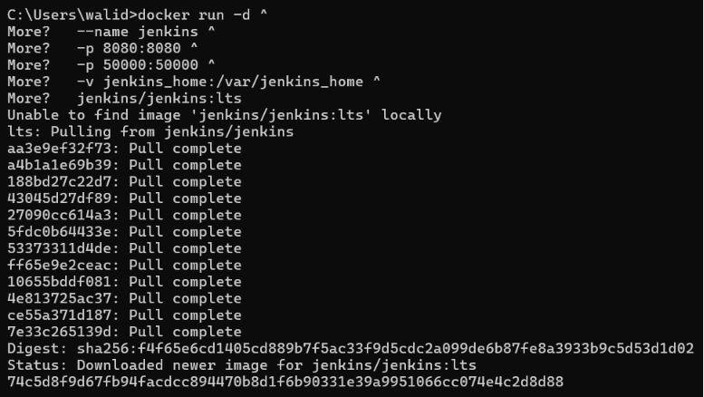
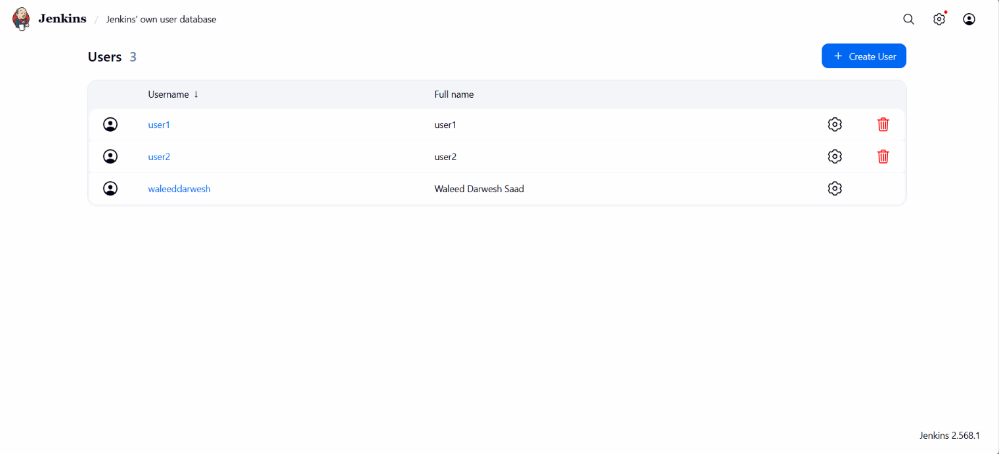
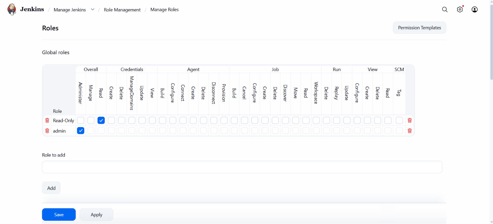
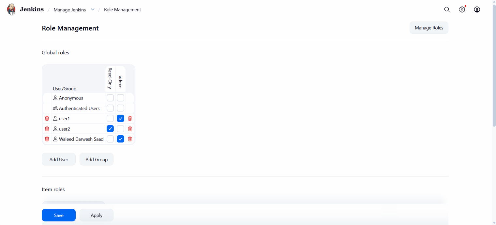

# ⚙️ Lab 21: Role-Based Authorization in Jenkins

## 📌 Overview

**Continuous Integration and Continuous Delivery (CI/CD)** is a set of practices that automate the processes of building, testing, and deploying software. 
- **CI (Continuous Integration)** automates the process of integrating code changes, building applications, and running tests whenever new code is committed.
- **CD (Continuous Delivery/Deployment)** automates packaging and deployment, enabling reliable software releases with minimal manual intervention.

**Jenkins** is an open-source automation server and one of the most popular CI/CD tools. It allows developers to build, test, and deploy their software automatically.

By default, every authenticated user in Jenkins has broad permissions, which is not suitable for production environments. In this lab, Jenkins is configured with **Role-Based Access Control (RBAC)** to implement fine-grained access control. After installing Jenkins via Docker, the **Role-Based Authorization Strategy** plugin is installed and configured. Two users are then created:

- **user1** is assigned an **Administrator** role with full control over Jenkins.
- **user2** is assigned a **Read-Only** role with permission to view Jenkins without making changes.

This lab demonstrates how to secure Jenkins by granting users only the permissions required for their responsibilities.

---

## 🎯 Objectives

- Understand CI/CD and Jenkins.
- Run Jenkins using Docker and Docker Compose.
- Access the Jenkins web interface.
- Install the Role-Based Authorization Strategy plugin.
- Create Jenkins users.
- Configure role-based authorization.
- Create Administrator and Read-Only roles.
- Assign roles to users.
- Verify user permissions.

---

## 📂 Project Structure

```text
Lab21-Jenkins-Role-Based-Authorization/
│
├── README.md
└── Screenshots/
    ├── install_jenkins.png
    ├── create_users.png
    ├── create_roles.png
    └── assign_roles.png
```

---

## 🛠 Technologies Used

- Jenkins
- Docker
- Docker Compose
- Docker Volumes
- Jenkins Plugins
- Role-Based Authorization Strategy Plugin
- Web Browser

---

## ✅ Prerequisites

Before starting this lab, ensure you have:

- Docker Desktop installed
- WSL2 enabled (Windows)
- Docker Compose
- Internet connection

Verify Docker:

```bash
docker --version
docker ps
```

Verify WSL:

```bash
wsl --status
```

---

## 📖 Why Jenkins?

Jenkins is one of the most widely adopted automation servers for implementing CI/CD pipelines. It supports thousands of plugins and integrates with popular development and infrastructure tools such as Git, Docker, Kubernetes, Maven, Gradle, Terraform, Ansible, SonarQube, Prometheus, and cloud platforms.

Key capabilities include:

- Continuous Integration
- Continuous Delivery
- Pipeline as Code (Jenkinsfile)
- Plugin ecosystem
- Distributed build agents
- Extensive integrations

---

## 📖 Why Run Jenkins in Docker?

Running Jenkins inside Docker is the recommended approach for modern CI/CD environments because it provides:

- Easy installation
- Isolated environment
- Persistent data using Docker volumes
- Consistent environment across different machines
- Easy upgrades
- Easy backup and restore
- Seamless integration with Docker-based pipelines


---

## 📖 Understanding Role-Based Access Control

**Role-Based Access Control (RBAC)** controls access by assigning permissions to **roles** instead of individual users.

Key benefits include:

- Improved security
- Easier administration
- Principle of Least Privilege
- Better scalability
- Simplified permission management

```text
Developer
     │
     ▼
 Git Repository
     │
     ▼
  Jenkins
     │
     ├──────────────┐
     ▼              ▼
Administrator   Read-Only User
 (Full Access)   (View Only)
```

---

## 📖 Why RBAC?

Without RBAC:

```text
All Users
      │
      ▼
 Full Jenkins Access
```

With RBAC:

```text
Administrator
      │
      ▼
 Full Control

Read-Only User
      │
      ▼
 View Only
```

---

## 📋 Lab Requirements

### 1. Run Jenkins Container

We will run Jenkins using Docker. Mounting the Docker socket (`/var/run/docker.sock`) so Jenkins can build Docker images in later CI/CD pipelines. We also run as the `root` user (`-u root`) to avoid socket permission denied errors on local machines.

Execute the following cross-platform command in your preferred terminal (CMD, PowerShell, Git Bash, macOS, or Linux):

```bash
docker run -d --name jenkins -u root -p 8080:8080 -p 50000:50000 -v jenkins_home:/var/jenkins_home -v /var/run/docker.sock:/var/run/docker.sock jenkins/jenkins:lts
```

**Command Breakdown:**
- `-d`: Runs the container in the background (detached mode).
- `-u root`: Executes Jenkins as the root user to prevent Docker socket permission issues on local environments.
- `-p 8080:8080`: Exposes the Jenkins web interface.
- `-p 50000:50000`: Exposes the port for Jenkins agent (node) communication.
- `-v jenkins_home:...`: Persists Jenkins configuration, plugins, and job data.
- `-v /var/run/docker.sock:...`: Grants Jenkins access to the host's Docker daemon.

> ⚠️ **Git Bash on Windows:** If you encounter path translation errors (e.g., `C:\Program Files\Git\var\run...`), prepend an extra forward slash to the volume mount: `-v //var/run/docker.sock:/var/run/docker.sock`. Alternatively, use PowerShell.


---

### 2. Open Jenkins

Open:

```text
http://localhost:8080
```

You should see the Jenkins Unlock page.

---

### 3. Retrieve the Initial Administrator Password

```bash
docker exec jenkins cat /var/jenkins_home/secrets/initialAdminPassword
```

Example:

```text
4c1d3fd6d4c42e0...
```

Copy the password into the browser.

---

### 4. Install Suggested Plugins

Choose:

```text
Install Suggested Plugins
```

Wait until installation completes.

---

### 5. Create the Initial Administrator

Example:

```text
Username: admin
Password: ********
Full Name: Your Name
Email: [EMAIL_ADDRESS]
```

> **Security Note:** Never use simple passwords such as `admin123` in production environments. Always use strong passwords or integrate Jenkins with an external identity provider such as LDAP, Active Directory, or Single Sign-On (SSO).

---

### 6. Verify the Jenkins Dashboard

Verify that Jenkins loads successfully and displays:

- Dashboard
- New Item
- Build History
- Manage Jenkins

---
### 7. Install the Role-Based Authorization Strategy Plugin

Navigate to:

```text
Manage Jenkins
    └── Plugins
          └── Available Plugins
```

Search for:

```text
Role-Based Authorization Strategy
```

Install the plugin.

Restart Jenkins if prompted to activate the plugin.

---

### 8. Enable Role-Based Authorization

Navigate to:

```text
Manage Jenkins
    └── Security
```

Under **Authorization**, select:

```text
Role-Based Strategy
```

Save the configuration.

---

### 9. Create Users

Navigate to:

```text
Manage Jenkins
    └── Users
          └── Create User
```

Create:

**User 1**

```text
Username: user1
Password: ********
```

Create:

**User 2**

```text
Username: user2
Password: ********
```

---

### 10. Create Roles

Navigate to:

```text
Manage Jenkins
    └── Role Managament
```

Open:

```text
Manage Roles
```

#### Administrator Role

> **Note:** The `admin` role is created by default under **Global roles** and already has the **Overall > Administer** permission checked. This permission automatically provides full administrative access.

---

#### Read-Only Role

Under **Global roles**, add the Read-Only role:

1. In the **Role to add** field, enter `Read-Only`.
2. Click **Add**.
3. In the table, check the box for **Overall > Read** for the `Read-Only` row.

Do **not** grant build, configure, delete, administer, or credential-management permissions.

Click **Save** at the bottom of the page.

---

### 11. Assign Roles

Navigate to:

```text
Manage Jenkins
    └── Role Managament
```

Assign:

| User | Role |
|------|------|
| user1 | admin |
| user2 | readonly |

Save the configuration.

---

### 12. Verify User Permissions

Login as **user1**.

Verify that the user can:

- Configure Jenkins
- Install plugins
- Create jobs
- Delete jobs
- Manage users

---

Logout.

Login as **user2**.

Verify that the user can:

- View jobs
- View build history
- View dashboards

Verify that the user **cannot**:

- Create jobs
- Delete jobs
- Configure Jenkins
- Install plugins
- Manage users

---

## 🔐 Permission Comparison

| Permission | user1 | user2 |
|------------|:-----:|:-----:|
| View Jenkins | ✅ | ✅ |
| Build Jobs | ✅ | ❌ |
| Configure Jobs | ✅ | ❌ |
| Install Plugins | ✅ | ❌ |
| Manage Users | ✅ | ❌ |
| System Administration | ✅ | ❌ |

---

## 🧪 Verification

Verify Jenkins container is running:

```bash
docker ps
```

Verify users:

```text
Manage Jenkins
    └── Users
```

Verify roles:

```text
Manage Jenkins
    └── Role Managament
```

Login as each user and confirm the expected permissions.

Expected Results

- ✅ Jenkins installed successfully.
- ✅ Role-Based Authorization Strategy plugin installed.
- ✅ user1 created.
- ✅ user2 created.
- ✅ Administrator role configured.
- ✅ Read-Only role configured.
- ✅ Roles assigned successfully.
- ✅ Permissions enforced correctly.

---

## 🌍 Real-World Use Cases

Role-Based Authorization is commonly used for:

- DevOps teams
- Development teams
- QA engineers
- Release managers
- Security teams
- Enterprise CI/CD environments
- Multi-team Jenkins deployments

---

## 🧹 Cleanup

> **Note:** Skip this section if Jenkins will be used in subsequent labs.

Stop and remove Jenkins:

```bash
docker rm -f jenkins
```

*(Optional)* Remove the Docker volume if you want to delete all Jenkins data:

```bash
docker volume rm jenkins_home
```

---

## 📸 Screenshots

| Description | Image |
|------------|-------|
| Installing Jenkins |  |
| Creating Jenkins users (`user1` and `user2`) |  |
| Creating the Administrator and Read-Only roles |  |
| Assigning roles to users |  |

---

## 📚 Key Learning Outcomes

After completing this lab, you will be able to:

- Install Jenkins.
- Configure Jenkins security.
- Install Jenkins plugins.
- Enable Role-Based Authorization.
- Create Jenkins users.
- Create custom roles.
- Assign roles to users.
- Apply the principle of least privilege.

---

## 💡 Best Practices

- Always enable authentication in Jenkins.
- Use Role-Based Authorization instead of granting administrator access to all users.
- Follow the principle of least privilege.
- Grant only the permissions users require.
- Regularly audit user accounts and assigned roles.
- Use groups or external identity providers (LDAP, Active Directory, or SSO) in production environments.
- Keep Jenkins and installed plugins up to date.
- Back up the `jenkins_home` volume regularly to preserve jobs, plugins, and configuration.

---

## ✅ Result

Successfully installed **Jenkins**, configured **Role-Based Authorization Strategy**, created two users with different permission levels, assigned an **Administrator** role to **user1** and a **Read-Only** role to **user2**, and verified that Jenkins correctly enforced role-based access control according to the assigned permissions.

