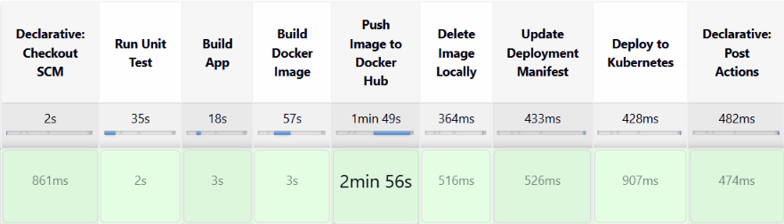

# ⚙️ Lab 22: Jenkins Pipeline for Application Deployment

## 📌 Overview

This lab demonstrates how to build an end-to-end Continuous Integration and Continuous Delivery (CI/CD) pipeline using Jenkins. The pipeline automates the entire software delivery lifecycle for a Java Maven application—from fetching the source code and running unit tests to building a Docker image and deploying it to a Kubernetes cluster.

By writing the pipeline as code (`Jenkinsfile`), we ensure the build and deployment process is version-controlled, repeatable, and easily auditable.

---

## 🎯 Objectives

- Clone a Java application repository from GitHub.
- Create a Declarative Jenkins Pipeline.
- Automate Maven unit testing and application builds.
- Automate Docker image creation and push it to Docker Hub.
- Use `sed` to dynamically update a Kubernetes deployment manifest.
- Automate application deployment to Kubernetes.
- Implement `post` actions to handle pipeline success, failure, and cleanup.

---

## 📂 Project Structure

```text
Lab22-Jenkins-CI-CD-Pipeline/
│
├── Dockerfile
├── Dockerfile.jenkins
├── Jenkinsfile
├── README.md
├── manifests/
│   ├── deployment.yaml
│   └── minikube-flat-config.yaml
├── src/
└── Screenshots/
     └── pipeline_success.png
```

---

## 🛠 Technologies Used

- Jenkins (Declarative Pipeline)
- Java & Maven
- Docker (Build, Tag, Push)
- Docker Hub
- Kubernetes (`kubectl`, Deployments)
- Linux Shell (`sed`, `sh`)
- Git & GitHub

---

## ✅ Prerequisites

Before starting this lab, ensure Jenkins is running and has the following configured:

Jenkins must have:
- Git installed
- Maven installed
- Docker Engine / Docker Desktop installed
- Docker CLI accessible by Jenkins
- kubectl installed
- Access to a running Kubernetes cluster (Minikube or other)
- Internet connectivity

---

## 📖 Understanding Continuous Integration and Continuous Delivery (CI/CD)

**Continuous Integration (CI)** is a DevOps practice where developers frequently merge code into a central repository, automatically triggering builds and tests to detect issues early. 

**Continuous Delivery (CD)** extends CI by automatically preparing successful builds for deployment, allowing for rapid, reliable releases.

Typical CI/CD workflow:

```text
Developer ──> Push Code ──> Jenkins Pipeline ──> Deploy to Kubernetes ──> Running App
```

By automating repetitive tasks, CI/CD reduces deployment risks, shortens release cycles, and improves software delivery speed.

## 📖 Understanding Jenkins Pipelines

A **Jenkins Pipeline** defines your entire software delivery process as code. Instead of clicking through UI menus, the workflow is written in a version-controlled `Jenkinsfile`.

Treating the pipeline as code provides:
- **Version control:** Track changes to your build process.
- **Reproducibility:** Consistent execution across environments.
- **Resilience:** Pipelines survive Jenkins controller restarts.

Example workflow:

```text
GitHub ──> Test ──> Build ──> Publish ──> Deploy
```

## 📖 Understanding Declarative Pipelines

Jenkins supports two syntaxes: Declarative and Scripted. The **Declarative Pipeline** is the modern standard, offering a structured, highly readable syntax.

A Declarative Pipeline uses predefined blocks:

```text
pipeline
 ├── agent
 ├── environment
 ├── stages
 │     └── stage
 └── post
```

This rigid structure makes it significantly easier to read, maintain, and troubleshoot in enterprise CI/CD environments.

## 📖 Understanding Pipeline Stages

A **Stage** represents a distinct, logical phase of the CI/CD process (e.g., `Unit Test`, `Docker Build`, `Deploy`). 

Benefits of stages include:
- **Visual tracking:** Easily see pipeline progress in the Jenkins UI.
- **Faster troubleshooting:** Jenkins highlights the exact stage where a failure occurred, isolating the problem immediately.

## 📖 Understanding Jenkins Credentials

Pipelines require sensitive data like Docker Hub passwords or Kubernetes `kubeconfig` files. **Jenkins Credentials Manager** securely stores these secrets.

Benefits include:
- **Centralized management:** No hardcoded passwords in your `Jenkinsfile`.
- **Automatic masking:** Secrets are redacted as `****` in console logs to prevent exposure.

## 📖 Understanding Docker Image Versioning

While Docker defaults to the `latest` tag, relying on it in CI/CD is an anti-pattern. Instead, use **immutable version tags** like the Jenkins `$BUILD_NUMBER` (e.g., `myapp:15`).

Benefits include:
- **Traceability:** Every container traces back to a specific pipeline execution.
- **Reliable rollbacks:** Instantly revert to a previous, known-good tag.

## 📖 Understanding Kubernetes Deployment Automation

Continuous Delivery finishes by deploying the newly built image to Kubernetes. Rather than manually editing YAML files, the pipeline dynamically updates the container image tag and applies it.

Deployment workflow:

```text
Build Image ──> Push Image ──> Update deployment.yaml ──> kubectl apply
```

When Kubernetes detects the updated manifest, it orchestrates a **Rolling Update**, gradually replacing old Pods with new ones to ensure zero downtime.

## 📖 Understanding Post Actions

The `post` section defines actions that execute automatically after the pipeline finishes.

| Condition | Description |
|-----------|-------------|
| `always` | Runs after every execution (e.g., Docker logout, cleanup). |
| `success` | Runs only if every stage passes (e.g., Slack success alert). |
| `failure` | Runs if the pipeline fails (e.g., Email error alert). |

Using post actions guarantees critical cleanup and notifications always occur.

---

## 🏗️ Pipeline Architecture for this Lab

```text
                Git Push
                    │
                    ▼
             GitHub Repository
                    │
             GitHub Webhook
                    │
                  ngrok
                    │
                    ▼
                Jenkins
                    │
                    ▼
               Unit Tests
                    │
                    ▼
                Build App
                    │
                    ▼
           Build Docker Image
                    │
                    ▼
             Push Docker Hub
                    │
                    ▼
          Update deployment.yaml
                    │
                    ▼
              kubectl apply
                    │
                    ▼
            Kubernetes Cluster
```

---

# 📋 Lab Steps

## 1. Clone the Sample Repository

Clone the sample application repository to your local machine:

```bash
git clone https://github.com/Ibrahim-Adel15/Jenkins_App.git
cd Jenkins_App
```

---

## 2. Setup Your Own GitHub Repository

Create a new, empty repository under your GitHub account (e.g., `jenkins-app-ci-cd`). Do not initialize it with a README or `.gitignore`.

Then, connect your local repository to your new remote:

```bash
# Remove the original remote
git remote remove origin

# Add your new repository as the remote
git remote add origin https://github.com/<YOUR_USERNAME>/jenkins-app-ci-cd.git

# Verify the remote was added correctly
git remote -v
```

---

## 3. Create the Jenkinsfile

Create a file named exactly:

```text
Jenkinsfile
```

in the root of the repository.

Paste the provided Declarative Pipeline into the file.

```groovy
pipeline {
    agent any

    environment {
        DOCKER_HUB_USER = "YOUR_DOCKERHUB_USERNAME"
        IMAGE_NAME = "${DOCKER_HUB_USER}/jenkins-app"
        IMAGE_TAG = "${BUILD_NUMBER}"

        // Jenkins Credentials IDs
        DOCKER_CREDENTIALS_ID = 'dockerhub-creds'
        KUBECONFIG_CREDENTIALS_ID = 'kubeconfig-creds'
    }

    stages {

        stage('Run Unit Test') {
            steps {
                echo 'Running Maven Unit Tests...'
                sh 'mvn test'
            }
        }

        stage('Build App') {
            steps {
                echo 'Compiling and Packaging the Application...'
                sh 'mvn clean package -DskipTests'
            }
        }

        stage('Build Docker Image') {
            steps {
                echo "Building Docker image: ${IMAGE_NAME}:${IMAGE_TAG}"

                sh "docker build -t ${IMAGE_NAME}:${IMAGE_TAG} ."
                sh "docker tag ${IMAGE_NAME}:${IMAGE_TAG} ${IMAGE_NAME}:latest"
            }
        }

        stage('Push Image to Docker Hub') {
            steps {
                echo 'Authenticating and pushing image to Docker Hub...'

                withCredentials([
                    usernamePassword(
                        credentialsId: DOCKER_CREDENTIALS_ID,
                        usernameVariable: 'DOCKER_USER',
                        passwordVariable: 'DOCKER_PASS'
                    )
                ]) {

                    sh "echo \$DOCKER_PASS | docker login -u \$DOCKER_USER --password-stdin"

                    sh "docker push ${IMAGE_NAME}:${IMAGE_TAG}"
                    sh "docker push ${IMAGE_NAME}:latest"
                }
            }
        }

        stage('Delete Image Locally') {
            steps {
                echo 'Removing local Docker images...'

                sh "docker rmi ${IMAGE_NAME}:${IMAGE_TAG} || true"
                sh "docker rmi ${IMAGE_NAME}:latest || true"
            }
        }

        stage('Update Deployment Manifest') {
            steps {
                echo 'Updating deployment manifest with the new image...'

                sh "sed -i 's|image: .*|image: ${IMAGE_NAME}:${IMAGE_TAG}|g' manifests/deployment.yaml"
            }
        }

        stage('Deploy to Kubernetes') {
            steps {

                echo 'Deploying application to Kubernetes...'

                withCredentials([
                    file(
                        credentialsId: KUBECONFIG_CREDENTIALS_ID,
                        variable: 'KUBECONFIG'
                    )
                ]) {

                    sh "kubectl apply -f manifests/deployment.yaml --kubeconfig=\$KUBECONFIG"
                }
            }
        }
    }

    post {

        always {
            echo "Pipeline execution completed."
            sh "docker logout || true"
        }

        success {
            echo "Application deployed successfully."
        }

        failure {
            echo "Pipeline execution failed."
        }
    }
}
```
> **Note:** Before running the pipeline, update the following placeholders in the Jenkinsfile:
> - `YOUR_DOCKERHUB_USERNAME`
> - Docker Hub Credential ID
> - Kubernetes Credential ID
> - Kubernetes manifest path (if different)

---

## 4. Create a Custom Jenkins Image

The standard Jenkins image does not include Maven, the Docker CLI, or `kubectl`. To run this pipeline, you must build a custom image.

Create a file named `Dockerfile.jenkins`:

```dockerfile
FROM jenkins/jenkins:lts
USER root
RUN apt-get update && \
    apt-get install -y maven docker.io curl apt-transport-https ca-certificates gnupg
RUN curl -LO "https://dl.k8s.io/release/$(curl -L -s https://dl.k8s.io/release/stable.txt)/bin/linux/amd64/kubectl" && \
    chmod +x kubectl && mv kubectl /usr/local/bin/
RUN usermod -aG docker jenkins || true
```

Build and run the custom container (running as `root` is recommended in local Docker Desktop labs to avoid `/var/run/docker.sock` permission denied errors):

```bash
docker build -t custom-jenkins-lts -f Dockerfile.jenkins .
docker rm -f jenkins || true
docker run -d --name jenkins -u root -p 8080:8080 -p 50000:50000 -v jenkins_home:/var/jenkins_home -v //var/run/docker.sock:/var/run/docker.sock custom-jenkins-lts
```

Open:

```text
http://localhost:8080
```

---

## 5. Configure Jenkins Credentials

Before creating the pipeline, securely store all required credentials in Jenkins.

### 5.1. The Docker Hub Credential (`dockerhub-creds`)

1. Open Jenkins and go to **Dashboard ──> Manage Jenkins ──> Credentials**.
2. Click on **System** ──> **Global credentials (unrestricted)** ──> **Add Credentials**.
3. Set the following:
   - **Kind:** Username with password
   - **Username:** Your Docker Hub username
   - **Password:** Your Docker Hub password
   - **ID:** `dockerhub-creds` *(must match exactly)*
4. Click **Create**.

### 5.2. The Kubeconfig Credential (`kubeconfig-creds`)

Since Jenkins is running in a Docker container, it cannot read your local Windows `.kube/config` file due to absolute paths. You must generate a "flattened" configuration file.

1. Open a terminal and generate a flattened `kubeconfig` with embedded certificates:
   ```bash
   kubectl config view --raw --minify --flatten > minikube-flat-config.yaml
   ```
2. Open `minikube-flat-config.yaml` in a text editor.
3. Locate the `server:` line (e.g., `server: https://127.0.0.1:60870`).
4. Change `127.0.0.1` to `host.docker.internal` so Jenkins can reach the cluster from within Docker.
5. **Critical for Docker connections:** Delete the `certificate-authority-data` line completely, and replace it with `insecure-skip-tls-verify: true`. This prevents TLS mismatch errors since Minikube's certificates do not include `host.docker.internal`:
   ```yaml
   - cluster:
       insecure-skip-tls-verify: true
       server: https://host.docker.internal:60870
   ```
6. Go back to **Add Credentials** in Jenkins.
7. Set the following:
   - **Kind:** Secret file
   - **File:** Upload the `minikube-flat-config.yaml` file you just modified
   - **ID:** `kubeconfig-creds` *(must match exactly)*
7. Click **Create**.

The pipeline will retrieve these credentials securely using the `withCredentials` step instead of hardcoding secrets inside the Jenkinsfile.

---


## 6. Expose Jenkins using ngrok

GitHub Webhooks require a publicly accessible URL.

If Jenkins is running locally, expose it using **ngrok**.

### Install ngrok

Download:

https://ngrok.com/download

Install it and authenticate your account:

```bash
ngrok config add-authtoken <YOUR_NGROK_AUTHTOKEN>
```

---
### Expose Jenkins

Run:

```bash
ngrok http 8080
```

Example output:

```text
Forwarding

https://abcd1234.ngrok-free.app
        │
        ▼
http://localhost:8080
```

Keep this terminal open.

Copy the HTTPS forwarding URL.

Example:

```text
https://abcd1234.ngrok-free.app
```

---

## 7. Configure GitHub Webhook

Open your GitHub repository.

Navigate to:

```text
Settings
    └── Webhooks
            └── Add webhook
```

Configure:

### Payload URL

```text
https://abcd1234.ngrok-free.app/github-webhook/
```

> **Important:** The `/github-webhook/` endpoint and trailing slash are required.

---

### Content Type

```text
application/json
```

---

### Secret

Leave empty unless you configure webhook secrets in Jenkins.

---

### Events

Choose:

```text
Just the push event
```

---

### Active

Leave enabled.

Click:

```text
Add webhook
```

GitHub immediately sends a **Ping** request.

Expected:

```text
✓ 200 OK
```

Verify that the webhook is working.

Navigate to:

```text
Repository
    └── Settings
          └── Webhooks
```

Select your webhook.

You should see:

```text
✓ Recent Deliveries
✓ HTTP 200
```

This confirms GitHub successfully reached Jenkins.

---

## 8. Create Jenkins Pipeline Job

Navigate to:

```text
Dashboard
    └── New Item
```

Create:

```text
Pipeline
```

Example name:

```text
Lab22-App-Deployment
```

Configure the pipeline:

**General**
- (Optional) GitHub project
- GitHub project URL:
  `https://github.com/<YOUR_GITHUB_USERNAME>/jenkins-app-ci-cd`

**Build Triggers**
✅ GitHub hook trigger for GITScm polling

**Pipeline**

Definition:
```text
Pipeline script from SCM
```

SCM:
```text
Git
```

Repository URL:
```text
https://github.com/<YOUR_GITHUB_USERNAME>/jenkins-app-ci-cd.git
```

Credentials:
```text
(Optional if repository is private)
```

Branch Specifier:
```text
*/main
```

Script Path:
```text
Jenkinsfile
```

Without this, Jenkins doesn't know where the Jenkinsfile is.

Click **Save**.

---

## 9. Trigger the Pipeline

Make a small change to the repository.

Example:

```bash
echo "CI Test" >> README.md

git add .
git commit -m "Trigger Jenkins pipeline"
git push origin main
```

GitHub sends a webhook to Jenkins.

Jenkins automatically starts the pipeline.

You can monitor the build from:

```text
Dashboard
└── Lab22-App-Deployment
```

> You can still use **Build Now** to manually execute the pipeline for testing purposes.


---


## 🌍 Real-World Use Cases

- Automated software delivery pipelines
- Continuous Integration for development teams
- Continuous Delivery to Kubernetes environments
- Multi-stage application deployment
- Automated Docker image management
- Infrastructure as Code (IaC) deployments
- Enterprise DevOps workflows

---

## 🧹 Cleanup

> **Note:** Do not perform these cleanup steps if you plan to use this Jenkins environment for subsequent labs.

To avoid unnecessary resource consumption, remove the infrastructure and background processes created during this lab:

### 1. Delete Kubernetes Resources
Remove the deployed application and its associated services from your cluster:
```bash
kubectl delete -f manifests/deployment.yaml
```

### 2. Terminate the Webhook Tunnel
Return to the terminal window running **ngrok** and stop the process by pressing:
<kbd>Ctrl</kbd> + <kbd>C</kbd>

### 3. Prune Docker Images (Optional)
To free up local disk space, you can remove any dangling or unused Docker images generated during the pipeline builds:
```bash
docker image prune -a
```

---
## 📸 Screenshots

| Description | Image |
|------------|-------|
| Successful Jenkins Pipeline execution |  |

 ---
## 📚 Key Learning Outcomes

After completing this lab, you will be able to:
- Write declarative Jenkins pipelines.
- Automate Maven builds and tests.
- Securely pass credentials into a Jenkins pipeline.
- Build and push Docker images dynamically using Jenkins environment variables.
- Use string manipulation (`sed`) to update Infrastructure as Code (IaC) files on the fly.
- Automate Kubernetes deployments from outside the cluster.

---

## 💡 Best Practices

- Use Pipeline as Code (Jenkinsfile).
- Store the Jenkinsfile in the same repository as the application.
- Store all secrets in Jenkins Credentials.
- Keep the Jenkinsfile under version control.
- Trigger builds automatically using GitHub Webhooks.
- Version Docker images with immutable tags instead of relying only on `latest`.
- Separate build, test, and deployment stages.
- Clean up local Docker images to conserve disk space.
- Avoid hardcoding environment-specific values.
- Use post actions for cleanup and notifications.

---

## ✅ Result

Successfully implemented an end-to-end Jenkins CI/CD pipeline that automatically cloned application source code from GitHub, executed unit tests, built a Docker image, pushed it to Docker Hub, dynamically updated a Kubernetes deployment manifest, and securely deployed the application to a Kubernetes cluster.
