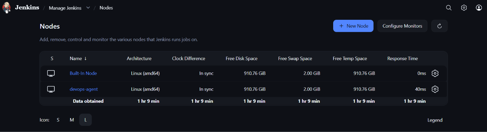
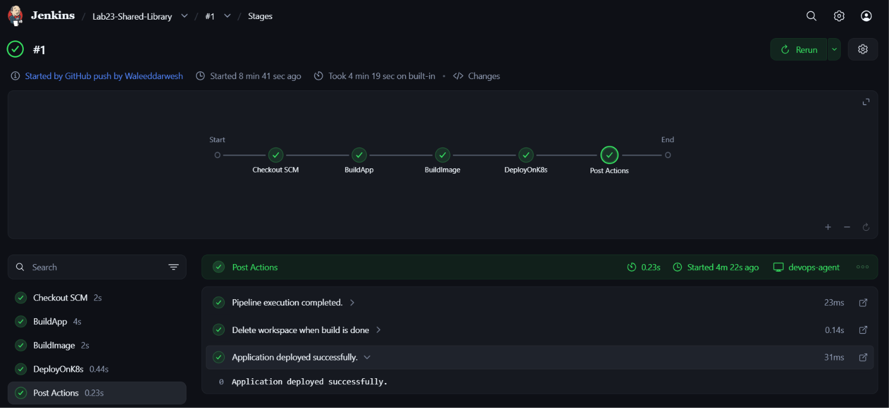

# ⚙️ Lab 23: CI/CD Pipeline Implementation with Jenkins Agents and Shared Libraries

## 📌 Overview

This lab demonstrates how to build a modular and scalable CI/CD pipeline using **Jenkins Shared Libraries** and **Jenkins Agents (Nodes)**. Instead of placing all pipeline logic inside a single `Jenkinsfile`, common functions are extracted into reusable shared library components, allowing multiple pipelines to reuse the same code.

The pipeline automatically builds a Java application, creates a Docker image, and deploys it to a Kubernetes cluster while executing the workload on a dedicated Jenkins Agent.

---

## 📖 Understanding Jenkins Agents

A **Jenkins Agent** (formerly called a *Slave*) is a machine that executes Jenkins jobs on behalf of the Jenkins Controller.

Instead of running every build on the controller, Jenkins distributes workloads across multiple agents.

Benefits include:

- Better scalability
- Faster pipeline execution
- Isolation of build environments
- Support for different operating systems and toolchains

Typical architecture:

```text
                Jenkins Controller
                        │
        ┌───────────────┴───────────────┐
        │                               │
        ▼                               ▼
 Linux Agent                     Windows Agent
        │                               │
 Build Docker                 Build .NET Apps
```

## 📖 Understanding Jenkins Shared Libraries

A Shared Library allows reusable pipeline code to be written once and used across multiple Jenkins pipelines.

Instead of duplicating stages in every Jenkinsfile, common logic is stored inside a Git repository and imported when needed.

Benefits include:

- Code reuse
- Easier maintenance
- Standardized CI/CD pipelines
- Centralized updates

Example:

```groovy
@Library('shared-library') _

buildApp()
buildImage()
deployOnK8s()
```

## 📖 Shared Library Structure

A Jenkins Shared Library typically follows this structure:

```text
jenkins-shared-library/
│
├── vars/
│   ├── buildApp.groovy
│   ├── buildImage.groovy
│   └── deployOnK8s.groovy
│
├── src/
│
└── README.md
```

The `vars` directory contains reusable pipeline functions that can be called directly from any Jenkinsfile.

## 📖 Pipeline Workflow

```text
GitHub
   │
   ▼
Checkout Source
   │
   ▼
Build Application
   │
   ▼
Build Docker Image
   │
   ▼
Deploy to Kubernetes
   │
   ▼
Post Actions (Clean Workspace)
```

All three stages are executed through reusable Shared Library functions.

## 🎯 Objectives
- Configure a Jenkins Agent.
- Create a Jenkins Shared Library.
- Move pipeline logic into reusable Groovy functions.
- Build a Java application using Maven.
- Build a Docker image.
- Deploy the application to Kubernetes.
- Execute the pipeline on a Jenkins Agent.
- Reuse the Shared Library from multiple pipelines.

## 📂 Project Structure

```text
Lab23-Jenkins-Shared-Library/
│
├── Jenkinsfile
├── shared-library/
│   └── vars/
│       ├── buildApp.groovy
│       ├── buildImage.groovy
│       └── deployOnK8s.groovy
├── Screenshots/
│   ├── agent-online.png
│   └── pipeline-success.png
└── README.md
```

## 🛠 Technologies Used
- Jenkins
- Jenkins Agent
- Jenkins Shared Library
- Java
- Maven
- Docker
- Kubernetes
- Git
- GitHub
- Groovy

## ✅ Prerequisites

Before starting this lab, ensure the following are configured:

- Jenkins Controller
- Jenkins Agent connected and online
- Git installed
- Maven installed
- Docker installed
- kubectl installed
- Kubernetes cluster
- Docker Hub account
- Shared Library repository

## 📋 Lab Steps

### 1. Clone the Sample Application

Clone the application repository:

```bash
git clone https://github.com/Ibrahim-Adel15/Jenkins_App.git
```

### 2. Create a Jenkins Shared Library Repository

Create a new GitHub repository.

Example: `jenkins-shared-library`

Create the following structure:

```text
jenkins-shared-library/
│
├── vars/
│   ├── buildApp.groovy
│   ├── buildImage.groovy
│   └── deployOnK8s.groovy
└── README.md
```

### 3. Create Shared Library Functions

Create highly reusable, dynamically parameterized pipeline functions.

> 💡 **Why use `Map config = [:]`?** 
> By passing a Map object to the function (`def call(Map config)`), we can provide optional named arguments when calling the function in our Jenkinsfile. This allows the shared library to be highly dynamic, falling back to sensible defaults (like `.`) if a parameter isn't provided, while remaining entirely reusable across different projects.

**buildApp.groovy**
```groovy
def call(Map config = [:]) {
    def workingDir = config.workingDir ?: '.'
    dir(workingDir) {
        echo "Building application..."
        sh 'mvn clean package -DskipTests'
    }
}
```
> **What this does:** Changes the working directory to `config.workingDir` (defaulting to the repository root) before executing the Maven build. This prevents the `MissingProjectException` that occurs when Jenkins executes functions outside the application's root directory.

**buildImage.groovy**
```groovy
def call(Map config = [:]) {
    def workingDir = config.workingDir ?: '.'
    def imageName = config.imageName ?: 'myapp'
    def imageTag = config.imageTag ?: env.BUILD_NUMBER
    def dockerCredentialsId = config.dockerCredentialsId

    dir(workingDir) {
        echo "Building Docker image ${imageName}:${imageTag}..."
        sh "docker build -t ${imageName}:${imageTag} ."
        
        if (dockerCredentialsId) {
            echo "Pushing image to Docker Hub..."
            withCredentials([usernamePassword(credentialsId: dockerCredentialsId, passwordVariable: 'DOCKER_PASS', usernameVariable: 'DOCKER_USER')]) {
                sh """
                echo "\$DOCKER_PASS" | docker login -u "\$DOCKER_USER" --password-stdin
                docker push ${imageName}:${imageTag}
                """
            }
        }
    }
}
```
> **What this does:** Accepts `imageName` and `imageTag` to dynamically build the Docker image. More importantly, it accepts a `dockerCredentialsId`. If provided, it securely retrieves those credentials from Jenkins using `withCredentials`, authenticates to Docker Hub, and pushes the image.

**deployOnK8s.groovy**
```groovy
def call(Map config = [:]) {
    def workingDir = config.workingDir ?: '.'
    def manifestPath = config.manifestPath ?: 'manifests/deployment.yaml'
    def kubeconfigCredentialsId = config.kubeconfigCredentialsId
    def serverIp = config.serverIp

    dir(workingDir) {
        echo "Deploying application from ${manifestPath}..."
        
        if (kubeconfigCredentialsId) {
            withCredentials([file(credentialsId: kubeconfigCredentialsId, variable: 'KUBECONFIG')]) {
                // If a server IP is provided, use it to override the API server endpoint dynamically
                def serverOverride = serverIp ? "--server=https://${serverIp}:8443 --insecure-skip-tls-verify=true" : ""
                sh "kubectl apply -f ${manifestPath} --kubeconfig=\$KUBECONFIG ${serverOverride}"
            }
        } else {
            // Fallback for hardcoded/local environments
            sh "kubectl apply -f ${manifestPath} --kubeconfig=/home/jenkins/kubeconfig"
        }
    }
}
```
> **What this does:** Deploys the application using the specified `manifestPath`. It dynamically accepts `kubeconfigCredentialsId` to securely pull the `kubeconfig` from Jenkins. It also accepts an optional `serverIp` to override the API server endpoint on the fly (`--server=...`), solving complex networking issues (like Jenkins containers failing to reach Minikube) without having to hardcode values in the `kubeconfig` file.

Commit and push the Shared Library repository.

### 4. Configure the Shared Library in Jenkins

Navigate to:

```text
Dashboard
    └── Manage Jenkins
            └── System
                    └── Global Trusted Pipeline Libraries
```

Click: **Add**

Configure:

| Field | Value |
|---|---|
| Name | shared-library |
| Default Version | main |
| Retrieval Method | Modern SCM |
| Source Code Management | Git |
| Repository URL | `https://github.com/<YOUR_USERNAME>/jenkins-shared-library.git` |

Save the configuration.

### 5. Create and Configure a Jenkins Agent Container

Since our Jenkins Controller runs in a container, we will run the Jenkins Agent in a separate container. This isolates the build workload from the controller.

#### 5.1 Build the Agent Docker Image
Create a `Dockerfile.agent` to install Maven, Docker CLI, and `kubectl` on top of the official Jenkins Inbound Agent image.

> ⚠️ **Warning:** Jenkins requires the Agent's Java version to be the **exact same or newer** than the Controller's Java version. If your controller runs Java 21, your agent MUST run Java 21. If they mismatch, you will get an `UnsupportedClassVersionError` and the node will remain offline.

```dockerfile
FROM jenkins/inbound-agent:jdk21

USER root

# Install Maven and Docker CLI
RUN apt-get update && \
    apt-get install -y maven docker.io curl

# Installing maven via apt pulls in Java 17 and overrides the default java path.
# We MUST reset the java path back to the Java 21 version provided by the base image.
RUN ln -sf /opt/java/openjdk/bin/java /usr/bin/java

# Install kubectl
RUN curl -LO "https://dl.k8s.io/release/$(curl -L -s https://dl.k8s.io/release/stable.txt)/bin/linux/amd64/kubectl" && \
    chmod +x kubectl && \
    mv kubectl /usr/local/bin/

# Allow jenkins user to use docker socket
RUN groupadd -f docker && usermod -aG docker jenkins

USER jenkins
```

Build the image from your terminal:
```bash
docker build -t my-jenkins-agent -f Dockerfile.agent .
```

#### 5.2 Define the Node in Jenkins
Navigate to:
`Dashboard ➔ Manage Jenkins ➔ Nodes`

Click: **New Node**
- **Node Name:** `devops-agent`
- **Type:** Permanent Agent

Configure the Node:
- **Remote root directory:** `/home/jenkins/agent`
- **Labels:** `devops-agent`
- **Launch method:** Launch agent by connecting it to the controller
> 💡 *If "Launch by connecting..." is not visible, go to Manage Jenkins ➔ Security, and set "TCP port for inbound agents" to Random, then return here.*

Click **Save**. Jenkins will display a connection command containing a **Secret**.

#### 5.3 Run the Agent Container
Copy the `<SECRET>` from the Jenkins UI and start your agent container, connecting it back to your Jenkins controller. *(Replace `<JENKINS_URL>` with your actual Jenkins URL, e.g., `http://192.168.1.100:8080`)*:

```bash
docker run -d -u root --name jenkins-agent -v /var/run/docker.sock:/var/run/docker.sock my-jenkins-agent:latest -url <JENKINS_URL> -webSocket <SECRET> devops-agent
```

Refresh the Nodes page in Jenkins. Ensure the node status becomes: **Online**

> 🚨 **Troubleshooting: Docker Networking & Kubernetes Credentials**
> - **Connection Refused:** Because Minikube binds its API server to `127.0.0.1` on the Windows host, traffic escaping the agent container via `host.docker.internal` is immediately dropped. To fix this, attach the agent directly to the Minikube network:
>   ```bash
>   docker network connect minikube jenkins-agent
>   ```
> - **Credential Parsing Errors:** Windows text editors add invisible `CRLF` carriage returns to files. If you upload a `minikube-flat-config.yaml` saved on Windows, `kubectl` inside the Jenkins agent will crash with `tls: failed to parse private key`. To bypass this permanently, inject a pristine, Linux-generated configuration file directly into the agent container instead of using the Jenkins UI:
>   ```bash
>   docker cp manifests/minikube-flat-config.yaml jenkins-agent:/home/jenkins/kubeconfig
>   ```
>   *(Make sure the server URL inside this file is updated to point directly to Minikube's internal container IP, e.g., `https://192.168.49.2:8443`)*

### 6. Create the Jenkins Pipeline

Create a new Pipeline job.

Navigate to:

```text
Dashboard
    └── New Item
```

Select: **Pipeline**

Example: `Lab23-Shared-Library`

Pipeline Definition: **Pipeline script from SCM**

Repository: `https://github.com/<YOUR_USERNAME>/<YOUR_REPOSITORY>.git`

Script Path: `Jenkinsfile`

Save.

### 7. Create the Jenkinsfile

Import the Shared Library and execute the reusable functions.

```groovy
@Library('shared-library') _

pipeline {

    agent {
        label 'devops-agent'
    }

    stages {

        stage('BuildApp') {
            steps {
                buildApp(workingDir: '04-Jenkins/Lab23-Jenkins-Shared-Library')
            }
        }

        stage('BuildImage') {
            steps {
                buildImage(
                    workingDir: '04-Jenkins/Lab23-Jenkins-Shared-Library',
                    imageName: 'myapp'
                )
            }
        }

        stage('DeployOnK8s') {
            steps {
                deployOnK8s(
                    workingDir: '04-Jenkins/Lab23-Jenkins-Shared-Library',
                    manifestPath: 'manifests/deployment.yaml'
                )
            }
        }

    }

    post {
        always {
            echo 'Pipeline execution completed.'
            cleanWs()
        }
        success {
            echo 'Application deployed successfully.'
        }
        failure {
            echo 'Pipeline execution failed.'
        }
    }
}
```

> 🚨 **Troubleshooting: Maven Build Failure (`MissingProjectException`)**
> If you omit the `workingDir` parameter in your `buildApp()` call, Maven will fail with `there is no POM in this directory`. This happens because Jenkins executes the shared library functions at the root of the Git workspace by default, meaning Maven can't find your `pom.xml` unless the shared library is explicitly told to execute inside the application subfolder.

### 8. Execute the Pipeline

Because a **GitHub Webhook** is configured, the pipeline is fully automated! Any `git push` to the repository will instantly trigger the build.

> 💡 **Alternative (Manual Trigger):** You can also trigger the pipeline manually at any time by navigating to the job in the Jenkins UI and clicking **Build Now**.

The pipeline will execute on the configured Jenkins Agent.

Pipeline flow:

```text
GitHub (Webhook Trigger on Push)
    │
  ngrok (Webhook Forwarding)
    │
    ▼
Jenkins Controller
    │
Schedules Job
    │
    ▼
Jenkins Agent
    │
    ├── BuildApp
    ├── BuildImage
    └── DeployOnK8s
```

## 📸 Screenshots

Include screenshots demonstrating:

| Description | Image |
|---|---|
| Jenkins Agent Online |  |
| Successful Pipeline Execution |  |

## 📚 Key Learning Outcomes

After completing this lab, you will be able to:
- Configure Jenkins Agents for distributed builds.
- Create reusable Jenkins Shared Libraries.
- Execute pipelines on dedicated agents.
- Separate reusable CI/CD logic from application pipelines.
- Improve pipeline maintainability through modular design.
- Build scalable enterprise Jenkins pipelines.

## 💡 Best Practices
- Keep reusable logic inside Shared Libraries.
- Keep Jenkinsfiles lightweight.
- Use descriptive stage names.
- Execute builds on Jenkins Agents instead of the Controller.
- Store credentials in Jenkins Credentials Manager.
- Version control Shared Libraries.
- Reuse common pipeline functions across multiple projects.
- Test Shared Library changes before production use.

## 🌍 Real-World Use Cases
- Enterprise CI/CD platforms
- Organization-wide reusable pipelines
- Distributed build environments
- Multi-team DevOps automation
- Kubernetes application deployments
- Standardized software delivery pipelines

## 🧹 Cleanup


> **Note:** **Do not perform these cleanup steps if you plan to use this Jenkins environment for subsequent labs.** Removing the agent container or images now will require you to rebuild them later.

To avoid unnecessary resource consumption, ensure you clean up the lab environment once you are finished.

### 1. Delete Kubernetes Resources
Remove the deployed application from your Kubernetes cluster:
```bash
kubectl delete -f manifests/deployment.yaml
```

### 2. Remove the Jenkins Agent Container
Stop and remove the dedicated agent container:
```bash
docker rm -f jenkins-agent
```

### 3. Remove the Custom Agent Image
Delete the Docker image we built for the agent:
```bash
docker rmi my-jenkins-agent
```

### 4. Remove the Node from Jenkins
1. Navigate to **Dashboard** ➔ **Manage Jenkins** ➔ **Nodes**.
2. Click on the `devops-agent` node.
3. Click <kbd>Delete Agent</kbd> from the left sidebar.
4. Click **Yes** to confirm the deletion.

### 5. Prune Unused Images (Optional)
Clean up any dangling Docker images to free up disk space:
```bash
docker image prune -a
```

## ✅ Result

Successfully implemented a modular Jenkins CI/CD pipeline using Jenkins Shared Libraries and Jenkins Agents, enabling reusable pipeline stages for building applications, creating Docker images, and deploying to Kubernetes while executing workloads on a dedicated build agent. This approach improves maintainability, scalability, and consistency across multiple CI/CD pipelines.
