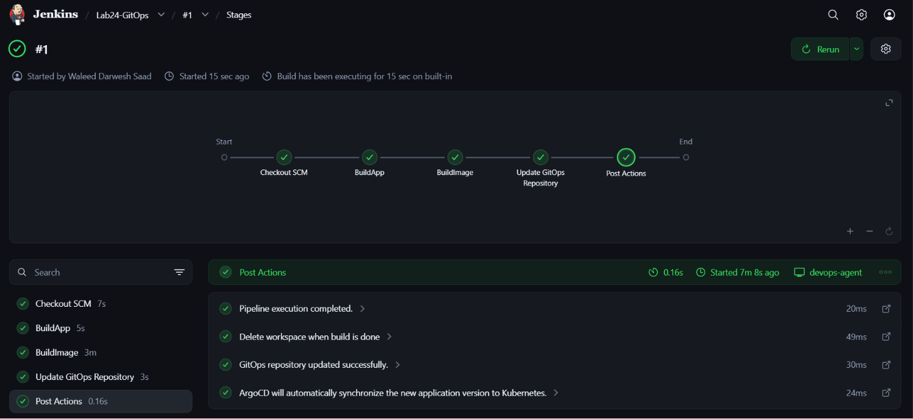
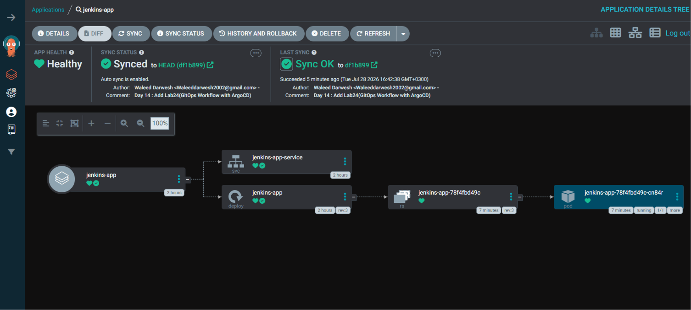

# ⚙️ Lab 24: GitOps Workflow with ArgoCD

## 📌 Overview

This lab demonstrates how to implement a **GitOps Continuous Delivery workflow** using **ArgoCD** and **Jenkins**. Jenkins is responsible for building the application, creating and publishing Docker images, and updating Kubernetes deployment manifests stored in Git. ArgoCD continuously monitors the Git repository and automatically synchronizes any detected changes to the Kubernetes cluster.

By separating Continuous Integration (CI) from Continuous Delivery (CD), Git becomes the **single source of truth** for Kubernetes deployments, enabling automated, auditable, and reliable application delivery.

---

# 📖 Understanding GitOps

**GitOps** is a modern DevOps practice where Git repositories become the single source of truth for infrastructure and application deployments.

Instead of manually applying Kubernetes manifests using `kubectl`, GitOps tools continuously monitor Git repositories and automatically synchronize the cluster with the desired state stored in Git.

GitOps provides:

- Declarative infrastructure
- Automated deployments
- Version-controlled changes
- Easy rollbacks
- Continuous reconciliation

Typical GitOps workflow:

```text
Developer
    │
    ▼
Git Repository
    │
    ▼
ArgoCD
    │
Synchronizes
    │
    ▼
Kubernetes Cluster
```

---

# 📖 Understanding ArgoCD

**ArgoCD** is a declarative GitOps Continuous Delivery tool designed specifically for Kubernetes.

ArgoCD continuously compares the desired application state stored in Git with the live state running inside the Kubernetes cluster.

If differences are detected, ArgoCD automatically synchronizes the cluster to match Git.

Benefits include:

- Automated Kubernetes deployments
- Drift detection
- Automatic synchronization
- Rollback support
- Deployment history
- Health monitoring

---

# 📖 CI vs GitOps CD

In this lab, Jenkins handles **Continuous Integration**, while ArgoCD handles **Continuous Delivery**.

```text
Developer
      │
      ▼
GitHub
      │
Webhook
      ▼
Jenkins
      │
Build Application
      │
Build Docker Image
      │
Push Docker Image
      │
Update deployment.yaml
      │
Commit & Push
      ▼
GitHub
      │
ArgoCD Detects Change
      ▼
Kubernetes Cluster
```

---

# 📖 CI Engine Selection: GitHub Actions vs. Jenkins

> 💡 **Industry Best Practice: GitHub Actions**
> In modern cloud-native software engineering, **GitHub Actions** is widely considered the industry best practice for Continuous Integration in GitOps workflows. It offers zero infrastructure maintenance overhead, native event triggers on pull requests and commits, built-in secret management, and a vast ecosystem of reusable marketplace actions.

> 🛠️ **Why Jenkins is Used in This Lab**
> In this lab, we utilize **Jenkins** (specifically leveraging the custom **Jenkins Shared Libraries** created in Lab 23 running on our dedicated `devops-agent`) to maintain continuity with the CI infrastructure built in previous labs (Lab 21–23). This demonstrates a foundational principle of GitOps: **ArgoCD is completely agnostic to the CI engine**—whether your CI pipeline is executed by Jenkins, GitHub Actions, or GitLab CI, ArgoCD only monitors and reconciles changes committed to the Git repository.

---

# 📖 Why GitOps?

Traditional deployment:

```text
Jenkins
     │
kubectl apply
     │
Kubernetes
```

GitOps deployment:

```text
Jenkins
     │
Update Git
     │
Git Repository
     │
ArgoCD
     │
Kubernetes
```

Git becomes the only deployment interface.

---

## 🎯 Objectives

- Install and configure ArgoCD.
- Configure ArgoCD to monitor a Git repository.
- Build a Java application using Jenkins.
- Build and publish Docker images.
- Update Kubernetes manifests automatically.
- Push deployment changes back to GitHub.
- Validate automatic deployment by ArgoCD.

---

## 📂 Project Structure

```text
Lab24-GitOps-Workflow/
│
├── Jenkinsfile
├── README.md
├── ArgoCD-shared-library/
│   ├── vars/
│   │   ├── buildApp.groovy
│   │   ├── buildImage.groovy
│   │   └── updateGitOpsRepo.groovy
│   └── README.md
└── Screenshots/
    ├── pipeline-success.png
    └── sync-success.png
```

---

## 🛠 Technologies Used

- Jenkins
- GitHub
- Docker
- Docker Hub
- Kubernetes
- ArgoCD
- Java
- Maven
- Git
- Linux Shell

---

## ✅ Prerequisites

Ensure the following are available before starting:

- Kubernetes Cluster
- kubectl installed
- Docker installed
- Jenkins installed
- Git installed
- Maven installed
- Docker Hub account
- GitHub repository
- ArgoCD installed

---

# 📋 Lab Steps

## 1. Clone the Sample Application

Clone the sample application:

```bash
git clone https://github.com/Ibrahim-Adel15/Jenkins_App.git
cd Jenkins_App
```

---

## 2. Create Your GitHub Repository

Create a new GitHub repository.

Example:

```text
jenkins-argocd-gitops
```

Push the project to your repository.

---

## 3. Configure ArgoCD

Install ArgoCD.

Create the namespace:

```bash
kubectl create namespace argocd
```

Install ArgoCD:

```bash
kubectl apply -n argocd -f https://raw.githubusercontent.com/argoproj/argo-cd/stable/manifests/install.yaml
```

Verify:

```bash
kubectl get pods -n argocd
```

All pods should become:

```text
Running
```

---

## 4. Access the ArgoCD UI

Retrieve the initial admin password:

**Linux / Git Bash:**

```bash
kubectl -n argocd get secret argocd-initial-admin-secret -o jsonpath="{.data.password}" | base64 -d
```

**Windows PowerShell:**

```powershell
[System.Text.Encoding]::UTF8.GetString([System.Convert]::FromBase64String((kubectl -n argocd get secret argocd-initial-admin-secret -o jsonpath="{.data.password}")))
```

Port-forward the ArgoCD server:

```bash
kubectl port-forward svc/argocd-server -n argocd 8081:443
```

Open:

```text
https://localhost:8081
```

Login:

```text
Username:
admin
```

Password:

```text
<retrieved password>
```

---

## 5. Create an ArgoCD Application

Inside the ArgoCD dashboard:

Click:

```text
NEW APP
```

Configure:

| Field | Value |
|-------|-------|
| Application Name | jenkins-app |
| Project | default |
| Sync Policy | Automatic |
| Repository URL | `<YOUR_GITHUB_REPOSITORY_URL>` |
| Revision | main |
| Path | manifests (or subfolder path to manifests) |
| Cluster URL | https://kubernetes.default.svc |
| Namespace | default |

> ℹ️ **Note on Monorepo Structure:** If your Kubernetes manifests live inside a specific subfolder of a monorepo (e.g. `04-Jenkins/Lab23-Jenkins-Shared-Library/manifests`), set the **Path** field to that relative subfolder path so ArgoCD monitors only the relevant manifests.

Click:

```text
Create
```

ArgoCD now continuously monitors the repository path.

---

## 6. Configure Jenkins Credentials

Navigate to:

```text
Dashboard
    └── Manage Jenkins
            └── Credentials
```

Create:

| Credential ID | Type | Purpose |
|--------------|------|---------|
| dockerhub | Username with Password | Docker Hub authentication |
| GitHub | Username with Password or Personal Access Token | Push deployment updates to GitHub |

---

## 7. Create the Jenkins Pipeline

Create a Pipeline Job.

Navigate to:

```text
Dashboard
    └── New Item
```

Select:

```text
Pipeline
```

Example:

```text
Lab24-GitOps
```

Pipeline Definition:

```text
Pipeline script from SCM
```

Repository URL:

```text
https://github.com/<YOUR_USERNAME>/<YOUR_REPOSITORY>.git
```

Branch:

```text
*/main
```

Script Path:

```text
Jenkinsfile
```

Click **Save**.

### Jenkinsfile Implementation (Using Shared Libraries)

```groovy
@Library('shared-library') _

pipeline {
    agent {
        label 'devops-agent'
    }

    stages {

        stage('BuildApp') {
            steps {
                buildApp(
                    workingDir: '<PATH_TO_APPLICATION>'
                )
            }
        }

        stage('BuildImage') {
            steps {
                buildImage(
                    workingDir: '<PATH_TO_APPLICATION>',
                    imageName: '<YOUR_DOCKERHUB_USERNAME>/<IMAGE_NAME>',
                    dockerCredentialsId: 'dockerhub'
                )
            }
        }

        stage('Update GitOps Repository') {
            steps {
                updateGitOpsRepo(
                    workingDir: '<PATH_TO_APPLICATION>',
                    manifestPath: 'manifests/deployment.yaml',
                    imageName: '<YOUR_DOCKERHUB_USERNAME>/<IMAGE_NAME>',
                    githubCredentialsId: 'GitHub'
                )
            }
        }
    }

    post {
        always {
            echo 'Pipeline execution completed.'
            cleanWs()
        }

        success {
            echo 'GitOps repository updated successfully.'
            echo 'ArgoCD will automatically synchronize the new application version to Kubernetes.'
        }

        failure {
            echo 'Pipeline execution failed.'
        }
    }
}
```

---

## 8. Jenkins Pipeline Workflow & Shared Library Breakdown

The pipeline leverages the custom Groovy steps imported from the **Jenkins Shared Library** to perform each stage of the CI process:

| Stage | Shared Library Step | Description & What It Does Under the Hood |
|--------|---------------------|-------------------------------------------|
| **1. Import Library** | `@Library('shared-library') _` | Dynamically loads the shared library functions from the centralized Git repository at the start of the build. |
| **2. Agent Allocation** | `label 'devops-agent'` | Routes execution to our dedicated Jenkins inbound agent container equipped with Maven and Docker CLI. |
| **3. Build App** | `buildApp(workingDir: ...)` | Executes `mvn clean package -DskipTests` inside the target directory specified by `workingDir`, generating the application JAR artifact (`target/*.jar`). |
| **4. Build & Push Image** | `buildImage(workingDir: ..., imageName: ...)` | Builds a container image tagged as `${imageName}:${BUILD_NUMBER}` from the `Dockerfile`, authenticates against Docker Hub, and pushes the image. |
| **5. Update GitOps Repository** | `updateGitOpsRepo(workingDir: ..., manifestPath: ...)` | Updates `manifests/deployment.yaml` with the newly published image tag and commits/pushes the updated manifest back to GitHub for ArgoCD auto-sync. |
| **6. Post Actions** | `post { always { cleanWs() } }` | Cleans up the agent workspace after pipeline completion to ensure disk space optimization. |

> ⚠️ **Key GitOps Concept:** Unlike traditional CI/CD pipelines where Jenkins directly executes `kubectl apply` against the cluster, **Jenkins never touches the production Kubernetes API in a GitOps workflow**. Instead, Jenkins only updates and commits the manifest file to GitHub. **ArgoCD** detects the change in Git and handles the actual deployment to Kubernetes.

---

## 9. Validate GitOps Deployment

After Jenkins pushes the updated manifest to GitHub:

```text
GitHub
      │
      ▼
ArgoCD detects change
      │
      ▼
Syncs Kubernetes
      │
      ▼
New Pods Created
```

Open the ArgoCD Dashboard.

Verify:

- Application Status = **Healthy**
- Sync Status = **Synced**

Confirm Kubernetes deployment:

```bash
kubectl get pods
```

Expected:

```text
jenkins-app-xxxxxxxx Running
```

Verify the deployed image:

```bash
kubectl describe deployment jenkins-app
```

The image tag should match the latest Jenkins build number.

---

## 🛠️ Troubleshooting

**Issue:** ArgoCD reports `ErrImagePull` / `pull access denied` for the Docker image.

**Cause:** Docker Hub creates new repositories as private by default, so Kubernetes cannot pull the image without authentication.

**Solution (Private Repository):**

Create a Kubernetes `imagePullSecret`:

```bash
kubectl create secret docker-registry dockerhub-secret \
  --docker-username=<YOUR_DOCKERHUB_USERNAME> \
  --docker-password=<YOUR_DOCKERHUB_TOKEN> \
  --docker-email=<YOUR_EMAIL>
```

Add `imagePullSecrets` to your `deployment.yaml`:

```yaml
spec:
  template:
    spec:
      imagePullSecrets:
        - name: dockerhub-secret
      containers:
        - name: jenkins-app
```

---

# 📸 Screenshots

Include screenshots demonstrating:

| Description | Image |
|------------|-------|
| Jenkins Pipeline Success | |
| Successful Synchronization |  |


---

## 📚 Key Learning Outcomes

After completing this lab, you will be able to:

- Understand GitOps principles.
- Install and configure ArgoCD.
- Connect ArgoCD to a GitHub repository.
- Build Docker images using Jenkins.
- Automatically update Kubernetes manifests.
- Push deployment changes back to GitHub.
- Validate automatic Kubernetes deployments using ArgoCD.
- Separate Continuous Integration from Continuous Delivery.

---

## 💡 Best Practices

- Treat Git as the single source of truth.
- Avoid direct `kubectl apply` commands from Jenkins.
- Use immutable Docker image tags.
- Store credentials securely in Jenkins.
- Enable automatic synchronization in ArgoCD.
- Keep Kubernetes manifests under version control.
- Separate CI responsibilities (Jenkins) from CD responsibilities (ArgoCD).
- Review Git changes before deployment.

---

## 🌍 Real-World Use Cases

- Enterprise GitOps deployments
- Kubernetes Continuous Delivery
- Multi-cluster application management
- Infrastructure as Code (IaC)
- Cloud-native application delivery
- Automated production deployments

---

## 🧹 Cleanup

Delete the application:

```bash
kubectl delete -f manifests/deployment.yaml
```

Delete the ArgoCD application:

```bash
argocd app delete jenkins-app
```

Delete ArgoCD:

```bash
kubectl delete namespace argocd
```

---

## ✅ Result

Successfully implemented a **GitOps-based Continuous Delivery workflow** using **Jenkins** and **ArgoCD**. Jenkins automated application builds, Docker image creation, image publishing, and Kubernetes manifest updates before committing changes back to GitHub. ArgoCD continuously monitored the repository, detected the updated deployment manifest, and automatically synchronized the Kubernetes cluster, ensuring the running application always matched the desired state defined in Git.