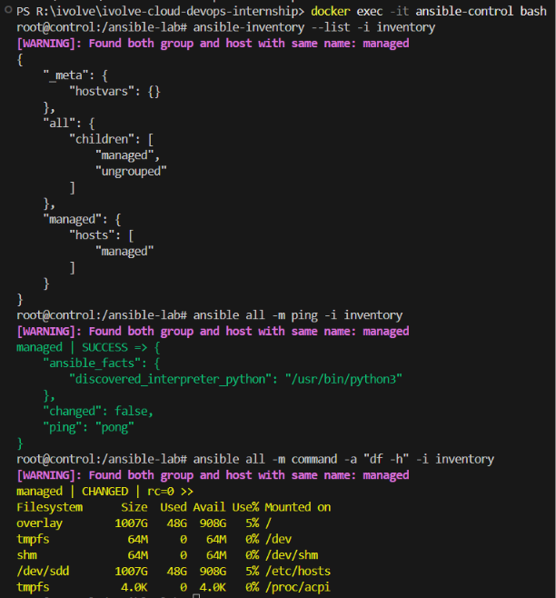

# 🤖 Lab 25: Initial Ansible Configuration and Ad-Hoc Execution

## 📌 Overview

This lab demonstrates how to install and configure **Ansible Automation Platform** on a control node, establish passwordless SSH authentication with managed nodes, create a host inventory, and execute ad-hoc commands to perform quick administrative tasks without writing a full playbook.

Ansible is an agentless automation tool — it requires no software installation on managed nodes. All communication happens over SSH, making initial setup simple and lightweight.

---

# 📖 Understanding Ansible

**Ansible** is an open-source IT automation engine that automates provisioning, configuration management, application deployment, and orchestration.

Unlike tools such as Chef or Puppet, Ansible is **agentless** — it communicates with managed nodes over standard SSH and requires no daemon or agent process on the target systems.

Benefits include:

- Extensive module library
- Push-based execution model

---

# 📖 Ansible vs. Ansible Navigator

In modern Ansible environments (especially Red Hat Ansible Automation Platform), you will often hear about **Ansible Navigator** (`ansible-navigator`) alongside traditional Ansible commands (`ansible`, `ansible-playbook`).

| Feature | `ansible` / `ansible-playbook` | `ansible-navigator` |
|---------|--------------------------------|---------------------|
| **Interface** | Standard command-line output (stdout). | Interactive, text-based user interface (TUI) with menus. |
| **Execution Environment** | Runs locally using the Python environment installed on the control node. | Runs inside **Execution Environments (EEs)** (Docker/Podman containers) pre-packaged with all required collections and dependencies. |
| **Troubleshooting** | Requires scrolling through terminal logs. | Allows you to zoom in/out of specific tasks, inspect host states interactively, and view detailed JSON results. |
| **Inventory Viewing** | `ansible-inventory --list` (JSON/YAML dump). | Interactive, searchable table of hosts and groups. |

> 💡 **Summary:** `ansible` is the classic CLI tool. `ansible-navigator` is the modern, interactive wrapper designed to run playbooks consistently inside containers (Execution Environments) while providing a much richer troubleshooting experience. In this lab, we use the classic `ansible` CLI to understand the fundamentals.

---

# 📖 Ansible Architecture

Ansible follows a simple **control node → managed nodes** architecture:

```text
              Control Node
        (Ansible installed here)
                  │
          SSH Connection
                  │
      ┌───────────┴───────────┐
      │                       │
      ▼                       ▼
 Managed Node 1         Managed Node 2
  (No agent)              (No agent)
```

Key components:

- **Control Node**: The machine where Ansible is installed and commands are executed from
- **Managed Nodes**: Remote servers managed by Ansible (no agent required)
- **Inventory**: A file listing all managed nodes and their groups
- **Modules**: Units of code Ansible executes on managed nodes (e.g., `command`, `copy`, `yum`)
- **Ad-Hoc Commands**: One-line Ansible commands for quick tasks without writing a playbook

---

# 📖 SSH Key-Based Authentication

Ansible communicates with managed nodes over SSH. For automation to work without manual password entry, **SSH key-based authentication** must be configured between the control node and all managed nodes.

```text
Control Node                    Managed Node
     │                                │
     │  1. Generate SSH Key Pair      │
     │  (ssh-keygen)                  │
     │                                │
     │  2. Copy Public Key            │
     │  (ssh-copy-id)                 │
     │ ──────────────────────────────►│
     │                                │
     │  3. Passwordless SSH Login     │
     │ ◄──────────────────────────────│
     │                                │
     │  4. Ansible Commands via SSH   │
     │ ──────────────────────────────►│
```

---

# 📖 Inventory File

An **inventory** file defines the managed nodes that Ansible can connect to. It can be a simple INI-style or YAML-based file that groups hosts by purpose.

Example INI inventory:

```ini
[webservers]
192.168.1.10
192.168.1.11

[databases]
db-server.example.com
```

Example YAML inventory:

```yaml
all:
  children:
    webservers:
      hosts:
        192.168.1.10:
        192.168.1.11:
    databases:
      hosts:
        db-server.example.com:
```

---

# 📖 Ad-Hoc Commands

**Ad-hoc commands** are one-line Ansible commands used for quick, one-time tasks without writing a full playbook.

Syntax:

```bash
ansible <host-pattern> -m <module> -a "<arguments>" -i <inventory>
```

Examples:

```bash
# Ping all hosts
ansible all -m ping -i inventory

# Check disk space
ansible all -m command -a "df -h" -i inventory

# Check uptime
ansible all -m command -a "uptime" -i inventory
```

---

## 🎯 Objectives

- Install and configure Ansible Automation Platform on a control node.
- Generate a new SSH key pair on the control node.
- Transfer the public key to managed nodes using `ssh-copy-id`.
- Create an inventory file listing managed nodes.
- Execute ad-hoc commands to verify connectivity and check disk space.

---

## 📂 Project Structure

```text
Lab25-Initial-Configuration/
│
├── control-node/
|   ├── inventory
|   ├── ansible.cfg
│   └── Dockerfile
├── managed-node/
│   └── Dockerfile
├── docker-compose.yml
├── Screenshots/
│   └── ansible_lab.png
└── README.md
```

---

## 🛠 Technologies Used

- Ansible
- SSH
- Linux (RHEL / CentOS / Ubuntu)
- Docker / Docker Compose
- Bash

---

## ✅ Prerequisites

Ensure the following are available before starting:

**Option A — Standard Setup (Physical / Virtual Machines):**

- Two Linux machines (Control Node + Managed Node)
- Root or sudo access on both machines
- Network connectivity between both machines
- SSH service running on managed node

**Option B — Docker-Based Setup (Windows / macOS / Linux):**

- Docker Desktop installed and running
- Docker Compose installed

---

# 🐳 Option B: Docker-Based Lab Environment

> 💡 **Why Docker?** Ansible requires a Linux control node and cannot run natively on Windows. Using Docker containers provides a lightweight, reproducible lab environment without needing virtual machines. This approach creates two containers on the same Docker network — one with Ansible installed (control node) and one running an SSH server (managed node).

## Docker Architecture

```text
Docker Desktop (Host Machine)
    │
    ├── ansible-control (Ubuntu 22.04 + Ansible)
    │       └── /ansible-lab/  (ansible.cfg + inventory)
    │
    └── ansible-managed (Ubuntu 22.04 + SSH Server)
            └── user: ansible (password: ansible)
    │
    └── Network: ansible-net (bridge)
```

## Control Node Dockerfile

`control-node/Dockerfile`

```dockerfile
FROM ubuntu:22.04

RUN apt-get update && apt-get install -y \
    ansible \
    openssh-client \
    sshpass \
    iputils-ping \
    && rm -rf /var/lib/apt/lists/*

RUN mkdir -p /ansible-lab

WORKDIR /ansible-lab

CMD ["sleep", "infinity"]
```

> **What this does:** Creates an Ubuntu container with Ansible, SSH client, and `sshpass` (needed for initial `ssh-copy-id` authentication) pre-installed.

## Managed Node Dockerfile

`managed-node/Dockerfile`

```dockerfile
FROM ubuntu:22.04

RUN apt-get update && apt-get install -y \
    openssh-server \
    python3 \
    sudo \
    && rm -rf /var/lib/apt/lists/*

RUN mkdir /var/run/sshd

RUN useradd -m -s /bin/bash ansible && \
    echo "ansible:ansible" | chpasswd && \
    usermod -aG sudo ansible && \
    echo "ansible ALL=(ALL) NOPASSWD:ALL" >> /etc/sudoers

RUN sed -i 's/#PermitRootLogin prohibit-password/PermitRootLogin yes/' /etc/ssh/sshd_config && \
    sed -i 's/#PasswordAuthentication yes/PasswordAuthentication yes/' /etc/ssh/sshd_config

EXPOSE 22

CMD ["/usr/sbin/sshd", "-D"]
```

> **What this does:** Creates an Ubuntu container running an SSH server with a pre-configured `ansible` user. Python3 is required because Ansible executes Python modules on managed nodes.

## Docker Compose File

`docker-compose.yml`

```yaml
services:
  control-node:
    build: ./control-node
    container_name: ansible-control
    hostname: control
    networks:
      - ansible-net
    volumes:
      - ansible-data:/ansible-lab
    stdin_open: true
    tty: true

  managed-node:
    build: ./managed-node
    container_name: ansible-managed
    hostname: managed
    networks:
      - ansible-net

networks:
  ansible-net:
    driver: bridge

volumes:
  ansible-data:
```

> **What this does:** Defines the entire lab infrastructure as code. The `control-node` service builds the Ansible container, mounts a persistent volume at `/ansible-lab` (so your config files survive container restarts), and sets `stdin_open` + `tty` to keep the container alive for interactive use. The `managed-node` service builds the SSH server container. Both services are placed on the same `ansible-net` bridge network, enabling them to communicate using container hostnames (`control` and `managed`) instead of IP addresses. The `ansible-data` named volume persists your `ansible.cfg`, `inventory`, and any other files created inside `/ansible-lab`.

## Launch the Environment

Build and start both containers:

```bash
docker compose up -d --build
```

Verify both containers are running:

```bash
docker ps --filter "name=ansible"
```

Expected:

```text
CONTAINER ID   IMAGE           COMMAND              STATUS          NAMES
xxxxxxxx       control-node    "sleep infinity"     Up 10 seconds   ansible-control
xxxxxxxx       managed-node    "/usr/sbin/sshd -D"  Up 10 seconds   ansible-managed
```

## Execute Lab Steps Inside the Control Node

All subsequent lab steps (Steps 1–7) are executed inside the control node container.

Open an interactive shell:

```bash
docker exec -it ansible-control bash
```

Or execute commands directly from the host:

```bash
docker exec ansible-control bash -c "<COMMAND>"
```

> ℹ️ **Note:** When using the Docker-based setup, replace any `<MANAGED_NODE_IP>` in the lab steps below with the hostname `managed` — Docker's internal DNS automatically resolves container names on the same network.

---

# 📋 Lab Steps

## 1. Install Ansible on the Control Node

Update the system packages:

```bash
sudo apt update && sudo apt upgrade -y
```

Install Ansible:

**Ubuntu / Debian:**

```bash
sudo apt install -y ansible
```

**RHEL / CentOS:**

```bash
sudo dnf install -y ansible-core
```

Verify the installation:

```bash
ansible --version
```

Expected:

```text
ansible [core X.X.X]
```

---

## 2. Generate SSH Key Pair on Control Node

Generate a new SSH key pair:

```bash
ssh-keygen -t rsa -b 4096
```

When prompted:

```text
Enter file in which to save the key: Press Enter (default)
Enter passphrase: Press Enter (no passphrase for automation)
```

This creates two files:

| File | Purpose |
|------|---------|
| `~/.ssh/id_rsa` | Private key (stays on control node) |
| `~/.ssh/id_rsa.pub` | Public key (copied to managed nodes) |

---

## 3. Transfer Public Key to Managed Node

Copy the public key to the managed node using `ssh-copy-id`:

```bash
ssh-copy-id <USER>@<MANAGED_NODE_IP>
```

Example:

```bash
ssh-copy-id user@192.168.1.10
```

Enter the managed node password when prompted.

Verify passwordless SSH:

```bash
ssh <USER>@<MANAGED_NODE_IP>
```

You should connect **without being asked for a password**.

---

## 4. Create Ansible Configuration File

Create a project directory:

```bash
mkdir ~/ansible-lab && cd ~/ansible-lab
```

Create `ansible.cfg`:

```ini
[defaults]
inventory = ./inventory
remote_user = <YOUR_USER>
host_key_checking = False
```

> 💡 **Why `host_key_checking = False`?** This disables the SSH host key verification prompt (`Are you sure you want to continue connecting?`), which would otherwise block automation when connecting to a host for the first time.

---

## 5. Create the Inventory File

Create the `inventory` file:

```ini
[managed]
<MANAGED_NODE_IP>
```

Example:

```ini
[managed]
192.168.1.10
```

Verify the inventory:

```bash
ansible-inventory --list -i inventory
```

Expected output:

```json
{
    "managed": {
        "hosts": [
            "192.168.1.10"
        ]
    }
}
```

---

## 6. Test Connectivity with Ping Module

Run the Ansible `ping` module to verify SSH connectivity:

```bash
ansible all -m ping -i inventory
```

Expected output:

```text
192.168.1.10 | SUCCESS => {
    "changed": false,
    "ping": "pong"
}
```

> ℹ️ **Note:** The Ansible `ping` module does not perform an ICMP ping. It verifies that Ansible can connect to the managed node via SSH, transfer a Python module, execute it, and return results.

---

## 7. Execute Ad-Hoc Command — Check Disk Space

Check disk space on the managed node:

```bash
ansible all -m command -a "df -h" -i inventory
```

Expected output:

```text
192.168.1.10 | CHANGED | rc=0 >>
Filesystem      Size  Used Avail Use% Mounted on
/dev/sda1        50G   12G   35G  26% /
tmpfs           2.0G     0  2.0G   0% /dev/shm
```

Additional useful ad-hoc commands:

Check memory usage:

```bash
ansible all -m command -a "free -m" -i inventory
```

Check system uptime:

```bash
ansible all -m command -a "uptime" -i inventory
```

List running services:

```bash
ansible all -m command -a "systemctl list-units --type=service --state=running" -i inventory
```

---

## 8. Ad-Hoc Command Summary

| Command | Module | Description |
|---------|--------|-------------|
| `ansible all -m ping` | `ping` | Test SSH connectivity |
| `ansible all -m command -a "df -h"` | `command` | Check disk space |
| `ansible all -m command -a "free -m"` | `command` | Check memory usage |
| `ansible all -m command -a "uptime"` | `command` | Check system uptime |
| `ansible all -m shell -a "cat /etc/os-release"` | `shell` | Check OS version |
| `ansible all -m setup` | `setup` | Gather all system facts |

---

# 📸 Screenshots

Include screenshots demonstrating:

| Description | Image |
|------------|-------|
| Ansible Configuration and Ad-Hoc Execution |  |

---

## 📚 Key Learning Outcomes

After completing this lab, you will be able to:

- Install and configure Ansible on a control node.
- Generate SSH key pairs for passwordless authentication.
- Transfer SSH public keys to managed nodes.
- Create and verify Ansible inventory files.
- Execute ad-hoc commands for quick system administration.
- Understand the difference between `ping`, `command`, and `shell` modules.
- Understand Ansible's agentless architecture and SSH-based communication.

---

## 💡 Best Practices

- Always use SSH key-based authentication instead of passwords for automation.
- Disable host key checking only in lab environments. In production, use `known_hosts`.
- Group hosts logically in the inventory (e.g., `webservers`, `databases`).
- Use the `command` module for simple commands and the `shell` module when piping or redirection is needed.
- Keep `ansible.cfg` in the project directory for project-specific settings.
- Use `--become` flag when tasks require elevated privileges.
- Test connectivity with `ansible all -m ping` before running any playbooks.

---

## 🌍 Real-World Use Cases

- Server provisioning and initial configuration
- Quick health checks across hundreds of servers
- Patch management and system updates
- User account management across multiple machines
- Service status monitoring
- Compliance auditing

---

## 🧹 Cleanup

**Option A — Standard Cleanup:**

Remove the SSH key from the managed node:

```bash
ssh <USER>@<MANAGED_NODE_IP> "rm ~/.ssh/authorized_keys"
```

Remove the local SSH key pair:

```bash
rm ~/.ssh/id_rsa ~/.ssh/id_rsa.pub
```

Remove the project directory:

```bash
rm -rf ~/ansible-lab
```

**Option B — Docker Cleanup:**

Stop and remove all containers, networks, and volumes:

```bash
docker compose down -v
```

Remove the built images:

```bash
docker rmi lab25-initial-configuration-control-node lab25-initial-configuration-managed-node
```

---

## ✅ Result

Successfully installed and configured **Ansible Automation Platform** on a control node, established passwordless SSH key-based authentication with a managed node, created an inventory file, verified connectivity using the `ping` module, and executed ad-hoc commands to check disk space and system information on the remote host.
