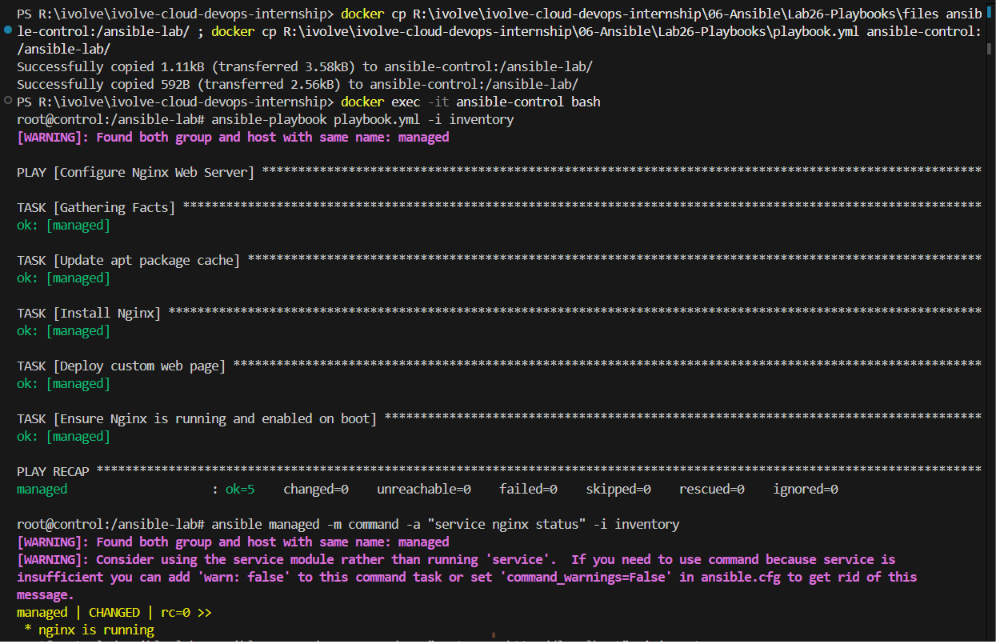
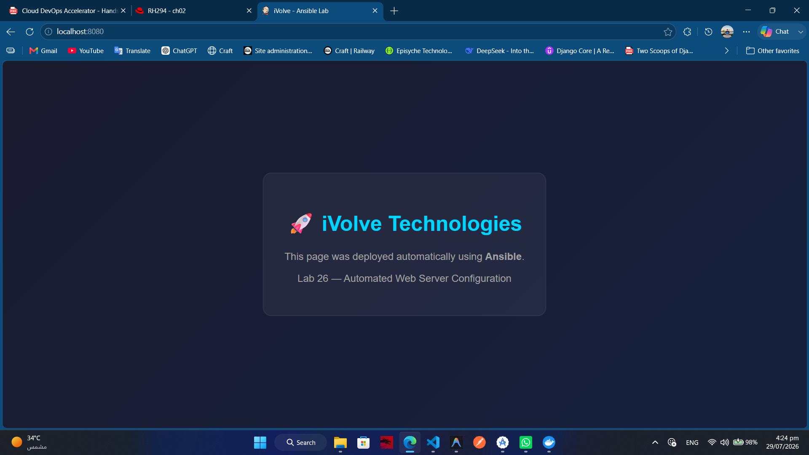

# 🤖 Lab 26: Automated Web Server Configuration Using Ansible Playbooks

## 📌 Overview

This lab demonstrates how to write and execute an **Ansible Playbook** to automate the configuration of a web server on a managed node. The playbook installs **Nginx**, deploys a custom HTML web page, and ensures the web server is running and enabled on boot. Finally, the configuration is verified by accessing the deployed web page from the managed node.

By moving from ad-hoc commands (Lab 25) to playbooks, we gain repeatable, version-controlled, and idempotent automation that can be applied consistently across any number of servers.

---

# 📖 Understanding Ansible Playbooks

An **Ansible Playbook** is a YAML file that defines a set of tasks to be executed on managed nodes in a specific order. Playbooks are the core building block of Ansible automation.

Unlike ad-hoc commands (which execute a single task), playbooks can orchestrate multiple tasks, use variables, handle conditions, and manage complex workflows.

Benefits include:

- Repeatable and version-controlled automation
- Idempotent execution (safe to re-run without side effects)
- Multi-task orchestration in a defined order
- Variable substitution and template support
- Conditional logic and error handling

---

# 📖 Playbook Structure

An Ansible playbook consists of one or more **plays**, each targeting a group of hosts:

```yaml
---
- name: Play Name
  hosts: target_hosts
  become: yes

  tasks:
    - name: Task 1 Description
      module_name:
        parameter: value

    - name: Task 2 Description
      module_name:
        parameter: value
```

Key elements:

- **`name`**: A human-readable description of the play or task
- **`hosts`**: The target hosts or groups from the inventory
- **`become`**: Escalate privileges to root (equivalent to `sudo`)
- **`tasks`**: An ordered list of actions to execute on the target hosts

---

# 📖 Key Ansible Modules Used

| Module | Purpose |
|--------|---------|
| `apt` | Install, update, or remove packages on Debian/Ubuntu systems |
| `copy` | Copy files or inline content to managed nodes |
| `service` | Start, stop, restart, or enable system services |

---

# 📖 Playbook Workflow

```text
Control Node
      │
      ▼
Run Playbook
      │
      ├── Task 1: Install Nginx
      │
      ├── Task 2: Deploy Custom Web Page
      │
      ├── Task 3: Enable & Start Nginx
      │
      ▼
Managed Node
(Nginx Running with Custom Page)
```

---

## 🎯 Objectives

- Write an Ansible playbook to automate web server configuration.
- Install Nginx on the managed node using the `apt` module.
- Deploy a custom HTML web page using the `copy` module.
- Ensure the Nginx service is running and enabled on boot.
- Verify the configuration by accessing the deployed web page.

---

## 📂 Project Structure

```text
Lab26-Playbooks/
│
├── playbook.yml
├── files/
│   └── index.html
├── Screenshots/
│   └── playbook_lab.png
└── README.md
```

---

## 🛠 Technologies Used

- Ansible
- Nginx
- HTML
- SSH
- Linux (Ubuntu)
- Docker / Docker Compose (if using Lab 25 Docker environment)

---

## ✅ Prerequisites

Ensure the following are available before starting:

- Ansible control node with Ansible installed
- Managed node accessible via SSH with passwordless authentication
- Inventory file configured (completed in Lab 25)

> 💡 **Tip:** If you set up the Docker-based environment in Lab 25, you can reuse the same `ansible-control` and `ansible-managed` containers for this lab.

---

# 📋 Lab Steps

## 1. Create the Custom Web Page

Create the `files` directory and a custom HTML page:

```bash
mkdir -p files
```

Create `files/index.html`:

```html
<!DOCTYPE html>
<html lang="en">
<head>
    <meta charset="UTF-8">
    <meta name="viewport" content="width=device-width, initial-scale=1.0">
    <title>iVolve - Ansible Lab</title>
    <style>
        body {
            font-family: Arial, sans-serif;
            display: flex;
            justify-content: center;
            align-items: center;
            min-height: 100vh;
            margin: 0;
            background: linear-gradient(135deg, #1a1a2e, #16213e);
            color: #e0e0e0;
        }
        .container {
            text-align: center;
            padding: 40px;
            border-radius: 16px;
            background: rgba(255, 255, 255, 0.05);
            border: 1px solid rgba(255, 255, 255, 0.1);
        }
        h1 { color: #00d4ff; font-size: 2.5em; }
        p { font-size: 1.2em; color: #a0a0a0; }
    </style>
</head>
<body>
    <div class="container">
        <h1>🚀 iVolve Technologies</h1>
        <p>This page was deployed automatically using <strong>Ansible</strong>.</p>
        <p>Lab 26 — Automated Web Server Configuration</p>
    </div>
</body>
</html>
```

---

## 2. Create the Ansible Playbook

Create `playbook.yml`:

```yaml
---
- name: Configure Nginx Web Server
  hosts: managed
  become: true

  tasks:

    - name: Update apt package cache
      apt:
        update_cache: true
        cache_valid_time: 3600

    - name: Install Nginx
      apt:
        name: nginx
        state: present

    - name: Deploy custom web page
      copy:
        src: files/index.html
        dest: /var/www/html/index.html
        owner: www-data
        group: www-data
        mode: '0644'

    - name: Ensure Nginx is running and enabled on boot
      service:
        name: nginx
        state: started
        enabled: true
```

---

## 3. Playbook Task Breakdown

| Task | Module | Description |
|------|--------|-------------|
| **Update apt cache** | `apt` | Refreshes the package index. `cache_valid_time: 3600` prevents re-downloading if the cache was updated within the last hour. |
| **Install Nginx** | `apt` | Installs the `nginx` package. `state: present` ensures idempotency — Ansible skips this task if Nginx is already installed. |
| **Deploy custom web page** | `copy` | Copies `files/index.html` from the control node to `/var/www/html/index.html` on the managed node with proper ownership (`www-data`) and permissions (`0644`). |
| **Enable & start Nginx** | `service` | Ensures the Nginx service is actively running (`state: started`) and configured to start automatically on system boot (`enabled: yes`). |

---

## 4. Run the Playbook

Execute the playbook:

```bash
ansible-playbook playbook.yml -i inventory
```

Expected output:

```text
PLAY [Configure Nginx Web Server] *********************************************

TASK [Gathering Facts] *********************************************************
ok: [managed]

TASK [Update apt package cache] ************************************************
changed: [managed]

TASK [Install Nginx] ***********************************************************
changed: [managed]

TASK [Deploy custom web page] **************************************************
changed: [managed]

TASK [Ensure Nginx is running and enabled on boot] *****************************
changed: [managed]

PLAY RECAP *********************************************************************
managed                    : ok=5    changed=4    unreachable=0    failed=0    skipped=0
```

> 💡 **Understanding the PLAY RECAP:**
> - **ok**: Tasks that completed successfully (including those already in the desired state)
> - **changed**: Tasks that modified the managed node
> - **unreachable**: Hosts that could not be contacted
> - **failed**: Tasks that encountered errors

---

## 5. Verify Idempotency

Run the playbook again to verify idempotency:

```bash
ansible-playbook playbook.yml -i inventory
```

Expected output on second run:

```text
PLAY RECAP *********************************************************************
managed                    : ok=5    changed=0    unreachable=0    failed=0    skipped=0
```

> ℹ️ **Note:** `changed=0` confirms idempotency. Since Nginx is already installed, the web page is already deployed, and the service is already running, Ansible detects that the desired state is already achieved and makes no changes.

---

## 6. Verify the Configuration on the Managed Node

Verify Nginx is running:

```bash
# If using real VMs (Systemd):
ansible managed -m command -a "systemctl status nginx" -i inventory

# If using Docker lab environment (SysVinit):
ansible managed -m command -a "service nginx status" -i inventory
```

Verify the custom web page was deployed:

```bash
ansible managed -m command -a "cat /var/www/html/index.html" -i inventory
```

Test the web server response:

```bash
# Using wget since curl is not installed in the basic Ubuntu image
ansible managed -m command -a "wget -qO- http://localhost" -i inventory
```

The output should display the content of the custom HTML page deployed in Step 1.

---

# 📸 Screenshots

Include screenshots demonstrating:

| Description | Image |
|------------|-------|
| Playbook Execution and Verification |   |
| Website Deployed Successfully |   |

---

## 📚 Key Learning Outcomes

After completing this lab, you will be able to:

- Write Ansible playbooks using YAML syntax.
- Install packages using the `apt` module.
- Deploy files to managed nodes using the `copy` module.
- Manage services using the `service` module.
- Understand playbook idempotency and how Ansible detects desired state.
- Verify deployments using ad-hoc commands.
- Automate web server configuration across multiple servers.

---

## 💡 Best Practices

- Always use `become: yes` when tasks require root privileges.
- Set `cache_valid_time` on `apt` to avoid unnecessary cache updates.
- Use `state: present` for package installation to ensure idempotency.
- Set proper file ownership and permissions when deploying files.
- Run the playbook twice to verify idempotency (`changed=0` on the second run).
- Use descriptive `name` fields for every play and task for clear output.
- Store files to be deployed in a `files/` directory within the project.

---

## 🌍 Real-World Use Cases

- Automated web server provisioning across environments
- Consistent application deployment across development, staging, and production
- Infrastructure as Code (IaC) for web tier management
- Compliance enforcement (ensuring services are running and enabled)
- Disaster recovery (quickly rebuild web servers from playbooks)
- Fleet management (deploy updates to hundreds of servers simultaneously)

---

## 🧹 Cleanup

Remove Nginx from the managed node:

```bash
ansible managed -m apt -a "name=nginx state=absent purge=yes" --become -i inventory
```

Remove the custom web page:

```bash
ansible managed -m file -a "path=/var/www/html/index.html state=absent" --become -i inventory
```

---

## ✅ Result

Successfully wrote and executed an Ansible playbook that automated the installation of **Nginx**, deployed a **custom HTML web page**, and ensured the service was **running and enabled on boot**. The playbook demonstrated idempotency by reporting zero changes on subsequent runs, and the deployed web page was verified by accessing it on the managed node.
