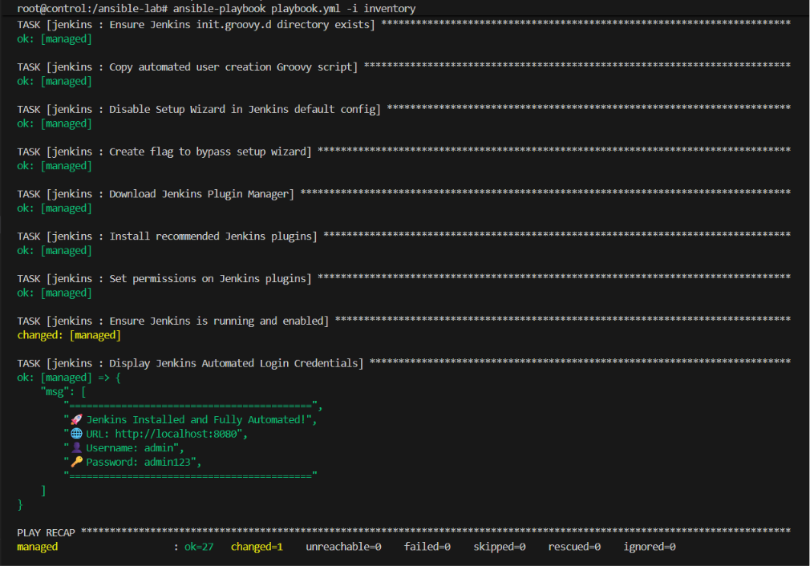

# 🤖 Lab 27: Structured Configuration Management with Ansible Roles

## 📌 Overview

This lab demonstrates how to create and use **Ansible Roles** to structure reusable, modular automation for installing and configuring **Docker**, **Kubernetes CLI (kubectl)**, and **Jenkins** on managed nodes. Instead of placing all tasks in a single playbook (Lab 26), roles organize tasks, handlers, files, and variables into a standardized directory structure that can be shared and reused across projects.

By adopting roles, we follow Ansible best practices for large-scale configuration management — each role encapsulates the complete installation logic for a single tool, making the automation modular, testable, and maintainable.

---

# 📖 Understanding Ansible Roles

An **Ansible Role** is a standardized way to organize automation content into a reusable, self-contained unit. Roles break down complex playbooks into smaller, focused components that each handle a single responsibility.

Instead of writing one large playbook with dozens of tasks, roles allow you to split the logic:

```text
Single Playbook (Monolithic)          Roles (Modular)
┌──────────────────────┐       ┌──────────┐ ┌──────────┐ ┌──────────┐
│ Install Docker       │       │  docker  │ │ kubectl  │ │ jenkins  │
│ Install kubectl      │  ──►  │  role    │ │  role    │ │  role    │
│ Install Jenkins      │       └──────────┘ └──────────┘ └──────────┘
│ Configure everything │         Reusable     Reusable     Reusable
└──────────────────────┘
```

Benefits include:

- Modular and reusable automation units
- Standardized directory structure
- Separation of concerns (one role per tool)
- Easy sharing via Ansible Galaxy
- Simplified playbooks that simply reference roles
- Independent testing of each role

---

# 📖 Role Directory Structure

Each Ansible role follows a standardized directory layout:

```text
roles/
└── role_name/
    ├── tasks/
    │   └── main.yml       # Core tasks to execute
    ├── handlers/
    │   └── main.yml       # Event-triggered actions (e.g., restart service)
    ├── templates/
    │   └── config.j2      # Jinja2 templates for dynamic files
    ├── files/
    │   └── static_file    # Static files to copy
    ├── vars/
    │   └── main.yml       # Role-specific variables
    ├── defaults/
    │   └── main.yml       # Default variable values (lowest priority)
    └── meta/
        └── main.yml       # Role metadata and dependencies
```

> 💡 **Not all directories are required.** Ansible only looks for the directories that exist. A simple role may only contain `tasks/main.yml`.

---

# 📖 How Roles Are Used in Playbooks

Once roles are created, the playbook becomes minimal — it simply lists which roles to apply to which hosts:

```yaml
---
- name: Configure DevOps Tools
  hosts: managed
  become: yes

  roles:
    - docker
    - kubectl
    - jenkins
```

Ansible automatically looks for each role inside a `roles/` directory relative to the playbook.

---

# 📖 Playbook vs. Roles Comparison

| Aspect | Playbook (Lab 26) | Roles (Lab 27) |
|--------|-------------------|----------------|
| **Structure** | All tasks in a single YAML file | Tasks organized into separate role directories |
| **Reusability** | Copy-paste between projects | Import roles into any playbook |
| **Maintainability** | Becomes unwieldy as tasks grow | Each role is independently maintained |
| **Testing** | Test entire playbook at once | Test each role individually |
| **Collaboration** | Single file conflicts in version control | Team members work on different roles |
| **Best for** | Simple, single-purpose automation | Multi-tool, production-grade configuration |

---

## 🎯 Objectives

- Understand the Ansible role directory structure.
- Create three Ansible roles: `docker`, `kubectl`, and `jenkins`.
- Write a playbook that executes the created roles.
- Verify the installation of all three tools on the managed node.

---

## 📂 Project Structure

```text
Lab27-Roles/
│
├── playbook.yml
├── ansible.cfg
├── inventory
├── roles/
│   ├── docker/
│   │   ├── tasks/
│   │   │   └── main.yml
│   │   └── handlers/
│   │       └── main.yml
│   ├── kubectl/
│   │   └── tasks/
│   │       └── main.yml
│   └── jenkins/
│       ├── tasks/
│       │   └── main.yml
│       └── handlers/
│           └── main.yml
├── Screenshots/
│   └── roles_lab.png
└── README.md
```

---

## 🛠 Technologies Used

- Ansible
- Docker
- Kubernetes CLI (kubectl)
- Jenkins
- SSH
- Linux (Ubuntu)

---

## ✅ Prerequisites

Ensure the following are available before starting:

- Ansible control node with Ansible installed
- Managed node accessible via SSH with passwordless authentication
- Inventory file configured (completed in Lab 25)

> 💡 **Tip:** If you set up the Docker-based environment in Lab 25, you can reuse the same `ansible-control` and `ansible-managed` containers for this lab.

---

# 📋 Lab Steps

## 1. Initialize the Role Directory Structure

Create the roles using `ansible-galaxy init`:

```bash
mkdir -p roles
ansible-galaxy init roles/docker
ansible-galaxy init roles/kubectl
ansible-galaxy init roles/jenkins
```

> 💡 **What `ansible-galaxy init` does:** Generates the complete standardized role directory structure with all subdirectories (`tasks/`, `handlers/`, `vars/`, `defaults/`, `meta/`, `templates/`, `files/`) and placeholder `main.yml` files.

---

## 2. Create the Docker Role

`roles/docker/tasks/main.yml`

```yaml
---
- name: Install required packages for Docker
  apt:
    name:
      - apt-transport-https
      - ca-certificates
      - curl
      - gnupg
      - lsb-release
    state: present
    update_cache: yes

- name: Add Docker GPG key
  apt_key:
    url: https://download.docker.com/linux/ubuntu/gpg
    state: present

- name: Add Docker APT repository
  apt_repository:
    repo: "deb [arch=amd64] https://download.docker.com/linux/ubuntu {{ ansible_distribution_release }} stable"
    state: present

- name: Install Docker Engine
  apt:
    name:
      - docker-ce
      - docker-ce-cli
      - containerd.io
    state: present
    update_cache: yes
  notify: Start and enable Docker

- name: Verify Docker installation
  command: docker --version
  register: docker_version
  changed_when: false

- name: Display Docker version
  debug:
    msg: "{{ docker_version.stdout }}"
```

`roles/docker/handlers/main.yml`

```yaml
---
- name: Start and enable Docker
  service:
    name: docker
    state: started
    enabled: yes
```

> **What this role does:** Installs Docker Engine from the official Docker repository by adding the GPG key and APT source, installs the Docker packages, and uses a handler to start and enable the Docker service only when the installation changes.

---

## 3. Create the kubectl Role

`roles/kubectl/tasks/main.yml`

```yaml
---
- name: Install required packages for kubectl
  apt:
    name:
      - apt-transport-https
      - ca-certificates
      - curl
    state: present
    update_cache: yes

- name: Add Kubernetes GPG key
  apt_key:
    url: https://pkgs.k8s.io/core:/stable:/v1.30/deb/Release.key
    state: present

- name: Add Kubernetes APT repository
  apt_repository:
    repo: "deb https://pkgs.k8s.io/core:/stable:/v1.30/deb/ /"
    state: present

- name: Install kubectl
  apt:
    name: kubectl
    state: present
    update_cache: yes

- name: Verify kubectl installation
  command: kubectl version --client
  register: kubectl_version
  changed_when: false

- name: Display kubectl version
  debug:
    msg: "{{ kubectl_version.stdout }}"
```

> **What this role does:** Installs the Kubernetes CLI (`kubectl`) from the official Kubernetes APT repository by adding the GPG key and repository source, then verifies the installation by printing the client version.

---

## 4. Create the Jenkins Role

`roles/jenkins/tasks/main.yml`

```yaml
---
- name: Install Java and fontconfig (Jenkins dependencies)
  apt:
    name:
      - openjdk-21-jdk
      - fontconfig
      - acl
    state: present
    update_cache: true

- name: Download Jenkins GPG key
  get_url:
    url: https://pkg.jenkins.io/debian-stable/jenkins.io-2026.key
    dest: /usr/share/keyrings/jenkins-keyring.asc
    force: yes

- name: Add Jenkins APT repository (Direct File)
  copy:
    dest: /etc/apt/sources.list.d/jenkins.list
    content: "deb [signed-by=/usr/share/keyrings/jenkins-keyring.asc] https://pkg.jenkins.io/debian-stable binary/\n"

- name: Update apt cache
  apt:
    update_cache: yes

- name: Install Jenkins
  apt:
    name: jenkins
    state: present
    update_cache: true

- name: Ensure Jenkins init.groovy.d directory exists
  file:
    path: /var/lib/jenkins/init.groovy.d
    state: directory
    owner: jenkins
    group: jenkins
    mode: '0755'

- name: Copy automated user creation Groovy script
  copy:
    src: basic-security.groovy
    dest: /var/lib/jenkins/init.groovy.d/basic-security.groovy
    owner: jenkins
    group: jenkins
    mode: '0644'

- name: Disable Setup Wizard in Jenkins default config
  lineinfile:
    path: /etc/default/jenkins
    regexp: '^JAVA_ARGS='
    line: 'JAVA_ARGS="-Djava.awt.headless=true -Djenkins.install.runSetupWizard=false"'
    state: present

- name: Create flag to bypass setup wizard
  copy:
    content: "2.0"
    dest: /var/lib/jenkins/jenkins.install.InstallUtil.lastExecVersion
    owner: jenkins
    group: jenkins

- name: Download Jenkins Plugin Manager
  get_url:
    url: https://github.com/jenkinsci/plugin-installation-manager-tool/releases/download/2.13.2/jenkins-plugin-manager-2.13.2.jar
    dest: /opt/jenkins-plugin-manager.jar

- name: Install recommended Jenkins plugins
  command: >
    java -jar /opt/jenkins-plugin-manager.jar
    --war /usr/share/java/jenkins.war
    --plugin-download-directory /var/lib/jenkins/plugins
    --plugins git matrix-auth workflow-aggregator docker-workflow blueocean credentials-binding
  register: plugin_install
  changed_when: "'Downloaded' in plugin_install.stdout"

- name: Set permissions on Jenkins plugins
  file:
    path: /var/lib/jenkins/plugins
    owner: jenkins
    group: jenkins
    recurse: yes
    state: directory

- name: Ensure Jenkins is running and enabled
  service:
    name: jenkins
    state: restarted
    enabled: true

- name: Display Jenkins Automated Login Credentials
  debug:
    msg: 
      - "=========================================="
      - "🚀 Jenkins Installed and Fully Automated!"
      - "🌐 URL: http://localhost:8080"
      - "👤 Username: admin"
      - "🔑 Password: admin123"
      - "=========================================="
```

`roles/jenkins/handlers/main.yml`

```yaml
---
- name: Start and enable Jenkins
  service:
    name: jenkins
    state: started
    enabled: true
```

> **What this role does:** Installs Java 21 (a Jenkins requirement), adds the official Jenkins repository, installs Jenkins, and uses a handler to start and enable the Jenkins service when the installation changes.

---

## 5. Jenkins Full Automation (Zero-Touch Setup)

To achieve a "Zero-Touch" installation where Jenkins is fully configured and ready to use without manually clicking through the setup wizard in the browser, the `jenkins` role was expanded to include:

1. **Bypassing the Setup Wizard:** We updated `/etc/default/jenkins` to inject `JAVA_ARGS="-Djenkins.install.runSetupWizard=false"`, and created a state file at `/var/lib/jenkins/jenkins.install.InstallUtil.lastExecVersion`.
2. **Automated User Creation:** We pushed a Groovy script (`basic-security.groovy`) into the `init.groovy.d` directory. When Jenkins starts, this script automatically creates an `admin` user with the password `admin123` and sets up matrix-based security.
3. **Automated Plugin Installation:** Instead of using the web UI, we use the official **Jenkins Plugin Installation Manager Tool JAR** to automatically install all recommended plugins (git, matrix-auth, workflow-aggregator, etc.) before Jenkins starts!

Because of this, once the playbook finishes, you can immediately log into `http://localhost:8080` with `admin` / `admin123`!

---

## 6. Create the Master Playbook

Create `playbook.yml`:

```yaml
---
- name: Configure DevOps Tools on Managed Nodes
  hosts: managed
  become: yes

  roles:
    - docker
    - kubectl
    - jenkins
```

> 💡 **Notice how clean this is!** The playbook is only 7 lines. All the complexity is encapsulated inside the roles. This is the power of role-based automation.

---

## 7. Role Breakdown Summary

| Role | Tasks | Key Modules | Handler |
|------|-------|-------------|---------|
| **docker** | Add GPG key → Add repo → Install Docker CE | `apt_key`, `apt_repository`, `apt` | Start & enable Docker service |
| **kubectl** | Add GPG key → Add repo → Install kubectl | `apt_key`, `apt_repository`, `apt` | — |
| **jenkins** | Install Java 21 → Add GPG key → Add repo → Install Jenkins | `apt_key`, `apt_repository`, `apt` | Start & enable Jenkins service |

---

## 8. Run the Playbook

Execute the playbook:

```bash
ansible-playbook playbook.yml -i inventory
```

Expected output:

```text
PLAY [Configure DevOps Tools on Managed Nodes] *********************************

TASK [Gathering Facts] *********************************************************
ok: [managed]

TASK [docker : Install required packages for Docker] ***************************
changed: [managed]

TASK [docker : Add Docker GPG key] *********************************************
changed: [managed]

TASK [docker : Add Docker APT repository] **************************************
changed: [managed]

TASK [docker : Install Docker Engine] ******************************************
changed: [managed]

TASK [docker : Verify Docker installation] *************************************
ok: [managed]

TASK [docker : Display Docker version] *****************************************
ok: [managed] => {
    "msg": "Docker version 29.6.2, build dfc4efb"
}

TASK [kubectl : Install required packages for kubectl] *************************
changed: [managed]

TASK [kubectl : Add Kubernetes GPG key] ****************************************
changed: [managed]

TASK [kubectl : Add Kubernetes APT repository] *********************************
changed: [managed]

TASK [kubectl : Install kubectl] ***********************************************
changed: [managed]

TASK [kubectl : Verify kubectl installation] ***********************************
ok: [managed]

TASK [kubectl : Display kubectl version] ***************************************
ok: [managed] => {
    "msg": "Client Version: v1.30.14\nKustomize Version: v5.0.4-0.20230601165947-6ce0bf390ce3"
}

TASK [jenkins : Install Java and fontconfig (Jenkins dependencies)] ************
changed: [managed]

TASK [jenkins : Download Jenkins GPG key] **************************************
changed: [managed]

TASK [jenkins : Add Jenkins APT repository (Direct File)] **********************
changed: [managed]

TASK [jenkins : Update apt cache] **********************************************
changed: [managed]

TASK [jenkins : Install Jenkins] ***********************************************
changed: [managed]

TASK [jenkins : Ensure Jenkins init.groovy.d directory exists] *****************
changed: [managed]

TASK [jenkins : Copy automated user creation Groovy script] ********************
changed: [managed]

TASK [jenkins : Disable Setup Wizard in Jenkins default config] ****************
changed: [managed]

TASK [jenkins : Create flag to bypass setup wizard] ****************************
changed: [managed]

TASK [jenkins : Download Jenkins Plugin Manager] *******************************
changed: [managed]

TASK [jenkins : Install recommended Jenkins plugins] ***************************
changed: [managed]

TASK [jenkins : Set permissions on Jenkins plugins] ****************************
changed: [managed]

TASK [jenkins : Ensure Jenkins is running and enabled] *************************
changed: [managed]

TASK [jenkins : Display Jenkins Automated Login Credentials] *******************
ok: [managed] => {
    "msg": [
        "==========================================",
        "🚀 Jenkins Installed and Fully Automated!",
        "🌐 URL: http://localhost:8080",
        "👤 Username: admin",
        "🔑 Password: admin123",
        "=========================================="
    ]
}

PLAY RECAP *********************************************************************
managed                    : ok=27   changed=21   unreachable=0    failed=0    skipped=0    rescued=0    ignored=0   
```

> ℹ️ **Note:** Handlers run at the end of all tasks, not immediately after being notified. This is by design — it prevents services from being restarted multiple times during a single playbook run.

---

## 8. Verify Installations on Managed Node

Verify Docker:

```bash
ansible managed -m command -a "docker --version" -i inventory
```

Verify kubectl:

```bash
ansible managed -m command -a "kubectl version --client" -i inventory
```

Verify Jenkins:

```bash
ansible managed -m command -a "jenkins --version" -i inventory
```

All three commands should return version numbers, confirming successful installation.

---


## 🚀 Enhancing this Lab with Ansible Collections

While **Ansible Roles** are excellent for organizing tasks and variables, **Ansible Content Collections** take this a step further. A Collection is a standard distribution format that can package and ship playbooks, roles, modules, and plugins together in one convenient unit.

### How Collections Could Improve This Setup:
1. **Using Official Collections (`community.docker`, `community.general`):**
   Instead of using raw `command` modules for plugin management or relying strictly on standard `apt` repositories, we could install the `community.docker` collection. This would give us access to dedicated modules like `docker_container` or `docker_image` to manage Docker workloads natively in Ansible, rather than just installing the engine!
   
2. **Packaging Our Lab into a Custom Collection:**
   We could group all three of our roles (`docker`, `kubectl`, `jenkins`) into a single custom collection, e.g., `ivolve.devops_tools`. This means anyone in your organization could install your entire toolkit with a single command: 
   `ansible-galaxy collection install ivolve.devops_tools`
   And then reference your roles dynamically in their playbook:
   ```yaml
   roles:
     - ivolve.devops_tools.docker
     - ivolve.devops_tools.jenkins
   ```

To get started with collections, you can explore the [Ansible Galaxy](https://galaxy.ansible.com/) repository!

---

# 📸 Screenshots

Include screenshots demonstrating:

| Description | Image |
|------------|-------|
| Roles Execution and Verification | | 

---

## 📚 Key Learning Outcomes

After completing this lab, you will be able to:

- Understand the Ansible role directory structure and its conventions.
- Create roles using `ansible-galaxy init`.
- Write role-specific tasks, handlers, and variables.
- Write clean playbooks that reference roles instead of inline tasks.
- Manage GPG keys and APT repositories using Ansible modules.
- Use handlers for event-driven service management.
- Verify tool installations using `command` module and `register`.
- Differentiate between Ansible Roles and Ansible Content Collections for distributing automation.

---

## 💡 Best Practices

- Use `ansible-galaxy init` to generate the standard role structure.
- Keep each role focused on a single tool or service (separation of concerns).
- Use handlers instead of explicit `service` tasks to avoid unnecessary restarts.
- Set `changed_when: false` on verification commands to prevent false `changed` reports.
- Use `debug` module to display version outputs for clear confirmation.
- Store role-specific variables in `defaults/main.yml` for easy overriding.
- Version control your roles separately for reuse across multiple projects.
- Transition from standalone Roles to Ansible Collections when grouping related roles and plugins for distribution.

---

## 🌍 Real-World Use Cases

- Standardized developer workstation provisioning
- CI/CD infrastructure setup (Jenkins, Docker, kubectl on build agents)
- Multi-environment configuration management
- Onboarding new servers with a consistent toolchain
- Disaster recovery (rebuild servers from roles)
- Compliance enforcement (ensure required tools are installed and configured)
- Distributing internal company DevOps toolkits via private Galaxy servers using Collections

---

## 🧹 Cleanup

Remove all installed tools from the managed node:

```bash
ansible managed -m apt -a "name=docker-ce,docker-ce-cli,containerd.io state=absent purge=yes" --become -i inventory
ansible managed -m apt -a "name=kubectl state=absent purge=yes" --become -i inventory
ansible managed -m apt -a "name=jenkins state=absent purge=yes" --become -i inventory
ansible managed -m apt -a "name=openjdk-21-jdk state=absent purge=yes" --become -i inventory
```

---

## ✅ Result

Successfully created three Ansible roles (**docker**, **kubectl**, **jenkins**), each encapsulating the complete installation and configuration logic for its respective tool. A minimal master playbook was written to orchestrate all three roles, and the installations were verified on the managed node by confirming version outputs for Docker, kubectl, and Jenkins.
