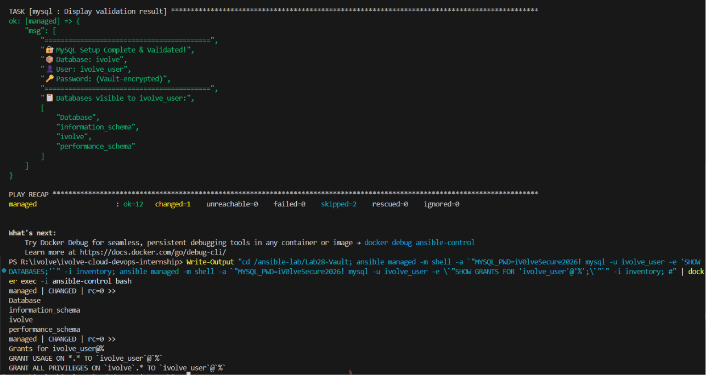

# 🤖 Lab 28: Securing Sensitive Data with Ansible Vault

## 📌 Overview

This lab demonstrates how to use **Ansible Vault** to securely manage sensitive information — such as database passwords — while automating the installation and configuration of **MySQL** on managed nodes. We build an Ansible **role** that installs MySQL, creates the `ivolve` database, provisions a dedicated user with full privileges, and validates the setup by connecting to the database remotely.

By combining Vault-encrypted secrets with role-based automation, we follow production-grade security practices — credentials never appear in plain text inside version-controlled files.

---

# 📖 Understanding Ansible Vault

**Ansible Vault** is a built-in feature that allows you to encrypt sensitive data (passwords, API keys, certificates) so it can be safely stored alongside your playbooks in version control.

```text
Without Vault                          With Vault
┌──────────────────────────┐    ┌──────────────────────────┐
│ vars/main.yml            │    │ vars/main.yml            │
│                          │    │                          │
│ db_password: P@ssw0rd!   │    │ db_password: !vault |    │
│ db_user: ivolve_user     │    │   $ANSIBLE_VAULT;1.1;    │
│                          │    │   AES256 61626364...     │
│  Plain text = DANGER     │    │  Encrypted = SAFE        │
└──────────────────────────┘    └──────────────────────────┘
```

### Key Vault Commands

| Command | Purpose |
|---------|---------|
| `ansible-vault create <file>` | Create a new encrypted file |
| `ansible-vault edit <file>` | Edit an existing encrypted file |
| `ansible-vault encrypt <file>` | Encrypt an existing plain-text file |
| `ansible-vault decrypt <file>` | Decrypt a vault-encrypted file |
| `ansible-vault view <file>` | View contents without decrypting to disk |
| `ansible-vault rekey <file>` | Change the encryption password |

### Running Playbooks with Vault

```bash
# Prompt for the vault password interactively
ansible-playbook playbook.yml --ask-vault-pass

# Use a password file (for CI/CD automation)
ansible-playbook playbook.yml --vault-password-file vault_pass.txt
```

---

# 📖 Vault Encryption Levels

Ansible Vault supports encrypting at different granularities:

| Level | Description | Use Case |
|-------|-------------|----------|
| **Entire File** | Encrypts the whole YAML file | Dedicated secrets files (`vault.yml`) |
| **Single Variable** | Encrypts only one variable value inline | Mixing secrets with non-sensitive vars |
| **String** | Encrypts an arbitrary string | Embedding secrets in templates |

> 💡 **Best Practice:** Keep encrypted variables in a separate file (e.g., `vars/vault.yml`) and reference them from your role. This makes it easy to identify which files contain secrets and avoids accidentally exposing them in diffs.

---

# 📖 Vault + Roles: Best Practice Architecture

When combining Vault with roles, the recommended approach is to layer your variables:

```text
roles/mysql/
├── defaults/
│   └── main.yml          # Non-sensitive defaults (db_name, db_user)
├── vars/
│   └── vault.yml         # 🔐 Vault-encrypted secrets (db_password)
├── tasks/
│   └── main.yml          # Task logic (install, configure, validate)
├── handlers/
│   └── main.yml          # Service restart handlers
└── meta/
    └── main.yml          # Role metadata
```

This separation means:
- **`defaults/main.yml`** can be freely shared and version-controlled
- **`vars/vault.yml`** is encrypted and safe to commit
- Variables merge at runtime — Ansible combines both sources automatically

---

## 🎯 Objectives

- Create an Ansible role for MySQL installation and configuration.
- Use Ansible Vault to encrypt the database user password.
- Automate database and user creation with proper privileges.
- Validate the setup by connecting to MySQL with the created user.

---

## 📂 Project Structure

```text
Lab28-Vault/
│
├── playbook.yml
├── ansible.cfg
├── inventory
├── vault_pass.txt                  # Vault password file (not committed)
├── roles/
│   └── mysql/
│       ├── tasks/
│       │   └── main.yml            # Install MySQL, create DB & user
│       ├── handlers/
│       │   └── main.yml            # Restart MySQL handler
│       ├── defaults/
│       │   └── main.yml            # Non-sensitive defaults
│       └── vars/
│           └── vault.yml           # 🔐 Encrypted credentials
├── Screenshots/
│   └── vault_lab.png
└── README.md
```

---

## 🛠 Technologies Used

- Ansible
- Ansible Vault
- MySQL
- SSH
- Linux (Ubuntu)

---

## ✅ Prerequisites

Ensure the following are available before starting:

- Ansible control node with Ansible installed
- Managed node accessible via SSH with passwordless authentication
- Inventory file configured (completed in Lab 25)
- Python `PyMySQL` library (installed by the role)

> 💡 **Tip:** If you set up the Docker-based environment in Lab 25, you can reuse the same `ansible-control` and `ansible-managed` containers for this lab.

---

# 📋 Lab Steps

## 1. Create the Ansible Configuration

`ansible.cfg`

```ini
[defaults]
# Specifies the default inventory file to use (points to our local 'inventory' file)
inventory = inventory

# Disables SSH host key checking (useful in lab environments to avoid manual confirmation prompts)
host_key_checking = False

# Allows Ansible to create world-readable temporary files (often needed when switching users in Docker containers)
allow_world_readable_tmpfiles = True

# Suppresses deprecation warnings from appearing in the output, keeping logs clean
deprecation_warnings = False
```

---

## 2. Create the Inventory File

`inventory`

```ini
# Defines a group named 'managed_nodes'
[managed_nodes]

# Defines a host named 'managed' belonging to the group above, along with its connection variables:
# - ansible_host: The actual hostname or IP address to connect to (resolves to the 'managed' container)
# - ansible_user: The SSH user to connect as ('root')
# - ansible_ssh_private_key_file: The path to the SSH private key used for passwordless authentication
managed ansible_host=managed ansible_user=root ansible_ssh_private_key_file=/root/.ssh/id_rsa
```

---

## 3. Create the Vault Password File

Create a file to store the vault password (this file should **never** be committed to version control):

```bash
echo "ivolve2026" > vault_pass.txt
chmod 600 vault_pass.txt
```

> ⚠️ **Security:** Add `vault_pass.txt` to your `.gitignore` to prevent accidental commits.

---

## 4. Create the MySQL Role

### Initialize the Role Structure

```bash
mkdir -p roles/mysql/{tasks,handlers,defaults,vars}
```

### 4.1 Define Default Variables

`roles/mysql/defaults/main.yml`

```yaml
---
# Non-sensitive defaults — safe to commit
# The name of the MySQL database we want to create
mysql_db_name: ivolve

# The username for the MySQL user we want to provision
mysql_db_user: ivolve_user

# The IP address MySQL should bind to (0.0.0.0 allows connections from any IP)
mysql_bind_address: "0.0.0.0"
```

> ⚠️ **Security Note:** Binding to `0.0.0.0` is useful for lab connectivity, but **not secure for production**. In the real world, you should bind MySQL to a private IP (e.g., `10.0.x.x`) or `127.0.0.1`, and enforce strict firewall rules (like AWS Security Groups) to only allow traffic to port `3306` from known application servers.

### 4.2 Create Vault-Encrypted Secrets

Create the encrypted variables file:

```bash
ansible-vault create roles/mysql/vars/vault.yml --vault-password-file vault_pass.txt
```

Add the following content when the editor opens:

```yaml
---
vault_mysql_root_password: R00tP@ss2026!
vault_mysql_user_password: iV0lve$ecure2026!
```

> 🔐 **What just happened?** Ansible Vault encrypted the file using AES-256. The plain-text passwords are now safely encrypted and can be committed to version control.

To verify the encryption worked:

```bash
cat roles/mysql/vars/vault.yml
```

Expected output (encrypted):

```text
$ANSIBLE_VAULT;1.1;AES256
61626364656667686970717273747576...
```

To view the decrypted contents:

```bash
ansible-vault view roles/mysql/vars/vault.yml --vault-password-file vault_pass.txt
```

### 4.3 Define the Role Tasks

`roles/mysql/tasks/main.yml`

```yaml
---
# Load vault-encrypted variables dynamically so passwords aren't hardcoded
- name: Include vault-encrypted variables
  include_vars:
    file: vault.yml

# Install the required MySQL packages and the Python MySQL module for Ansible
- name: Install MySQL and dependencies
  apt:
    name:
      - mysql-server
      - mysql-client
      - python3-pymysql
    state: present
    update_cache: true

# Ensure the MySQL service starts on boot and is running right now
- name: Ensure MySQL is running and enabled
  service:
    name: mysql
    state: started
    enabled: true

# Set the root password using the encrypted variable from the vault
- name: Set MySQL root password
  mysql_user:
    name: root
    password: "{{ vault_mysql_root_password }}"
    host: localhost
    login_unix_socket: /var/run/mysqld/mysqld.sock
    state: present

# Create the specific 'ivolve' database for the application
- name: Create iVolve database
  mysql_db:
    name: "{{ mysql_db_name }}"
    state: present
    login_unix_socket: /var/run/mysqld/mysqld.sock
  register: db_creation

# Output a success message if the database was just created
- name: Display database creation result
  debug:
    msg: "✅ Database '{{ mysql_db_name }}' created successfully!"
  when: db_creation.changed

# Provision a user and grant them ALL privileges exclusively on the 'ivolve' database
- name: Create iVolve database user with all privileges
  mysql_user:
    name: "{{ mysql_db_user }}"
    password: "{{ vault_mysql_user_password }}"
    priv: "{{ mysql_db_name }}.*:ALL"
    host: "%"
    state: present
    login_unix_socket: /var/run/mysqld/mysqld.sock
  register: user_creation

# Output a success message if the user was just created or modified
- name: Display user creation result
  debug:
    msg: "✅ User '{{ mysql_db_user }}' created with ALL privileges on '{{ mysql_db_name }}' database!"
  when: user_creation.changed

# Force MySQL to immediately reload the grant tables so privileges take effect
- name: Flush MySQL privileges
  command: mysql -u root -e "FLUSH PRIVILEGES;"
  changed_when: false

# Test the setup by actively connecting as the new user and executing a query
- name: Validate - Connect as ivolve_user and list databases
  command: >
    mysql -u {{ mysql_db_user }} -p{{ vault_mysql_user_password }} -e "SHOW DATABASES;"
  register: db_validation
  changed_when: false

# Print out the results of the connection test and the list of databases
- name: Display validation result
  debug:
    msg: 
      - "=========================================="
      - "🔐 MySQL Setup Complete & Validated!"
      - "📦 Database: {{ mysql_db_name }}"
      - "👤 User: {{ mysql_db_user }}"
      - "🔑 Password: (Vault-encrypted)"
      - "=========================================="
      - "📋 Databases visible to {{ mysql_db_user }}:"
      - "{{ db_validation.stdout_lines }}"
```

### 4.4 Define the Handler

`roles/mysql/handlers/main.yml`

```yaml
---
# Handlers are triggered only when notified by another task that reports a 'change'
- name: Restart MySQL
  service:
    name: mysql
    state: restarted
```

---

## 5. Create the Playbook

`playbook.yml`

```yaml
---
# The name of the play, displayed in the terminal output
- name: Secure MySQL Setup with Ansible Vault
# Target the 'managed_nodes' host group defined in the inventory file
  hosts: managed_nodes
# Execute tasks with elevated (sudo/root) privileges
  become: yes

# Apply the 'mysql' role to the targeted hosts
  roles:
    - mysql
```

---

## 6. Run the Playbook

Execute the playbook with the vault password:

```bash
ansible-playbook playbook.yml -i inventory --vault-password-file vault_pass.txt
```

Expected output:

```text
PLAY [Secure MySQL Setup with Ansible Vault] ***********************************

TASK [Gathering Facts] *********************************************************
ok: [managed]

TASK [mysql : Include vault-encrypted variables] *******************************
ok: [managed]

TASK [mysql : Install MySQL and dependencies] **********************************
changed: [managed]

TASK [mysql : Ensure MySQL is running and enabled] *****************************
changed: [managed]

TASK [mysql : Set MySQL root password] *****************************************
changed: [managed]

TASK [mysql : Create iVolve database] ******************************************
changed: [managed]

TASK [mysql : Display database creation result] ********************************
ok: [managed] => {
    "msg": "✅ Database 'ivolve' created successfully!"
}

TASK [mysql : Create iVolve database user with all privileges] *****************
changed: [managed]

TASK [mysql : Display user creation result] ************************************
ok: [managed] => {
    "msg": "✅ User 'ivolve_user' created with ALL privileges on 'ivolve' database!"
}

TASK [mysql : Flush MySQL privileges] ******************************************
ok: [managed]

TASK [mysql : Validate - Connect as ivolve_user and list databases] ************
ok: [managed]

TASK [mysql : Display validation result] ***************************************
ok: [managed] => {
    "msg": [
        "==========================================",
        "🔐 MySQL Setup Complete & Validated!",
        "📦 Database: ivolve",
        "👤 User: ivolve_user",
        "🔑 Password: (Vault-encrypted)",
        "==========================================",
        "📋 Databases visible to ivolve_user:",
        [
            "Database",
            "information_schema",
            "ivolve"
        ]
    ]
}

PLAY RECAP *********************************************************************
managed                    : ok=12   changed=5    unreachable=0    failed=0    skipped=0    rescued=0    ignored=0   
```

---

## 7. Verify on the Managed Node

### Verify MySQL is Running

```bash
ansible managed -m command -a "service mysql status" -i inventory
```

### Connect as the Created User

```bash
ansible managed -m command -a "mysql -u ivolve_user -piV0lve\$ecure2026! -e 'SHOW DATABASES;'" -i inventory
```

Expected output:

```text
Database
information_schema
ivolve
```

### Verify User Privileges

```bash
ansible managed -m command -a "mysql -u ivolve_user -piV0lve\$ecure2026! -e \"SHOW GRANTS FOR 'ivolve_user'@'%';\"" -i inventory
```

Expected output:

```text
Grants for ivolve_user@%
GRANT USAGE ON *.* TO 'ivolve_user'@'%'
GRANT ALL PRIVILEGES ON `ivolve`.* TO 'ivolve_user'@'%'
```

---

# 📸 Screenshots

Include screenshots demonstrating:

| Description | Image |
|------------|-------|
| Vault Lab Execution and Validation | |

---

## 📚 Key Learning Outcomes

After completing this lab, you will be able to:

- Use Ansible Vault to encrypt and manage sensitive data securely.
- Create Ansible roles that combine encrypted and non-encrypted variables.
- Automate MySQL installation, database creation, and user provisioning.
- Use `mysql_db` and `mysql_user` Ansible modules for database management.
- Validate database configurations using ad-hoc commands.
- Understand best practices for secret management in infrastructure-as-code.

---

## 💡 Best Practices

- **Never store plain-text passwords** in playbooks, roles, or version control.
- Keep vault-encrypted files in a **separate `vars/vault.yml`** file for clarity.
- Use `vault_pass.txt` with restrictive permissions (`chmod 600`) for automation.
- Add `vault_pass.txt` and `.retry` files to `.gitignore`.
- Use descriptive variable prefixes (e.g., `vault_`) to distinguish encrypted variables.
- Rotate vault passwords periodically using `ansible-vault rekey`.
- In CI/CD pipelines, pass the vault password via environment variables, never hardcode it.
- Use `no_log: true` on tasks that handle sensitive data to prevent password leaks in logs.

---

## 🌍 Real-World Use Cases

- Securing database credentials in automated deployments
- Managing API keys and tokens across multiple environments
- Encrypting TLS/SSL certificates and private keys in Ansible roles
- CI/CD pipeline secret management without external tools
- Compliance-ready infrastructure provisioning (PCI-DSS, HIPAA)
- Multi-team secret sharing with vault password rotation policies

---

## 🧹 Cleanup

> **Note:** **Do not perform these cleanup steps if you plan to use this Ansible environment for subsequent labs.**

Remove MySQL from the managed node:

```bash
ansible managed -m apt -a "name=mysql-server,mysql-client,python3-pymysql state=absent purge=yes" --become -i inventory
ansible managed -m file -a "path=/var/lib/mysql state=absent" --become -i inventory
```

---

## ✅ Result

Successfully created an Ansible role for **MySQL** that installs the database server, creates the `ivolve` database, provisions the `ivolve_user` with full privileges, and validates connectivity — all while securing the database password using **Ansible Vault** encryption. Sensitive credentials are safely encrypted with AES-256 and never exposed in plain text within version-controlled files.
