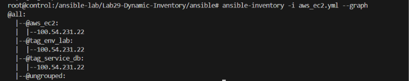
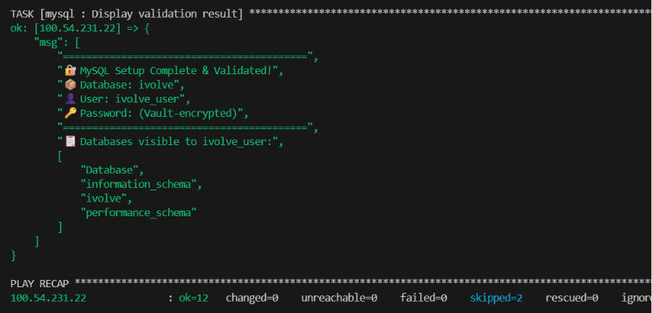
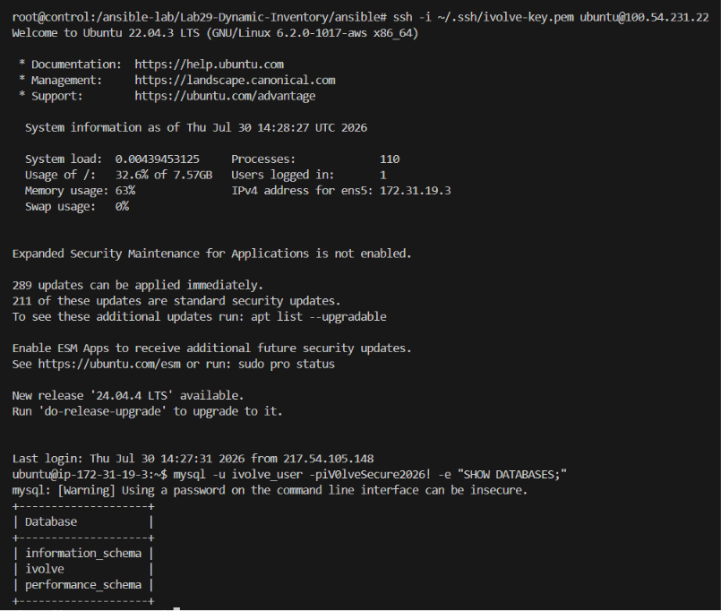

# 🤖 Lab 29: Automated Host Discovery with Ansible Dynamic Inventory

## 📌 Overview

This lab demonstrates how to use **Ansible Dynamic Inventory** with the **AWS EC2 plugin** to automatically discover and manage cloud infrastructure. Instead of manually maintaining a static inventory file, Ansible queries the AWS API at runtime to find running EC2 instances based on tags, regions, and filters.

We provision an EC2 instance tagged with `service:db` using **Terraform**, configure Ansible's `aws_ec2` dynamic inventory plugin to discover it automatically, and then run the **MySQL role** (from Lab 28) against the dynamically discovered host — achieving a fully automated, end-to-end infrastructure provisioning and configuration workflow.

---

# 📖 Understanding Dynamic Inventory

In previous labs, we used a **static inventory** file — a manually maintained list of hostnames and IP addresses. This approach works well for small, stable environments, but breaks down in cloud-native workflows where instances are created and destroyed dynamically.

```text
Static Inventory                    Dynamic Inventory
┌──────────────────────────┐    ┌──────────────────────────┐
│ inventory                │    │ aws_ec2.yml              │
│                          │    │                          │
│ [webservers]             │    │ plugin: aws_ec2          │
│ 10.0.1.5                 │    │ regions: us-east-1       │
│ 10.0.1.6                 │    │ filters:                 │
│                          │    │   tag:service: db        │
│ [databases]              │    │                          │
│ 10.0.2.10                │    │  Auto-discovers hosts    │
│                          │    │  from AWS API            │
│ Manual updates needed    │    │  Always up-to-date       │
└──────────────────────────┘    └──────────────────────────┘
```

### Why Dynamic Inventory?

| Feature | Static Inventory | Dynamic Inventory |
|---------|-----------------|-------------------|
| **Host List** | Manually maintained | Auto-discovered from cloud provider |
| **Scaling** | Update file every time | Automatically reflects changes |
| **Accuracy** | Can become stale | Always current (queries API live) |
| **Cloud-Native** | Not designed for it | Built for dynamic cloud environments |
| **Tagging** | No tag awareness | Group hosts by AWS tags automatically |

---

# 📖 How the AWS EC2 Dynamic Inventory Plugin Works

The `amazon.aws.aws_ec2` inventory plugin queries the AWS EC2 API and builds an inventory at runtime:

```text
┌─────────────┐    API Query     ┌──────────────┐    Discovers    ┌──────────────┐
│  Ansible    │ ──────────────►  │   AWS EC2    │ ──────────────► │  Inventory   │
│  Control    │   (filters,      │   API        │   (running      │  Groups      │
│  Node       │    regions)      │              │   instances)    │              │
└─────────────┘                  └──────────────┘                 └──────────────┘
                                                                   ├── tag_service_db
                                                                   │   └── 54.xx.xx.xx
                                                                   └── us_east_1
                                                                       └── 54.xx.xx.xx
```

The plugin:
1. Authenticates with AWS using credentials (environment variables, IAM role, or `~/.aws/credentials`)
2. Queries EC2 instances matching specified filters (tags, regions, states)
3. Builds inventory groups based on tags, regions, instance types, etc.
4. Provides host variables (public IP, private IP, instance ID, etc.)

---
# 📖 How Terraform Provisions the Infrastructure

Terraform is an Infrastructure as Code (IaC) tool that allows you to define cloud resources in human-readable configuration files. In this lab, we use Terraform to create the AWS EC2 instance that Ansible will later configure.

```text
┌─────────────┐    API Call      ┌──────────────┐    Creates      ┌──────────────┐
│  Terraform  │ ──────────────►  │   AWS EC2    │ ──────────────► │  EC2 Instance│
│  Files      │   (AWS API)      │   API        │   (tagged:      │  (service:db)│
│  (.tf)      │                  │              │    service:db)  │              │
└─────────────┘                  └──────────────┘                 └──────────────┘
```

**Terraform Workflow:**
1. **`terraform init`**: Initializes the working directory, downloads the AWS provider plugin, and sets up the local state.
2. **`terraform plan`**: Reads the `.tf` files and creates an execution plan, showing you exactly what resources will be created, modified, or destroyed without actually making changes.
3. **`terraform apply`**: Executes the plan and makes the API calls to AWS to provision the EC2 instance. It also creates a `terraform.tfstate` file to track the real-world resources.
4. **`terraform destroy`**: Cleans up and deletes all resources managed by the current state file, ensuring you don't leave unused infrastructure running.

By using Terraform, we ensure our infrastructure is reproducible, version-controlled, and consistently tagged (e.g., `service:db`), which is essential for Ansible's dynamic inventory to find the instances later.

---

# 📖 Terraform + Ansible: Infrastructure as Code Workflow

This lab combines two powerful IaC tools in a complementary workflow:

```text
┌───────────────────────────────────────────────────────────────┐
│                    Infrastructure Pipeline                    │
│                                                               │
│  ┌─────────┐    Provision    ┌───────────┐    Configure       │
│  │Terraform│ ──────────────► │ AWS EC2   │ ◄──────────────    │
│  │  (IaC)  │   (create VM)   │ instance  │   (install MySQL)  │
│  └─────────┘                 └───────────┘                    │
│       │                          ▲                            │
│       │    tag: service=db       │                            │
│       └──────────────────────────┘                            │
│                                  │                            │
│                          ┌───────┴───────┐                    │
│                          │    Ansible    │                    │
│                          │  Dynamic Inv. │                    │
│                          │  (auto-find)  │                    │
│                          └───────────────┘                    │
└───────────────────────────────────────────────────────────────┘
```

| Tool | Responsibility |
|------|---------------|
| **Terraform** | Provisions infrastructure (EC2 instances, VPCs, security groups) |
| **Ansible** | Configures software on provisioned infrastructure (MySQL, users, databases) |

> 💡 **Key Insight:** Terraform creates the *infrastructure*, Ansible configures the *software*. Dynamic inventory is the bridge that connects them — Terraform tags the instance, Ansible discovers it by tag.

---

## 🎯 Objectives

- Provision an AWS EC2 instance with the tag `service:db` using Terraform.
- Configure Ansible's `aws_ec2` dynamic inventory plugin for automatic host discovery.
- Verify dynamic inventory using `ansible-inventory` commands.
- Run the MySQL role (from Lab 28) against the dynamically discovered EC2 instance.

---

## 📂 Project Structure

```text
Lab29-Dynamic-Inventory/
│
├── terraform/
│   ├── main.tf                     # EC2 instance + security group
│   ├── variables.tf                # Input variables
│   ├── outputs.tf                  # Instance IP output
│   └── terraform.tfvars            # Variable values
│
├── ansible/
│   ├── aws_ec2.yml                 # Dynamic inventory plugin config
│   ├── ansible.cfg                 # Ansible configuration
│   ├── playbook.yml                # Master playbook
│   ├── vault_pass.txt              # Vault password (not committed)
│   └── roles/
│       └── mysql/
│           ├── tasks/
│           │   └── main.yml
│           ├── handlers/
│           │   └── main.yml
│           ├── defaults/
│           │   └── main.yml
│           └── vars/
│               └── vault.yml       # 🔐 Encrypted credentials
│
├── Screenshots/
│   ├── dynamic_inventory.png
│   ├── playbook_execution.png
│   └── ssh_and_mysql_validation.png
└── README.md
```

---

## 🛠 Technologies Used

- Terraform
- Ansible
- Ansible Vault
- AWS EC2
- AWS CLI
- MySQL
- SSH
- Linux (Ubuntu)

---

## ✅ Prerequisites

Ensure the following are available before starting:

- AWS account with IAM user credentials (Access Key ID and Secret Access Key)
- AWS CLI configured (`aws configure`)
- Terraform installed on your local machine
- Ansible installed with the `amazon.aws` collection
- An SSH key pair for EC2 access
- Python `boto3` and `botocore` libraries installed

> 💡 **Container Setup:**
> Since we are running Ansible inside a Docker container (`ansible-control`), you must install these dependencies inside the container from your terminal before starting:
> ```bash
> docker exec ansible-control bash -c "apt-get update && apt-get install -y python3-pip python3-boto3"
> docker exec ansible-control bash -c "ansible-galaxy collection install amazon.aws"
> ```

---

# 📋 Lab Steps

## 1. Configure AWS Credentials

Both Terraform and Ansible's `aws_ec2` dynamic inventory plugin need AWS credentials to authenticate with the AWS API. There are three ways to provide them:

### Option A: Environment Variables (Recommended for Labs)

Export your credentials in the terminal session before running any commands:

```bash
export AWS_ACCESS_KEY_ID="AKIA..."
export AWS_SECRET_ACCESS_KEY="wJalrXUtn..."
export AWS_DEFAULT_REGION="us-east-1"
```

> 💡 **On Windows (PowerShell):**
> ```powershell
> $env:AWS_ACCESS_KEY_ID = "AKIA..."
> $env:AWS_SECRET_ACCESS_KEY = "wJalrXUtn..."
> $env:AWS_DEFAULT_REGION = "us-east-1"
> ```

### Option B: AWS CLI Configuration (Persistent)

Run `aws configure` and enter your credentials when prompted:

```bash
aws configure
```

```text
AWS Access Key ID [None]: AKIA...
AWS Secret Access Key [None]: wJalrXUtn...
Default region name [None]: us-east-1
Default output format [None]: json
```

This stores your credentials in `~/.aws/credentials` and `~/.aws/config`, which both Terraform and Ansible will read automatically.

### Option C: Credentials File (Manual)

Create the credentials file manually:

```bash
mkdir -p ~/.aws

cat > ~/.aws/credentials << EOF
[default]
aws_access_key_id = AKIA...
aws_secret_access_key = wJalrXUtn...
EOF

cat > ~/.aws/config << EOF
[default]
region = us-east-1
output = json
EOF
```

> ⚠️ **Security Warning:** Never commit AWS credentials to version control. Add `~/.aws/`, `*.tfvars`, and any credential files to your `.gitignore`.

### Verify Credentials

Confirm your credentials are working:

```bash
aws sts get-caller-identity
```

Expected output:

```json
{
    "UserId": "AIDAEXAMPLE123",
    "Account": "123456789012",
    "Arn": "arn:aws:iam::123456789012:user/your-username"
}
```

---

## 1.5 Create AWS Key Pair

Before provisioning infrastructure, you need an SSH key pair to access your EC2 instance. Since this key is not managed by Terraform in this lab, you must create it manually.

```bash
# Generate the key pair and save the private key locally
aws ec2 create-key-pair --key-name ivolve-key --query "KeyMaterial" --output text > ~/.ssh/ivolve-key.pem

# Secure the private key
chmod 400 ~/.ssh/ivolve-key.pem
```

> 💡 **Windows PowerShell Users:** Using `>` in PowerShell can corrupt the key format. Use this command instead:
> ```powershell
> aws ec2 create-key-pair --key-name ivolve-key --query "KeyMaterial" --output text | Out-File -Encoding ascii ~/.ssh/ivolve-key.pem
> ```

---

## 2. Provision EC2 with Terraform

### 2.1 Define Terraform Variables

`terraform/variables.tf`

```hcl
# The AWS region where resources will be created
variable "aws_region" {
  description = "AWS region to deploy resources"
  type        = string
  default     = "us-east-1"
}

# The base operating system image to use (Ubuntu 22.04)
variable "ami_id" {
  description = "Ubuntu 22.04 AMI ID"
  type        = string
  default     = "ami-0c7217cdde317cfec"  # Ubuntu 22.04 LTS in us-east-1
}

# The size/capacity of the EC2 instance
variable "instance_type" {
  description = "EC2 instance type"
  type        = string
  default     = "t3.micro"
}

# The name of the SSH key pair required to access the instance securely
variable "key_name" {
  description = "SSH key pair name"
  type        = string
}
```

### 2.2 Define the EC2 Instance

`terraform/main.tf`

```hcl
# Configure the AWS Provider to use the specified region
provider "aws" {
  region = var.aws_region
}

# Create a Security Group (Firewall) allowing SSH and MySQL access
resource "aws_security_group" "db_sg" {
  name        = "ivolve-db-sg"
  description = "Allow SSH and MySQL inbound traffic"

  # Allow incoming SSH connections only from your IP address
  ingress {
    description = "SSH"
    from_port   = 22
    to_port     = 22
    protocol    = "tcp"
    cidr_blocks = ["YOUR_PUBLIC_IP/32"] # 🚨 Replace with your actual public IP!
  }

  # Allow incoming MySQL connections only from your IP address
  ingress {
    description = "MySQL"
    from_port   = 3306
    to_port     = 3306
    protocol    = "tcp"
    cidr_blocks = ["YOUR_PUBLIC_IP/32"] # 🚨 Replace with your actual public IP!
  }

  # Allow all outgoing traffic to the internet (necessary to download packages like mysql-server)
  egress {
    from_port   = 0
    to_port     = 0
    protocol    = "-1"
    cidr_blocks = ["0.0.0.0/0"]
  }

  tags = {
    Name = "ivolve-db-sg"
  }
}

# Provision the actual EC2 Instance and apply the crucial 'service:db' tag
resource "aws_instance" "db_server" {
  ami                    = var.ami_id
  instance_type          = var.instance_type
  key_name               = var.key_name
  vpc_security_group_ids = [aws_security_group.db_sg.id]

  # ⚠️ CRITICAL STEP: Ansible Dynamic Inventory will query AWS looking specifically for 'service = db'
  tags = {
    Name    = "ivolve-db-server"
    service = "db"
    env     = "lab"
  }
}
```

### 2.3 Define Outputs

`terraform/outputs.tf`

```hcl
# Print the generated EC2 Instance ID after deployment
output "instance_id" {
  description = "The ID of the EC2 instance"
  value       = aws_instance.db_server.id
}

# Print the dynamic Public IP address assigned to the server
output "public_ip" {
  description = "The public IP address of the EC2 instance"
  value       = aws_instance.db_server.public_ip
}

# Print the tags to visually confirm the 'service: db' tag was applied correctly
output "instance_tags" {
  description = "Tags applied to the instance"
  value       = aws_instance.db_server.tags
}
```

### 2.4 Deploy the Infrastructure

```bash
cd terraform

# Initialize Terraform
terraform init

# Preview the deployment plan
terraform plan

# Apply the configuration
terraform apply -auto-approve
```

Expected output:

```text
Apply complete! Resources: 2 added, 0 changed, 0 destroyed.

Outputs:

instance_id   = "i-0abc123def456789"
instance_tags = tomap({
  "Name"    = "ivolve-db-server"
  "env"     = "lab"
  "service" = "db"
})
public_ip     = "54.xx.xx.xx"
```

---

## 3. Configure Ansible Dynamic Inventory

### 3.1 Create the Dynamic Inventory Configuration

The inventory file must end with `aws_ec2.yml` or `aws_ec2.yaml` for Ansible to recognize it as a dynamic inventory plugin configuration.

`ansible/aws_ec2.yml`

```yaml
---
plugin: amazon.aws.aws_ec2

# AWS regions to query
regions:
  - us-east-1

# Only discover running instances with the service:db tag
filters:
  tag:service: db
  instance-state-name: running

# Group instances by their tags
keyed_groups:
  - key: tags.service
    prefix: tag_service
    separator: "_"
  - key: tags.env
    prefix: tag_env
    separator: "_"

# Use the public IP to connect
hostnames:
  - ip-address

# Compose additional host variables
compose:
  ansible_host: public_ip_address
  ansible_user: "'ubuntu'"
  ansible_ssh_private_key_file: "'~/.ssh/ivolve-key.pem'"
```

### 3.2 Create the Ansible Configuration

`ansible/ansible.cfg`

```ini
[defaults]
# Point Ansible to our dynamic inventory file by default
inventory = aws_ec2.yml
# Disable SSH key prompts since these are newly created cloud instances
host_key_checking = False
# Suppress deprecation warnings for cleaner terminal output
deprecation_warnings = False
# The default user for Ubuntu EC2 instances
remote_user = ubuntu
# The SSH private key we created to access the instance
private_key_file = ~/.ssh/ivolve-key.pem

[inventory]
# Explicitly enable the AWS EC2 dynamic inventory plugin
enable_plugins = amazon.aws.aws_ec2
```

---

## 4. Verify Dynamic Inventory

### 4.0 Container Setup for AWS Credentials

The `aws_ec2` plugin requires access to your AWS credentials to query the EC2 API. Securely copy them from your Windows host to the container:

```bash
docker exec ansible-control mkdir -p /root/.aws
docker cp ~/.aws/credentials ansible-control:/root/.aws/credentials
```

### 4.1 List All Discovered Hosts

```bash
cd ansible
ansible-inventory -i aws_ec2.yml --list
```

Expected output:

```json
{
    "_meta": {
        "hostvars": {
            "54.xx.xx.xx": {
                "ansible_host": "54.xx.xx.xx",
                "ansible_user": "ubuntu",
                "ansible_ssh_private_key_file": "~/.ssh/ivolve-key.pem"
            }
        }
    },
    "all": {
        "children": ["ungrouped", "tag_service_db", "tag_env_lab"]
    },
    "tag_service_db": {
        "hosts": ["54.xx.xx.xx"]
    },
    "tag_env_lab": {
        "hosts": ["54.xx.xx.xx"]
    }
}
```

### 4.2 Display Inventory as a Graph

```bash
ansible-inventory -i aws_ec2.yml --graph
```

Expected output:

```text
@all:
  |--@ungrouped:
  |--@tag_service_db:
  |  |--54.xx.xx.xx
  |--@tag_env_lab:
  |  |--54.xx.xx.xx
```

### 4.3 Ping Discovered Hosts

```bash
ansible tag_service_db -i aws_ec2.yml -m ping
```

Expected output:

```text
54.xx.xx.xx | SUCCESS => {
    "changed": false,
    "ping": "pong"
}
```

---

## 5. Set Up the MySQL Role

Reuse the MySQL role from Lab 28 with Vault-encrypted credentials.

### 5.1 Create the Vault Password File

```bash
echo "ivolve2026" > vault_pass.txt
chmod 600 vault_pass.txt
```

### 5.2 Create the Role Structure

```bash
mkdir -p roles/mysql/{tasks,handlers,defaults,vars}
```

### 5.3 Define Default Variables

`ansible/roles/mysql/defaults/main.yml`

```yaml
---
mysql_db_name: ivolve
mysql_db_user: ivolve_user
mysql_bind_address: "0.0.0.0"
```

### 5.4 Create Vault-Encrypted Secrets

```bash
ansible-vault create roles/mysql/vars/vault.yml --vault-password-file vault_pass.txt
```

Add when the editor opens:

```yaml
---
vault_mysql_root_password: R00tP@ss2026!
vault_mysql_user_password: iV0lve$ecure2026!
```

### 5.5 Define the Role Tasks

`ansible/roles/mysql/tasks/main.yml`

```yaml
---
- name: Include vault-encrypted variables
  include_vars:
    file: vault.yml

- name: Install MySQL and dependencies
  apt:
    name:
      - mysql-server
      - mysql-client
      - python3-pymysql
    state: present
    update_cache: true

- name: Ensure MySQL is running and enabled
  service:
    name: mysql
    state: started
    enabled: true

- name: Set MySQL root password
  mysql_user:
    name: root
    password: "{{ vault_mysql_root_password }}"
    host: localhost
    login_unix_socket: /var/run/mysqld/mysqld.sock
    state: present

- name: Create iVolve database
  mysql_db:
    name: "{{ mysql_db_name }}"
    state: present
    login_unix_socket: /var/run/mysqld/mysqld.sock
  register: db_creation

- name: Display database creation result
  debug:
    msg: "✅ Database '{{ mysql_db_name }}' created successfully!"
  when: db_creation.changed

- name: Create iVolve database user with all privileges
  mysql_user:
    name: "{{ mysql_db_user }}"
    password: "{{ vault_mysql_user_password }}"
    priv: "{{ mysql_db_name }}.*:ALL"
    host: "%"
    state: present
    login_unix_socket: /var/run/mysqld/mysqld.sock
  register: user_creation

- name: Display user creation result
  debug:
    msg: "✅ User '{{ mysql_db_user }}' created with ALL privileges on '{{ mysql_db_name }}' database!"
  when: user_creation.changed

- name: Flush MySQL privileges
  command: mysql -u root -e "FLUSH PRIVILEGES;"
  changed_when: false

- name: Validate - Connect as ivolve_user and list databases
  command: >
    mysql -u {{ mysql_db_user }} -p{{ vault_mysql_user_password }} -e "SHOW DATABASES;"
  register: db_validation
  changed_when: false

- name: Display validation result
  debug:
    msg:
      - "=========================================="
      - "🔐 MySQL Setup Complete & Validated!"
      - "📦 Database: {{ mysql_db_name }}"
      - "👤 User: {{ mysql_db_user }}"
      - "🔑 Password: (Vault-encrypted)"
      - "=========================================="
      - "📋 Databases visible to {{ mysql_db_user }}:"
      - "{{ db_validation.stdout_lines }}"
```

### 5.6 Define the Handler

`ansible/roles/mysql/handlers/main.yml`

```yaml
---
- name: Restart MySQL
  service:
    name: mysql
    state: restarted
```

---

## 6. Create the Playbook

`ansible/playbook.yml`

```yaml
---
- name: Configure MySQL on Dynamically Discovered DB Servers
  hosts: tag_service_db
  become: yes

  roles:
    - mysql
```

> 💡 **Notice:** The `hosts` field targets `tag_service_db` — a group automatically created by the dynamic inventory plugin based on the `service:db` EC2 tag. No hardcoded IPs needed!

---

## 7. Run the Playbook

Execute the playbook against the dynamically discovered hosts **from inside your Ansible Docker container** (make sure you are in the `/ansible-lab/Lab29-Dynamic-Inventory/ansible` directory):

```bash
ansible-playbook playbook.yml -i aws_ec2.yml --vault-password-file vault_pass.txt
```

Expected output:

```text
PLAY [Configure MySQL on Dynamically Discovered DB Servers] ********************

TASK [Gathering Facts] *********************************************************
ok: [54.xx.xx.xx]

TASK [mysql : Include vault-encrypted variables] *******************************
ok: [54.xx.xx.xx]

TASK [mysql : Install MySQL and dependencies] **********************************
changed: [54.xx.xx.xx]

TASK [mysql : Ensure MySQL is running and enabled] *****************************
changed: [54.xx.xx.xx]

TASK [mysql : Set MySQL root password] *****************************************
changed: [54.xx.xx.xx]

TASK [mysql : Create iVolve database] ******************************************
changed: [54.xx.xx.xx]

TASK [mysql : Display database creation result] ********************************
ok: [54.xx.xx.xx] => {
    "msg": "✅ Database 'ivolve' created successfully!"
}

TASK [mysql : Create iVolve database user with all privileges] *****************
changed: [54.xx.xx.xx]

TASK [mysql : Display user creation result] ************************************
ok: [54.xx.xx.xx] => {
    "msg": "✅ User 'ivolve_user' created with ALL privileges on 'ivolve' database!"
}

TASK [mysql : Flush MySQL privileges] ******************************************
ok: [54.xx.xx.xx]

TASK [mysql : Validate - Connect as ivolve_user and list databases] ************
ok: [54.xx.xx.xx]

TASK [mysql : Display validation result] ***************************************
ok: [54.xx.xx.xx] => {
    "msg": [
        "==========================================",
        "🔐 MySQL Setup Complete & Validated!",
        "📦 Database: ivolve",
        "👤 User: ivolve_user",
        "🔑 Password: (Vault-encrypted)",
        "==========================================",
        "📋 Databases visible to ivolve_user:",
        [
            "Database",
            "information_schema",
            "ivolve"
        ]
    ]
}

PLAY RECAP *********************************************************************
[IP_ADDRESS]                : ok=12   changed=5    unreachable=0    failed=0    skipped=0    rescued=0    ignored=0
```

---

## 8. Verify on the EC2 Instance

### SSH into the Instance

```bash
ssh -i ~/.ssh/ivolve-key.pem ubuntu@[IP_ADDRESS]
```

### Verify MySQL and Database

```bash
mysql -u ivolve_user -piV0lveSecure2026! -e "SHOW DATABASES;"
```

Expected output:

```text
+--------------------+
| Database           |
+--------------------+
| information_schema |
| ivolve             |
+--------------------+
```

---

# 📸 Screenshots

Include screenshots demonstrating:

| Description | Image |
|------------|-------|
| Dynamic Inventory | |
| Playbook Execution | |
| SSH into EC2 and Validate MySQL | |

---

## 📚 Key Learning Outcomes

After completing this lab, you will be able to:

- Provision AWS EC2 instances with tags using Terraform.
- Configure Ansible's `aws_ec2` dynamic inventory plugin for automatic host discovery.
- Use `ansible-inventory` commands to list and visualize discovered hosts.
- Combine Terraform (infrastructure provisioning) with Ansible (configuration management).
- Run Ansible roles against dynamically discovered cloud instances.
- Understand the advantages of dynamic inventory over static inventory in cloud environments.

---

## 💡 Best Practices

- Always tag your cloud resources with meaningful labels (`service`, `env`, `team`) for effective grouping.
- Use `filters` in the dynamic inventory to narrow results and avoid managing unrelated instances.
- Set `instance-state-name: running` to exclude terminated or stopped instances.
- Use `compose` to dynamically set `ansible_host`, `ansible_user`, and key file paths.
- Store AWS credentials in environment variables or IAM instance profiles — never in inventory files.
- Use `keyed_groups` to automatically organize hosts into Ansible groups based on tags.
- Combine dynamic inventory with Ansible Vault for a fully secure, automated pipeline.
- Always run `terraform plan` before `terraform apply` to review changes.

---

## 🌍 Real-World Use Cases

- Auto-scaling environments where instances are created and destroyed dynamically
- Multi-region deployments where inventory changes per region
- Blue/green deployment strategies with tag-based host targeting
- Disaster recovery — redeploy infrastructure with Terraform, auto-configure with Ansible
- Compliance auditing — dynamically discover all instances and verify configuration
- Hybrid cloud management — combine AWS, GCP, and Azure dynamic inventory plugins

---

## 🧹 Cleanup

> **Note:** Destroy all AWS resources to avoid ongoing charges.

### Destroy Terraform Infrastructure

```bash
cd terraform
terraform destroy -auto-approve
```

### Clean up AWS Key Pair and Local Files

Since the AWS Key Pair was created manually and not managed by Terraform, it must be deleted manually to avoid leaving orphaned resources.

```bash
aws ec2 delete-key-pair --key-name ivolve-key
rm -f ~/.ssh/ivolve-key.pem
rm -f ansible/vault_pass.txt
```

---

## ✅ Result

Successfully provisioned an AWS EC2 instance tagged with `service:db` using **Terraform**, configured Ansible's **aws_ec2 dynamic inventory plugin** to automatically discover the instance, verified the discovered hosts using `ansible-inventory` commands, and ran the **MySQL role** against the dynamically discovered host — installing MySQL, creating the `ivolve` database, provisioning the `ivolve_user`, and validating connectivity. This lab demonstrates the full **Infrastructure as Code** workflow: Terraform provisions, tags connect, Ansible discovers and configures.
