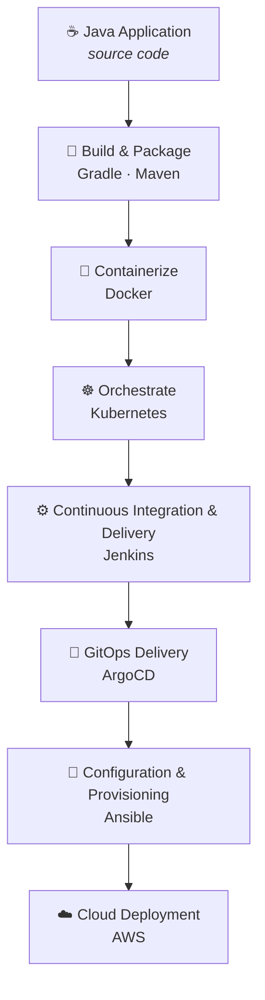

<div align="center">

# 🚀 iVolve Technologies — Cloud DevOps Internship

**A hands-on portfolio of labs, assignments, and projects completed during the Cloud DevOps internship at iVolve Technologies.**


</div>

---

## 📑 Table of Contents

- [Overview](#overview)
- [Architecture & Learning Path](#architecture--learning-path)
- [Internship Overview](#internship-overview)
- [Skills You'll Gain](#skills-youll-gain)
- [Objectives](#objectives)
- [Tech Stack](#tech-stack)
- [Repository Structure](#repository-structure)
- [Lab Catalog](#lab-catalog)
  - [01 · Build Tools](#01--build-tools)
  - [02 · Docker](#02--docker)
  - [03 · Kubernetes](#03--kubernetes)
  - [04 · Jenkins (CI/CD)](#04--jenkins-cicd)
  - [05 · ArgoCD (GitOps)](#05--argocd-gitops)
  - [06 · Ansible](#06--ansible)
- [What Each Lab Contains](#what-each-lab-contains)
- [Purpose of This Repository](#purpose-of-this-repository)
- [Contact](#contact)

---

<a id="overview"></a>

## 📖 Overview

This repository documents my learning journey through the **Cloud DevOps internship** at **iVolve Technologies** — a structured, hands-on curriculum of **30 labs** spanning the modern DevOps toolchain.

The program moves progressively from **build automation** through **containerization**, **orchestration**, **CI/CD**, **GitOps**, and **configuration management**, culminating in cloud-native deployment on AWS. Each lab captures real, reproducible implementations — manifests, Dockerfiles, pipelines, scripts, screenshots, and lessons learned.

---

<a id="architecture--learning-path"></a>

## 🗺️ Architecture & Learning Path

The internship mirrors the real journey of an application — from source code all the way to a running cloud deployment. Each stage introduces the tool that owns that step in a production DevOps workflow:



---

<a id="internship-overview"></a>

## 🧭 Internship Overview

The internship follows a progressive, project-based curriculum that builds skills layer by layer — from packaging an application, to shipping it in a container, to orchestrating, automating, and continuously delivering it. The **30 labs** are grouped into **six hands-on tracks**:

| # | Track | What It Covers | Labs |
|:-:|-------|----------------|:----:|
| 01 | 🔨 **Build Tools** | Building & packaging Java applications with Gradle and Maven | 2 |
| 02 | 🐳 **Docker** | Containerization, image optimization, environment variables, storage, networking, and multi-container applications with Docker Compose.| 7 |
| 03 | ☸️ **Kubernetes** | Container orchestration — workloads, storage, networking, and security | 11 |
| 04 | ⚙️ **Jenkins** | CI/CD pipelines, agents, and shared libraries | 3 |
| 05 | 🔄 **ArgoCD** | GitOps-driven continuous delivery workflows | 1 |
| 06 | 🤖 **Ansible** | Linux automation and configuration management | 5 |

> 📅 **Timeline:** Started July 2026 · 🚀 In Progress

---

<a id="skills-youll-gain"></a>

## 🎓 Skills You'll Gain

Practical, portfolio-ready competencies developed across the program:

| Domain | Skills |
|--------|--------|
| **Foundations** | Linux administration · Shell scripting · Git & GitHub workflows |
| **Build & Package** | Java build automation with Gradle & Maven · Artifact management |
| **Containers** | Docker image creation · Multi-stage builds · Environment variables · Volumes & Bind Mounts · Custom Docker networks · Docker Compose |
| **Orchestration** | Kubernetes workloads, storage, networking, RBAC & resource management |
| **Automation & Delivery** | Jenkins CI/CD pipelines · GitOps with ArgoCD · Ansible configuration management |
| **Cloud & Ops** | AWS deployment · Infrastructure automation · Troubleshooting real environments |

---

<a id="objectives"></a>

## 🎯 Objectives

- Build a strong foundation in **Cloud & DevOps engineering**.
- Gain hands-on experience with **industry-standard tools**.
- Master modern **deployment and automation** workflows.
- Document every task to a **professional, reproducible** standard.
- Assemble a portfolio that demonstrates **practical DevOps skills**.

---

<a id="tech-stack"></a>

## 🛠 Tech Stack

| Category | Technologies |
|----------|--------------|
| Operating System | Linux |
| Version Control | Git, GitHub |
| Build Tools | Gradle, Maven |
| Programming | Java, Python, Bash |
| Containers | Docker, Docker Compose |
| Orchestration | Kubernetes |
| CI/CD | Jenkins |
| GitOps | ArgoCD |
| Configuration Management | Ansible |
| Cloud Platform | AWS |
| Database | MySQL |
| Web Server | Nginx |

---

<a id="repository-structure"></a>

## 📂 Repository Structure

```text
ivolve-cloud-devops-internship/
│
├── 01-Build-Tools/
│   ├── Lab01-Gradle/
│   └── Lab02-Maven/
│
├── 02-Docker/
│   ├── Lab03-SpringBoot-Container/
│   ├── Lab04-JAR-Container/
│   ├── Lab05-MultiStage-Build/
│   ├── Lab06-Environment-Variables/
│   ├── Lab07-Volumes-BindMounts/
│   ├── Lab08-Custom-Network/
│   └── Lab09-Docker-Compose/
│
├── 03-Kubernetes/
│   ├── Lab10-Taints/
│   ├── Lab11-Namespaces/
│   ├── Lab12-ConfigMaps-Secrets/
│   ├── Lab13-Persistent-Volumes/
│   ├── Lab14-StatefulSets/
│   ├── Lab15-Deployments/
│   ├── Lab16-Init-Containers/
│   ├── Lab17-Resource-Management/
│   ├── Lab18-Network-Policies/
│   ├── Lab19-DaemonSets/
│   └── Lab20-RBAC/
│
├── 04-Jenkins/
│   ├── Lab21-Role-Based-Authorization/
│   ├── Lab22-CI-CD-Pipeline/
│   └── Lab23-Shared-Libraries/
│
├── 05-ArgoCD/
│   └── Lab25-GitOps-Workflow/
│
├── 06-Ansible/
│   ├── Lab26-Initial-Configuration/
│   ├── Lab27-Playbooks/
│   ├── Lab28-Roles/
│   ├── Lab29-Vault/
│   └── Lab30-Dynamic-Inventory/
│
├── Assets/
│   └── Images/
│
└── README.md
```

---

<a id="lab-catalog"></a>

## 📚 Lab Catalog

Status legend: ✅ Completed · 🚧 In Progress · ⬜ Planned

<a id="01--build-tools"></a>

### 01 · Build Tools

| Lab | Title | Summary | Status |
|:---:|-------|---------|:------:|
| 01 | [Gradle](01-Build-Tools/Lab01-Gradle) | Build & package a Java calculator app with Gradle → `build/libs/calculator.jar`. | ✅ |
| 02 | [Maven](01-Build-Tools/Lab02-Maven) | Build & package a Java calculator app with Maven → `target/calculator.jar`. | ✅ |

<a id="02--docker"></a>

### 02 · Docker

| Lab | Title | Summary | Status |
|:---:|-------|---------|:------:|
| 03 | [Spring Boot Container](02-Docker/Lab03-SpringBoot-Container) | Containerize a Spring Boot application by building it inside a Docker image using Maven and Java 17. | ✅ |
| 04 | [JAR Runtime Container](02-Docker/Lab04-JAR-Container) | Package a pre-built Spring Boot executable JAR into a lightweight Java runtime image. | ✅ |
| 05 | [Multi-Stage Docker Build](02-Docker/Lab05-MultiStage-Build) | Build a Spring Boot application using a multi-stage Dockerfile to separate build and runtime environments, producing a smaller and more secure image. | ✅ |
| 06 | [Environment Variables](02-Docker/Lab06-Environment-Variables) | Configure Docker environment variables using runtime flags, environment files, and Dockerfile defaults while comparing their precedence. | ✅ |
| 07 | [Docker Volumes & Bind Mounts](02-Docker/Lab07-Volumes-BindMounts) | Persist Nginx logs using Docker volumes and serve custom web content from the host machine using bind mounts. | ✅ |
| 08 | [Custom Docker Network](02-Docker/Lab08-Custom-Network) | Build frontend and backend microservices, connect them using a user-defined Docker bridge network, and verify container communication. | ✅ |
| 09 | [Docker Compose](02-Docker/Lab09-Docker-Compose) | Deploy a multi-container Node.js and MySQL application using Docker Compose, environment variables, persistent volumes, and Docker Hub. | ✅ |

<a id="03--kubernetes"></a>

### 03 · Kubernetes

| Lab | Title | Summary | Status |
|:---:|-------|---------|:------:|
| 10 | [Node Isolation Using Taints](03-Kubernetes/Lab10-Taints) | Create a two-node Kubernetes cluster, isolate the worker node using the `node=worker:NoSchedule` taint, and verify scheduling constraints with `kubectl describe`. | ✅ |
| 11 | [Namespace Management & Resource Quota Enforcement](03-Kubernetes/Lab11-Namespaces) | Create the `ivolve` namespace, apply a `ResourceQuota` limiting the namespace to **2 Pods**, and verify namespace resource governance. | ✅ |
| 12 | ConfigMaps & Secrets | Externalize MySQL config and base64-encoded credentials. | ⬜ |
| 13 | Persistent Volumes & PVCs | Provision a 1Gi `hostPath` PV with `ReadWriteMany` and a matching PVC. | ⬜ |
| 14 | StatefulSet + Headless Service | Run MySQL as a StatefulSet with persistent storage and a headless service. | ⬜ |
| 15 | Deployment + ClusterIP Service | Deploy a Node.js app with config/secret env vars behind a ClusterIP service. | ⬜ |
| 16 | Init Containers | Bootstrap the `ivolve` database and app user before the app starts. | ⬜ |
| 17 | Resource Requests & Limits | Set CPU/memory requests and limits and verify with `describe` / `top`. | ⬜ |
| 18 | Network Policies | Restrict ingress to MySQL (port 3306) to the application pods only. | ⬜ |
| 19 | DaemonSets | Roll out Prometheus `node-exporter` on every node, tolerating all taints. | ⬜ |
| 20 | RBAC & Service Accounts | Grant a `jenkins-sa` account read-only access to pods via Role + RoleBinding. | ⬜ |

<a id="04--jenkins-cicd"></a>

### 04 · Jenkins (CI/CD)

| Lab | Title | Summary | Status |
|:---:|-------|---------|:------:|
| 21 | Role-Based Authorization | Configure admin and read-only users with Jenkins RBAC. | ⬜ |
| 22 | CI/CD Pipeline | Test → build → image → push → update manifest → deploy to Kubernetes, with post actions. | ⬜ |
| 23 | Agents & Shared Libraries | Reuse pipeline logic across jobs via a shared library on a Jenkins agent. | ⬜ |

<a id="05--argocd-gitops"></a>

### 05 · ArgoCD (GitOps)

| Lab | Title | Summary | Status |
|:---:|-------|---------|:------:|
| 25 | GitOps Workflow | CI builds and pushes an image, commits the updated manifest, and ArgoCD auto-syncs it. | ⬜ |

> ℹ️ Lab 24 is intentionally omitted from the program's numbering.

<a id="06--ansible"></a>

### 06 · Ansible

| Lab | Title | Summary | Status |
|:---:|-------|---------|:------:|
| 26 | Initial Configuration | Set up Ansible, exchange SSH keys, build inventory, and run ad-hoc commands. | ⬜ |
| 27 | Playbooks | Automate Nginx installation and a custom web page on a managed node. | ⬜ |
| 28 | Roles | Structure reusable roles for Docker, `kubectl`, and Jenkins. | ⬜ |
| 29 | Vault | Provision MySQL with an `ivolve` DB and user, securing secrets with Ansible Vault. | ⬜ |
| 30 | Dynamic Inventory | Auto-discover tagged AWS EC2 hosts and run the MySQL role against them. | ⬜ |


**11 of 30 labs complete**

```text
███████████████░░░░░░░░░░░░░░░░░ 36.7%
```

---

<a id="what-each-lab-contains"></a>

## 📦 What Each Lab Contains

Every lab is self-documenting and may include:

- 📄 A dedicated `README.md` with objectives and step-by-step instructions
- ⚙️ Configuration files, Dockerfiles, and Kubernetes manifests
- 🤖 Automation scripts (Bash, Ansible, pipelines)
- 📷 Screenshots verifying the working result
- 💡 Troubleshooting notes, best practices, and key takeaways

---

<a id="purpose-of-this-repository"></a>

## 📌 Purpose of This Repository

This repository serves as:

- 📚 A personal **knowledge base** for Cloud & DevOps.
- 💼 A professional **portfolio** of hands-on work.
- 🚀 A living record of my **internship journey**.
- 📖 A **reference** for future projects and implementations.

---

<a id="contact"></a>

## 📬 Contact

<div align="center">

[](https://www.linkedin.com/in/waleeddarwesh1)
[](https://github.com/WaleedDarwesh)
[](mailto:Waleeddarweshsaad1@gmail.com)

</div>

---

<div align="center">

⭐ **If you find this repository helpful, consider giving it a star.** ⭐

_Thank you for visiting my Cloud DevOps internship repository!_

</div>
